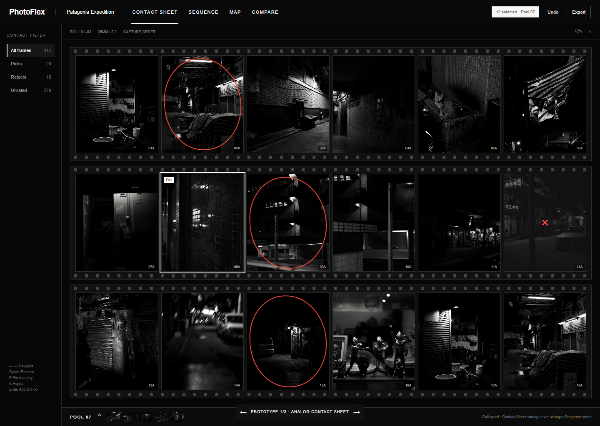
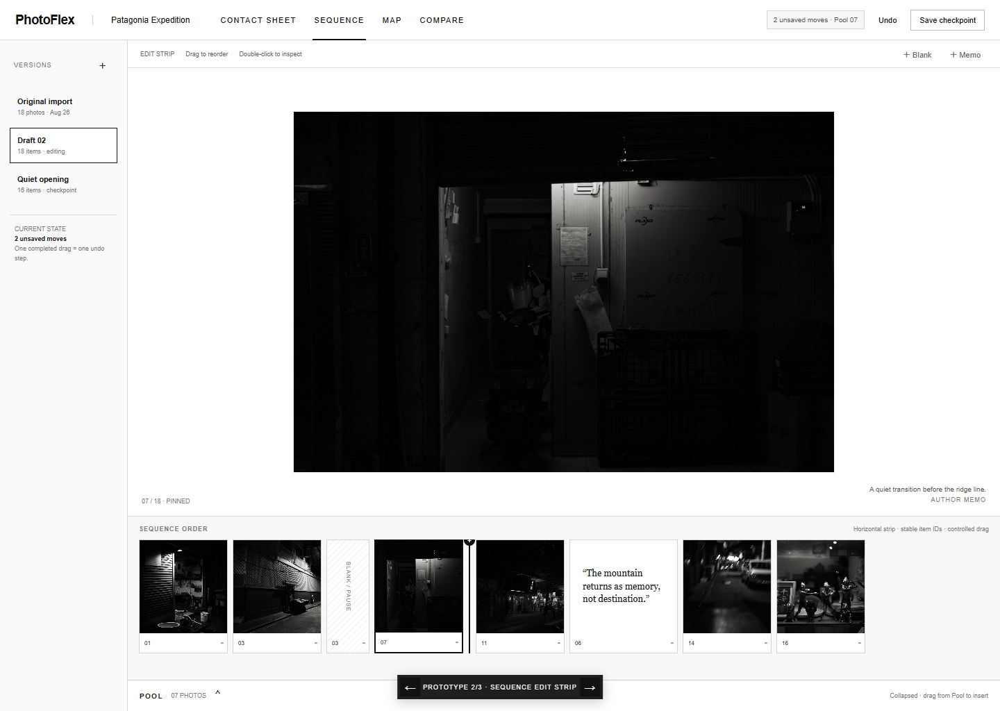
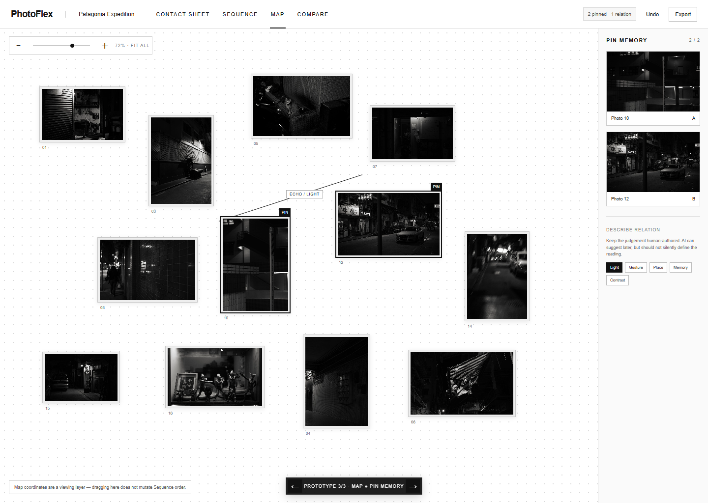

# PhotoFlex Contact Sheet 与 Sequence：React + TypeScript 开源资源与改良方案

> 核对日期：2026-08-28  
> 当前工程：React 19.1 + TypeScript 5.9 + Vite 7.1，本地优先。  
> 本文中的界面图是用于验证结构的 throwaway prototype（一次性原型），不是准备直接合并的产品代码。

## 结论先行

PhotoFlex 目前不需要整体替换 Contact Sheet。现有实现已经具备自定义虚拟网格、批量选择、Pool 与 Preview；Sequence 也已经定义 add / move / remove、undo / redo 等领域命令。更合适的路线是保留这些基础，只在最难且成熟度高的部分引入开源能力：

1. **现在采用：dnd-kit** —— 负责 Sequence 横向编辑条以及 Pool → Sequence 的可访问拖拽。
2. **现在采用：exifr** —— 在照片索引阶段读取时间、相机、镜头、方向等必要 EXIF；不要在 React 渲染组件里解析。
3. **做一个小型验证：react-zoom-pan-pinch** —— 用于 Map View 的缩放和平移，不介入 Sequence 的拖拽排序。
4. **按需评估：Yet Another React Lightbox** —— 当前 Preview 已经含有 PhotoFlex 的 Pool 操作，先对比再决定是否替换底层。
5. **暂不迁移：TanStack Virtual / React Photo Album** —— 它们很好，但当前虚拟网格已能工作；MVP 阶段重写的收益不够高。
6. **后期再考虑：React Flow** —— 只有 Relationship View 真正成为核心功能时才值得引入。

对应现有代码：

- [Contact Sheet 与 Preview：`src/app/M1App.tsx`](../src/app/M1App.tsx)
- [Sequence 命令契约：`src/contracts/sequence.ts`](../src/contracts/sequence.ts)
- [Pool 领域逻辑：`src/modules/library/pool.ts`](../src/modules/library/pool.ts)
- [IndexedDB 持久化：`src/platform/browser/IndexedDbProjectStore.ts`](../src/platform/browser/IndexedDbProjectStore.ts)
- [Sequence PRD：`docs/PRD_Sequence.md`](./PRD_Sequence.md)

## 开源资源清单

| 资源 | 能解决什么 | PhotoFlex 中的合适位置 | 许可证 / 风险 | 建议 |
|---|---|---|---|---|
| [clauderic/dnd-kit](https://github.com/clauderic/dnd-kit) | 鼠标、触控、键盘拖拽；sortable 与 drag overlay | Sequence 编辑条、Pool 拖入 Sequence | MIT；不同尺寸的自由网格排序仍需自己设计碰撞策略 | **立即采用** |
| [MikeKovarik/exifr](https://github.com/MikeKovarik/exifr) | 浏览器/Node 中读取 EXIF，支持按需解析标签 | 导入与索引 worker，形成标准化照片元数据 | MIT；HEIC/特殊 RAW 仍要用真实样本测试 | **立即采用** |
| [BetterTyped/react-zoom-pan-pinch](https://github.com/BetterTyped/react-zoom-pan-pinch) | DOM 内容的 zoom / pan / pinch | Sequence Map、Distance View 的观看尺度 | MIT；CSS transform 可能干扰拖拽命中 | **小型验证** |
| [igordanchenko/yet-another-react-lightbox](https://github.com/igordanchenko/yet-another-react-lightbox) | 键盘、触控、预加载、响应式图片、Zoom 插件 | 单张 Preview / Read View 的底层能力 | MIT；需要重新接回 Pin、Pool 与本地 URL 生命周期 | **按需评估** |
| [TanStack/virtual](https://github.com/TanStack/virtual) | Headless 的大列表/网格虚拟化，支持动态尺寸 | 文件量很大且当前网格维护成本上升时 | MIT；拖拽与虚拟化并用需要 overscan 和 DragOverlay | **保留现状，遇到瓶颈再迁移** |
| [igordanchenko/react-photo-album](https://github.com/igordanchenko/react-photo-album) | Rows / Columns / Masonry、自适应图像和自定义 render | 非编辑型 Overview、公开浏览页、小型项目 Map | MIT；不是“胶片接触印样”的语义模型，也不能替代大规模本地虚拟网格 | **可选视图，不替换 Contact Sheet** |
| [xyflow/xyflow](https://github.com/xyflow/xyflow) | 节点、连线、画布交互与 TypeScript API | 后期 Relationship View | MIT；若只是图片缩放/平移则明显过重 | **后期** |
| [GhostInTheBus/book-builder](https://github.com/GhostInTheBus/book-builder) | React + TS 的照片行、拖到页面、导出 PDF/JSON | 参考 Pool → 编排区、跨区域拖拽的产品交互 | 仓库未明确提供许可证时，不应复制代码 | **只参考交互** |
| [hugoxxxx/GT23_Workflow](https://github.com/hugoxxxx/GT23_Workflow) | 135/645/66/67 等胶片规格、齿孔、边码、EXIF 呈现 | Contact Sheet 的 analog skin 与导出外观 | MIT；Python 桌面项目，不适合作为 React 组件直接移植 | **参考视觉与物理规则** |
| [fabiodalez-dev/Cimaise](https://github.com/fabiodalez-dev/Cimaise) | 水平胶片条与 scroll-snap 的观看方式 | Sequence Read 的视觉参考 | LICENSE 为 GPL-3.0；README 的许可描述可能不一致 | **仅视觉参考，不复制实现** |
| [leuvi/sweet-album](https://github.com/leuvi/sweet-album) | 虚拟滚动、选择、全屏、justified layout 的 React 适配 | 阅读源码，比较网格抽象方式 | MIT，但项目较新、采用量有限 | **研究参考，不作为首选依赖** |

上线前仍应锁定具体版本、保留第三方 notice，并再次核对许可证。尤其是“仓库没有 LICENSE”或 README 与 LICENSE 不一致的项目，不要复制源码或资源文件。

## Contact Sheet：建议怎么改

### 1. 先把四种“顺序”分开

Contact Sheet 最容易出现的隐性 bug，是用户按时间或文件名排序后，Sequence 也跟着变化。建议数据模型明确区分：

```ts
type ProjectOrdering = {
  sourceOrder: PhotoId[];      // 导入时的稳定顺序
  contactViewOrder: PhotoId[]; // 当前观看排序，可以随时重算
  poolOrder: PhotoId[];        // 候选照片顺序
  sequenceOrder: SequenceItemId[]; // 作者真正保存的阅读顺序
};
```

**不可破坏的规则：Contact Sheet 的筛选和排序永远不能直接修改 Sequence。** 只有明确的“加入 Sequence / 移动 Sequence 项目”命令可以改序列。

### 2. “胶片感”做成皮肤，不要做成数据结构

接触印样的齿孔、边码、红色蜡笔圈、片幅标签非常有辨识度，但它们应属于呈现层：

```text
ContactSheetModel
  ├─ filtering / selection / rating / Pool membership
  └─ layout input
       ├─ ClassicGridSkin
       └─ AnalogFilmSkin (sprocket holes, frame number, grease marks)
```

这样既能保留高性能经典网格，也能提供接近真实 contact sheet 的观看模式。GT23_Workflow 最值得借鉴的是胶片规格和标记规则，不是它的 Python GUI。

### 3. 统一每张照片的状态，但不要把它们混成一个字段

```ts
type PhotoDecision = "unrated" | "pick" | "reject";

type ContactPhotoState = {
  selected: boolean; // 当前批量操作的临时选择
  decision: PhotoDecision;
  inPool: boolean;
  pinned: boolean;
  missing: boolean;
};
```

- `selected` 是短暂 UI 状态。
- `pick / reject` 是作者判断，应该持久化。
- `inPool` 是候选集合成员关系。
- `pinned` 是跨 Read / Map / Compare 的“观看记忆”。
- `missing` 不能让照片从序列中消失，应该保留占位与原位置。

### 4. Pool 使用底部可收起托盘

收起时仍显示 `POOL 07`、展开箭头和少量缩略图；展开后支持：

- 批量移除；
- 拖到 Sequence 的明确插入线；
- 键盘选择与 Enter 插入；
- 显示“已在当前 Sequence 中”的状态，避免重复加入时没有反馈。

Pool 是“候选集合”，不是另一个 Sequence。除非用户明确拖动，Pool 自身排序不应改变 Sequence。

### 5. 性能改良顺序

1. 导入阶段在 worker 中读取文件基本信息与必要 EXIF。
2. 缩略图与全尺寸预览分开；网格只请求缩略图。
3. `URL.createObjectURL` 要有集中管理与释放策略，不能由每个卡片随意创建。
4. 保留现有虚拟网格；用 1k、5k、20k 张真实尺寸数据做 profiling。
5. 只有动态行高、滚动同步或维护成本成为实际问题时，再迁移 TanStack Virtual。

### 6. 快捷键建议

| 操作 | 建议按键 |
|---|---|
| 在照片间移动 | `← ↑ ↓ →` |
| 预览 | `Space` |
| Pin / 取消 Pin | `P` |
| Pick / Reject | `1` / `X`，或与现有 Lightroom 习惯保持一致 |
| 加入 Pool | `Enter` |
| 连续范围选择 | `Shift + Click` |
| 非连续选择 | `Ctrl/Cmd + Click` |

快捷键应在界面中可发现；焦点位于输入框时不能劫持按键。

## Sequence：建议怎么改

### 1. MVP 只做三个职责清楚的模式

| 模式 | 目的 | 是否能改变顺序 |
|---|---|---|
| **Edit** | 用横向编辑条拖动、插入空白、插入 memo、从 Pool 加照片 | 是 |
| **Read** | 弱化 UI，按作者节奏逐张/跨页阅读 | 否 |
| **Map** | 摊开整体，发现色彩、形状、距离与重复 | 否 |

Compare 可以使用 Pin 串起来，但不必成为 Sequence 编辑器的一部分。Shuffle、Temporal、Relationship 和多人 “My Reading” 都有价值，不过应放到稳定的 Edit / Read / Map 之后。

### 2. 拖拽只负责输入，领域命令负责真相

dnd-kit 的 `onDragEnd` 不应直接随意改数组；它应该生成现有 `SequenceEditCommand`。推荐流程：

```text
pointer move → UI 中的临时拖动预览
drop          → 计算 beforeId / afterId
              → 创建一个 move/add 命令
              → domain 执行命令并记录 undo
              → store 持久化
```

一整次拖拽只生成一个命令，也只占一个 undo step。拖拽尚未完成时不要持续写 IndexedDB。

实现上的关键点：

- 每个 Sequence item 使用稳定 ID，不能用数组 index 作为 React key。
- 排序区域优先使用单行横向 strip；不同宽度的 photo / blank / memo 仍比自由网格容易预测。
- DragOverlay 放在 portal 中，避免被滚动容器裁切。
- 小于约 200 个项目时，Sequence strip 可以先不虚拟化；这是降低 DnD 复杂度的合理交换。
- 真正需要虚拟化时，提高 active item 附近 overscan，避免目标在拖动中被卸载。

### 3. Sequence item 应支持不同节奏单元

摄影书式阅读不只是照片排列，还需要空白与文字。后续可把当前 item 扩展为判别联合（discriminated union：通过 `kind` 让 TypeScript 安全地区分不同对象）：

```ts
type SequenceItem =
  | { id: SequenceItemId; kind: "photo"; photoId: PhotoId }
  | { id: SequenceItemId; kind: "blank"; width: "half" | "full" }
  | { id: SequenceItemId; kind: "memo"; text: string };
```

如果 MVP 暂时只允许 photo，仍可先保留 `kind: "photo"`，避免以后迁移所有持久化数据。

### 4. Pin 是贯穿模式的“观看记忆”

Pin 不应只是一颗收藏星。它的行为应保持连续：

- Read：Pin 当前照片，继续向后阅读；
- Map：同一照片仍有明显边框并自动进入可视区域；
- Compare：第一张 Pin 自动占据 A 位，再选择 B；
- Contact Sheet：Pin 与 Pick / Pool 分开显示。

MVP 建议最多 Pin 两张；这样状态容易理解，并自然通往 Compare。是否跨应用重启保留需要在产品层明确：若它模拟短期阅读记忆，可以只存 session；若它是研究标注，就应持久化。

### 5. Map 的坐标与 Sequence 顺序分离

Map 的自由摆放位置可独立保存：

```ts
type MapPlacement = {
  photoId: PhotoId;
  x: number;
  y: number;
  scale: number;
};
```

在 Map 中移动照片默认只改变 `MapPlacement`，不能重排 `sequenceOrder`。如果未来希望通过 Map 重编序，必须提供一个明确动作，例如“Create sequence from map reading path”，不能让两个语义在拖动时含混。

### 6. 版本与差异不需要先引入通用 diff 库

以稳定的 Sequence item ID 比较两个 checkpoint，即可得到：

- added：新 ID；
- removed：消失的 ID；
- moved：同一 ID 的前后邻居改变；
- edited：memo 文本或 blank 配置改变。

这比对整份 JSON 做文本 diff 更符合用户理解，也更容易在 UI 中标注“03 移到 07 之后”。

## 推荐实现顺序

### M2.1 — Sequence Edit（优先）

- 安装并封装 dnd-kit；
- 实现横向编辑条与明确插入线；
- Pool 可收起，支持 Pool → Sequence；
- 每次 drop 生成一个领域命令；
- 接通 undo / redo、保存 checkpoint 与 missing placeholder；
- 不做 Map 自由摆放，不做 Relationship。

### M2.2 — Read + Pin

- 单张、双页、空白、memo 的阅读节奏；
- 键盘 `← →`；
- Pin 在 Read / Contact Sheet / Compare 间保持；
- 用现有 Preview 做第一版，再决定是否接入 Yet Another React Lightbox。

### M2.3 — Map

- 先用普通 DOM + SVG 关系线；
- 用 react-zoom-pan-pinch 做缩放/平移验证；
- Map 位置与 sequence order 分开持久化；
- 先支持 Pin 定位，不急着加入自动关系分析。

### M2.4 — Contact Sheet Analog Skin

- 在现有高性能模型之上增加胶片条皮肤；
- 根据项目配置显示 35mm / 645 / 6×6 等 frame 规则；
- 红色圈选、边码和齿孔只作为视觉标注；
- 导出图像时再生成高分辨率完整接触印样。

## 三个示例方向

### A. Analog Contact Sheet Workbench



验证点：黑色工作台、三条真实胶片结构、齿孔、边码、蜡笔圈、Pick / Reject / Pin 并存，以及底部收起的 Pool。左侧筛选不会改变 Sequence。

### B. Sequence Edit Strip



验证点：中央预览与横向编辑条分工；照片、blank、memo 是同一种“节奏单元”；插入线比自由网格更容易理解；版本、未保存移动和单次 undo 的状态都可见。

### C. Map + Pin Memory



验证点：Map 是观看层而不是重排序工具；Pin 作为跨模式记忆；两张照片的关系由人选择标签。第一版不需要 React Flow，只用 DOM、SVG 与 zoom/pan 即可。

可交互原型入口：[打开 `design-output/contact-sequence-react-ts-prototype/index.html`](../design-output/contact-sequence-react-ts-prototype/index.html)。使用底部切换器或键盘 `← →` 查看三个方向。

## 依赖控制建议

不要一次安装 dnd-kit、TanStack Virtual、React Photo Album、React Flow、Zustand 和 Lightbox。每个库都带来新的状态边界、CSS 约束与升级成本。

当前最小组合应是：

```text
现有 React state + 领域命令 + IndexedDB store
  ├─ dnd-kit      → Sequence 拖拽输入
  ├─ exifr        → 导入阶段的元数据解析
  └─ zoom/pan POC → 只有 Map 验证通过后才正式保留
```

React Photo Album、TanStack Virtual 和 Yet Another React Lightbox 都可以作为“当现有实现出现明确痛点时的替换候选”，而不是提前建立的依赖。

## 验收时必须守住的交互规则

- Contact Sheet 的排序、过滤、视图切换不改变 Sequence。
- Pool 可以收起；收起后数量与当前状态仍可见。
- 一次完整拖拽只产生一个命令与一个 undo step。
- 没有 drop 的取消拖拽不写入持久化。
- 缺失文件保留 Sequence 中的位置，并显示可修复的 placeholder。
- Map 中移动照片不改变 Sequence；用户必须能看见这一规则。
- Pin 在 Read / Map / Compare 的语义一致，且与 Pick、Pool 成员关系分离。
- 所有鼠标操作都有键盘路径；输入框获得焦点时快捷键不被劫持。
- 缩略图和全尺寸图分离，并验证 object URL 能及时释放。

