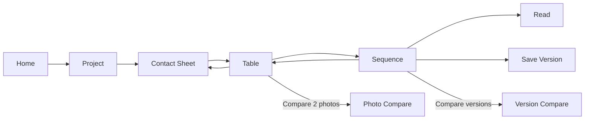
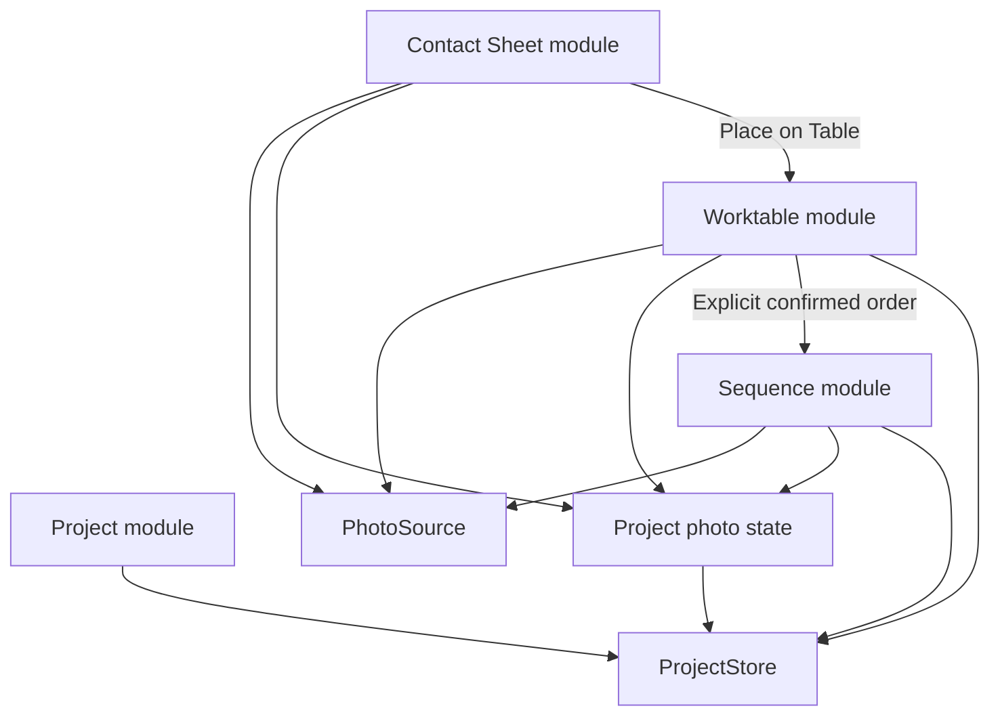
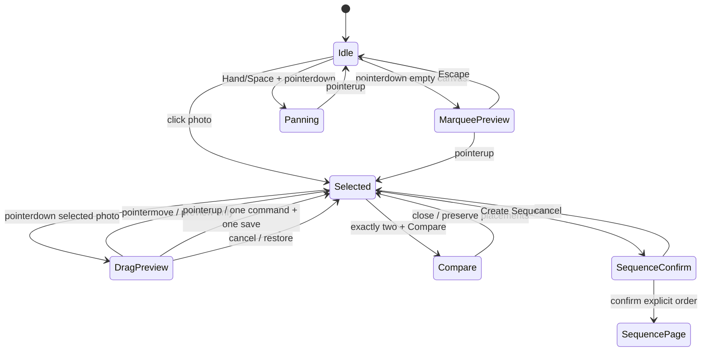

---
tags:
  - PhotoFlex
  - PRD
  - 产品需求
  - MVP
created: 2026-08-25
updated: 2026-08-30
status: approved-direction
version: 0.2
---

# PhotoFlex Sequence MVP 产品需求文档

## 一、版本说明

- 2026-08-25：v0.1，形成最初 Sequence / Pool / Whiteboard 构想。
- 2026-08-30：v0.2，确认以 Contact Sheet / Table / Sequence 为核心，取消 Pool 与 Whiteboard 用户界面。

## 二、背景与目标

### 2.1 背景

PhotoFlex 面向长期项目创作的摄影师、摄影爱好者与摄影专业学生，提供一个本地优先、轻量、不会修改原片的照片选择与排序工作环境。

摄影师通常需要先从大量照片中做判断，再把候选照片放在一个可自由比较和组织的工作桌面上，最后形成精确的一维阅读顺序。现有通用图库、白板和排版工具往往把这三个阶段混在一起，难以保持创作意图清晰。

### 2.2 产品目标

1. 提供快速、可恢复的全量照片浏览与筛选。
2. 提供摄影师专用的 Table，支持自由摆放、比较、分组和堆叠。
3. 提供独立的 Sequence 编辑与 Read 模式，保存准确阅读顺序。
4. 支持多个命名 Sequence 版本与显式比较。
5. 始终保持原片零写入，本地离线也能完成核心闭环。

### 2.3 非目标

MVP 前三期不做：

- 通用 Whiteboard 用户界面；
- 真实物理碰撞或随机旋转；
- AI 自动判断照片质量或自动生成关系；
- 复杂 Relationship View；
- 多人实时协作；
- 复杂摄影书排版与生产级 PDF 输出。

### 2.4 北极星指标

> 活跃项目中，摄影师将照片放上 Table、创建第二个命名 Sequence 版本，并至少完成一次 Table 照片比较或 Sequence 版本比较的项目比例。

目标：Alpha 阶段达到 60% 以上。样本不足 30 个有效项目时，只作为方向性信号。

## 三、用户与核心路径

### 3.1 用户画像

- 进行长期摄影项目创作的摄影师；
- 需要制作作品集、摄影书或展览序列的摄影学生与爱好者；
- 已完成基础后期，希望从大量照片中形成主题与叙事的人。

### 3.2 核心场景

1. 用户创建项目并连接一个或多个本地照片文件夹。
2. 在 Contact Sheet 中浏览全量照片，筛选、Pick / Reject、批量选择。
3. 使用 `Place on Table` 把候选照片放到 Table。
4. 在 Table 上自由移动、多选、框选、排列、分组、堆叠和比较照片。
5. 用户显式选择照片并通过顺序确认条创建 Sequence。
6. 在 Sequence 中精确调整一维顺序，保存命名版本，并使用 Read 模式观看。
7. 用户可继续回到 Contact Sheet 或 Table 修改候选关系，但这些操作不能静默改变现有 Sequence。

### 3.3 核心体验路径



### 3.4 产品对象

| 对象 | 定义 | 是否持久化 | 是否定义 Sequence 顺序 |
|---|---|:---:|:---:|
| Contact Sheet view | 对全部已索引照片的当前筛选和排序结果 | 只保存必要 resume 状态 | 否 |
| Pick / Reject | 摄影师对照片的项目级判断 | 是 | 否 |
| Pin | 项目级研究标记，可跨重启保留 | 是 | 否 |
| Table membership | 照片是否位于工作桌面 | 是 | 否 |
| Table placement | 照片在桌面的 x / y / z 与 cluster 状态 | 是 | 否 |
| Selection | 当前页面的临时选中集合 | 否 | 否 |
| Compare A / B | 当前比较工具的临时两个槽位 | 否 | 否 |
| Sequence items | 明确保存的阅读单元及其一维顺序 | 是 | 是 |

### 3.5 产品指标

| 指标 | 目标 | 完成事件与口径 |
|---|---:|---|
| 创建项目并成功导入照片 | >80% | `project_created` 且至少 1 张 `photos_imported` 成功 |
| 完成一次 Contact Sheet 判断 | >70% | 至少一次成功持久化的 `photo_decision_changed` |
| 将照片放上 Table | >70% | 至少一次成功持久化的 `photos_placed_on_table` |
| 完成一次 Table 编排 | >70% | `table_layout_saved`，且至少有一次 move / arrange command |
| Table 活跃时长 | >2 min | `table_opened` 到离开；连续无操作超过 60 秒暂停 |
| 完成两张照片比较 | >50% | `table_compare_completed`，成功加载并观看两张照片 |
| 创建并保存 Sequence | >80% | `sequence_created`、`sequence_saved` 均成功 |
| 创建第二个命名版本 | ≥60% | 活跃项目至少有两个不同命名版本 |
| 完成 Sequence 版本比较 | ≥60% | 至少两个版本的项目中触发 `version_compare_completed` |
| 在 Read 模式停留 | >5 min | 记录 active time 的均值、中位数与样本数 |
| 原片误改、误移、误删 | 0 | 文件前后检查、故障测试与用户报告 |
| 10,000 张 Contact Sheet 浏览 | 首屏缩略图 ≤2 秒，滚动无持续卡顿 | 固定 fixture 重复 benchmark |
| 已确认数据丢失 | 0 | 强制关闭、恢复、迁移与存储失败测试 |

推荐漏斗：

```text
landing_viewed
→ project_created
→ photos_imported
→ photos_placed_on_table
→ table_layout_saved
→ sequence_saved
→ version_2_created
→ table_compare_completed / version_compare_completed
```

只有状态持久化成功才能记录完成事件。按钮点击或页面打开不算完成。

## 四、信息架构

### 4.1 一级导航

```text
Home / Project / Contact Sheet / Table / Sequence
```

- Compare 是 Table 或 Sequence 内的 action，不是一级导航。
- 不提供 Pool 页面、Pool tray 或 Whiteboard 页面。
- Project 在没有照片时仍可进入；Contact Sheet 需要至少一个可读取 Source。
- Table 无照片时显示引导空态，并返回 Contact Sheet。

### 4.2 模块关系



### 4.3 状态归属原则

```text
ProjectWorkspace
├── photoStates[photoId]
│   ├── decision: unrated | pick | reject
│   └── pinned: boolean
├── worktableDraft
│   ├── entryOrder
│   ├── placements[photoId]: x / y / z
│   └── clusters（M2.2）
└── sequenceDraft
    └── SequenceItem[]
```

`inTable` 由 placement 是否存在推导，不保存重复 boolean。Table x/y 与 Sequence item order 必须独立持久化。

## 五、功能需求

### 5.1 Home

1. 创建项目。
2. 搜索、打开、重命名、删除项目。
3. 显示项目更新时间、Source 数量和 Table 照片数量。
4. 删除项目不删除原片。

### 5.2 Project

1. 连接、刷新、重新授权和移除本地 Source。
2. 显示索引进度、成功、跳过和失败数量。
3. 编辑项目名称与 memo。
4. 进入 Contact Sheet、Table 或已有 Sequence。
5. 移除 Source 不得静默删除 Table placements 或 Sequence items。

### 5.3 Contact Sheet

1. 浏览全量已索引照片，支持大数据量虚拟化。
2. 按来源、文件名、时间和决策状态筛选/排序；只影响当前 view。
3. 单选、多选、Shift 范围选择、全选、反选。
4. 显示独立的 `PINNED`、`ON TABLE`、`MISSING` 状态。
5. 使用 `Place on Table` 幂等添加当前选择。
6. 大图预览支持前后浏览、Fit、局部缩放、Pick / Reject、Pin 和 Place on Table。
7. Contact Sheet 的排序、过滤、选择和缩放永远不能修改 Sequence。

### 5.4 Table / Worktable

#### M2.1

1. 显示所有 Table placements 和 missing placeholders。
2. Select / Hand 两种明确工具状态。
3. 单选、Ctrl/Cmd 多选、Shift 增选、空白区域框选。
4. 自由拖动一张或多张照片。
5. pan、zoom、Fit all；坐标转换集中处理。
6. Grid、Row、Align 和 Bring to front。
7. `Remove from Table` 只移除 membership，不删除原片或其他状态。
8. Undo / Redo 覆盖 place、move、arrange、z-order 和 remove。
9. 一个完整 pointer gesture 只产生一个 command 和一个 undo step。
10. command 成功后持久化 Worktable snapshot；拖动预览期间不写 IndexedDB。

#### M2.2

1. Group：照片一起移动，但仍全部可见。
2. Stack：照片紧凑重叠，有显式内部顺序和顶部照片。
3. 选择恰好两张照片后打开 Compare；关闭后保留原位置和选择。
4. Pin 为 project-wide 持久化状态，不限制只能 Pin 两张。
5. 从显式选择创建 Sequence，必须先打开顺序确认条。
6. 确认条默认使用 Table `entryOrder` 中的选中子序列，不读取 x/y。

#### M2.3

1. Table named snapshot。
2. memo / paper note。
3. 手工 relationship label。
4. print-size simulation。

### 5.5 Sequence

1. 使用稳定 `SequenceItemId` 表示阅读单元。
2. 支持 add、move、remove、多选、undo / redo。
3. 横向编辑条提供明确插入线与顺序编号。
4. Sequence 可引用同一 PhotoId，但每个 item 保持独立 ID。
5. 支持命名 Sequence 与不可静默覆盖的版本。
6. Read 模式不改变顺序，支持键盘前后阅读与 Pin。
7. Table 位置变化不能修改 Sequence。
8. Contact Sheet 排序或过滤不能修改 Sequence。
9. 缺失文件保留原 item 位置并显示 placeholder。

### 5.6 Compare

Compare 不持有独立集合：

- **Table Photo Compare**：由当前显式选择的两张照片进入；退出后保留 Table 状态。
- **Sequence Version Compare**：由两个已保存版本进入；比较 added、removed、moved 等差异。
- Pin 可在 Compare 中修改，但 Compare A / B 槽位本身不持久化。

## 六、核心交互状态



## 七、关键不变量

1. Contact Sheet 排序、过滤、选择和缩放不改变 Sequence。
2. Table move、arrange、group、stack 和 viewport 不改变 Sequence。
3. 一次完整拖拽只产生一个 command、一个 undo step 和一次 snapshot save。
4. Remove from Table 不删除原始照片，也不清除 Pick、Pin 或现有 Sequence 引用。
5. 缺失文件保留 Table placement 和 Sequence item 的位置。
6. Pin、Pick / Reject、Table membership 和 selection 是不同状态。
7. `inTable` 只能由 Worktable membership 推导，不允许与另一个字段双写。
8. Create Sequence 不按 Table x/y 自动排序，必须由用户确认顺序。
9. Compare 不建立第四套持久化照片集合。
10. 所有核心功能在无网络、无 AI 时可用。

## 八、持久化与迁移要求

1. Workspace 增加 `photoStates` 与 `worktableDraft`，继续保留独立 `sequenceDraft`。
2. 旧 `poolPhotoIds` 自动迁移为 Worktable：
   - 原数组顺序成为 `entryOrder`；
   - 使用固定、确定性的 Grid 生成 x / y / z；
   - 迁移后删除 `poolPhotoIds`，不长期双写。
3. Pin 作为 project-wide state 跨重启持久化。
4. Worktable command history 在 M2.1 只保留当前 session；持久化的是 command 后 snapshot。
5. viewport 可作为 resume context 保存，但 pan / zoom 不进入 authoring undo history。
6. Memory 与 IndexedDB adapter 必须通过同一 ProjectStore contract tests。
7. Source access 失败或 photo index 缺失不能删除 Worktable / Sequence 引用。

## 九、验收标准

### 9.1 M2.1

- 从 Contact Sheet 选择多张照片并 Place on Table，重复操作不会产生重复 placement。
- 多次 pointermove 后 pointerup，只记录一次 move 和一次 undo。
- Undo 一次可恢复整次多选拖动。
- Grid / Row 不改变 `entryOrder` 或 Sequence。
- Remove from Table 后照片仍能在 Contact Sheet 中打开。
- 刷新页面后恢复 Table 位置；undo history 重新开始。
- missing photo 在原位置显示 placeholder。
- Contact Sheet 的排序/过滤测试证明 `sequenceDraft` 未变化。

### 9.2 M2.2

- Group 与 Stack 具有可区分的视觉和行为。
- Compare 只在恰好两张照片选择时可用，关闭后坐标不变。
- Pin 重启后仍存在，且与 Compare 槽位无关。
- Create Sequence 显示顺序确认条，调整后生成新的稳定 SequenceItemId。
- Table 移动后已创建 Sequence 顺序保持不变。

## 十、实现阶段

### M2.0：术语与数据地基

- Worktable contracts / editor / interface tests；
- workspace schema migration；
- Pool → Table 一次性迁移；
- 退役 Whiteboard contract；
- 新路由与页面文件骨架。

### M2.1：Table 基础闭环

- Place on Table、自由移动、多选、框选；
- pan / zoom、Grid / Row / Align；
- Remove、undo / redo、IndexedDB 恢复；
- missing placeholder 与基础 E2E。

### M2.2：比较与成序

- Group、Stack、Photo Compare、Pin；
- Create Sequence 顺序确认；
- Sequence Edit / Read 基础。

### M2.3：延伸表达

- snapshot、memo、关系标签、打印尺寸模拟。

## 十一、产品原则

1. **原片零写入**：不移动、重命名、覆盖或删除原片。
2. **创作判断属于用户**：产品提供观看与组织条件，不给艺术质量分数。
3. **空间关系不等于阅读顺序**：Table 与 Sequence 永远通过显式动作连接。
4. **版本优于覆盖**：已保存的创作节点不可被静默改写。
5. **恢复优于提醒**：项目状态服务于重新进入创作。
6. **本地核心独立成立**：无网络、无 AI 也能完成核心闭环。
7. **摄影师工作桌优先**：先做专用 Table，不扩成通用白板。
8. **错误可解释、工作可恢复**：部分失败不抹掉已成功状态。

## 十二、相关设计文档

- [Worktable 产品与模块设计基线](./Worktable_Architecture_Interaction_Proposal.md)
- [Contact Sheet / Worktable / Sequence React + TypeScript 资源建议](./Contact_Sheet_Sequence_React_TS_Resources.md)
