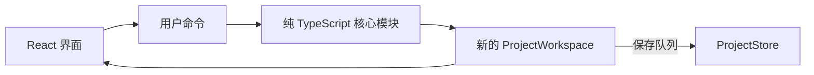

---
tags:
  - PhotoFlex
  - MVP
  - 技术架构
created: 2026-08-26
updated: 2026-08-26
status: draft
version: 0.5
---

# PhotoFlex MVP 开发技术架构方案

## 1. 这份方案解决什么

第一阶段只实现一条核心闭环：

> 导入照片 → 筛选到 Pool → 编辑序列 → 保存命名版本 → 比较两个版本

白板只是另一种排序方式：用户自由摆放照片，确认后按“从上到下、同一行从左到右”回写线性序列。白板布局不是作品，也不是通用白板数据。

当前只开发网页，目标浏览器为桌面版 Chrome 和 Edge。未来桌面端确定使用 **Tauri 2**：复用同一套 React 界面与核心逻辑，只增加 Tauri 壳，并替换文件读取和项目存储的适配器。Tauri 的 Rust 与原生构建链不进入当前网页阶段。

## 2. 范围边界

### 2.1 第一阶段包含

- 创建、打开和重命名 Project；
- 选择一个或多个本地 JPEG 文件夹作为 Source；
- Contact Sheet 浏览与预览；
- 将照片加入或移出 Project Pool；
- 建立、拖动和删除 Sequence 中的照片；
- 横向、网格、全景和单张大图观看；
- 保存不可变的命名版本；
- 任意选择两个版本进行只读 A/B Compare；
- 从历史版本创建新的工作副本；
- 简单白板排序：单选/框选、移动、删除、保存排序或放弃；
- 将项目结构和全部版本导出为 JSON 备份，并能重新导入恢复；
- 本地自动保存和基础匿名事件记录。

### 2.2 第一阶段不包含

- 摄影书排版、页面、单双页和作品 PDF 导出；项目 JSON 备份不属于作品导出；
- 文字卡、图形、连线、便签、嵌套画布和实时协作；
- RAW 处理、完整色彩管理和 ExifTool；
- 云同步、账号、分享、社区和 AI；
- 同时开发桌面壳；
- 把 10,000 张照片性能 Gate 当成首个交互切片的阻塞条件。

## 3. 技术选型

| 位置 | 选择 | 原因 |
|---|---|---|
| 语言 | TypeScript | 与技术 Spike 一致；核心逻辑可在网页和桌面壳复用 |
| 界面 | React 19 | 原型验证后的正式界面适合按模块组织，技术 Spike 已使用 |
| 构建 | Vite 7 | 启动和构建简单，可输出静态网页，也可被桌面壳加载 |
| 包管理 | pnpm | 与技术 Spike 保持一致，锁定依赖版本 |
| 核心状态 | 纯 TypeScript reducer/函数 | 不依赖 React、DOM 或宿主，容易测试和复用 |
| 页面状态 | React Context + `useReducer` | 第一阶段规模足够，不急于引入额外状态库 |
| 本地项目数据 | IndexedDB | 可保存结构化项目、序列草稿和版本；比 localStorage 更适合较大数据 |
| 图片读取 | File System Access API，必要时用目录输入回退 | 网页端本地读取，不上传原片；当前明确支持 Chrome/Edge |
| 图片显示 | Object URL + 缩略图缓存 + 虚拟列表 | 避免把原图内容塞进全局状态，也避免同时渲染全部照片 |
| 测试 | Vitest + React Testing Library + Playwright | 分别覆盖纯逻辑、界面模块和核心用户路径 |
| 发布 | 静态托管 + HTTPS | 无需第一阶段后端，部署最简单 |

不采用 SSR、微服务、GraphQL、服务端数据库或复杂状态框架。PhotoFlex 当前难点是本地照片、序列状态和交互性能，不是服务端渲染。

## 4. 总体代码结构

建议第一阶段保持一个应用，不提前建立复杂 monorepo：

```text
photoflex-mvp/
├── src/
│   ├── app/                    # 启动、路由、模块装配
│   ├── modules/
│   │   ├── project/            # Project 与 Source 管理
│   │   ├── library/            # Contact Sheet、Pool、预览
│   │   ├── sequence/           # 工作序列、排序、undo/redo
│   │   ├── versioning/         # 命名版本、打开历史版本
│   │   ├── compare/            # 两版本只读比较
│   │   └── whiteboard-sort/    # 临时自由排序与顺序回写
│   ├── contracts/              # 跨模块契约的唯一代码来源
│   │   ├── ids.ts              # 品牌 ID 与共享常量
│   │   ├── sequence.ts         # Sequence/Whiteboard 契约
│   │   ├── versioning.ts       # 版本与 Diff 契约
│   │   ├── persistence.ts      # ProjectStore/PhotoSource 契约
│   │   ├── backup.ts           # 可移植备份格式
│   │   └── index.ts            # 唯一公共导出入口
│   ├── platform/
│   │   ├── browser/            # IndexedDB 与浏览器文件夹适配器
│   │   └── memory/             # 测试用内存适配器
│   ├── shared/                 # ID、错误结果、通用小工具
│   └── styles/                 # 全局样式和设计变量
├── tests/
│   ├── integration/
│   └── e2e/
└── public/
```

每个业务模块只暴露少量接口，内部可以包含 reducer、查询函数和 React 视图。测试从模块接口验证行为，不依赖内部文件布局。

### 4.1 契约的唯一来源

- M0 实现完成后，`src/contracts/index.ts` 及其直接导出的类型、常量是跨模块接口的唯一代码来源；Sequence、Whiteboard、Versioning、适配器和测试只能从这里导入，不得各自重定义同名类型；
- 系统架构文档只描述模块责任、流程和行为承诺，不再维护一套并列的 TypeScript 接口；本文件中的代码块是 M0 前的契约草案，M0 落地时必须原样迁入 `src/contracts/`，之后以代码为准；
- 修改 `SequenceItemId`、命令、错误联合、存储或备份格式时，先修改 canonical contract（唯一正式契约）及其契约测试，再同步文档中的行为说明；
- `PhotoId` 只能标识照片，`SequenceItemId` 才能标识序列中的一次出现。任何排序模块都不得用 `PhotoId[]` 表达 Sequence 的位置顺序。

## 5. 核心模块

### 5.1 共享身份与结果类型

所有跨模块身份都使用独立类型。运行时仍是字符串，但 TypeScript 不允许把 VersionId、PhotoId 和 ProjectId 混用。

```ts
type Brand<T, Name extends string> = T & { readonly __brand: Name };

type ProjectId = Brand<string, "ProjectId">;
type SourceId = Brand<string, "SourceId">;
type PhotoId = Brand<string, "PhotoId">;
type SequenceItemId = Brand<string, "SequenceItemId">;
type VersionId = Brand<string, "VersionId">;
type WorkspaceRevision = Brand<number, "WorkspaceRevision">;

const MVP_SEQUENCE_ITEM_LIMIT = 500 as const;

type Result<T, E> =
  | { ok: true; value: T }
  | { ok: false; error: E };
```

取消、权限丢失、找不到数据、revision 冲突、空间不足和 I/O 失败都属于接口中的预期结果，不通过异常传递。异常只表示编程错误或违反模块内部不变量；适配器必须把可预期的平台异常转换为下文的错误联合类型。

### 5.2 Sequence 模块

这是第一阶段最重要的深模块。界面只需要发出用户意图：

```ts
interface SequenceItem {
  id: SequenceItemId;
  photoId: PhotoId;
}

interface SequenceDraft {
  projectId: ProjectId;
  baseVersionId?: VersionId;
  items: readonly SequenceItem[];
}

type SequenceEditCommand =
  | { type: "add"; items: SequenceItem[]; at?: number }
  | { type: "move"; itemIds: SequenceItemId[]; to: number }
  | { type: "remove"; itemIds: SequenceItemId[] };

type SequenceCommandError =
  | { kind: "unknown-item"; itemId: SequenceItemId }
  | { kind: "duplicate-item"; itemId: SequenceItemId }
  | { kind: "invalid-target"; target: number }
  | {
      kind: "sequence-limit-exceeded";
      limit: typeof MVP_SEQUENCE_ITEM_LIMIT;
      current: number;
      attempted: number;
    };

interface SequenceEditor {
  snapshot(): SequenceDraft;
  execute(command: SequenceEditCommand): Result<SequenceDraft, SequenceCommandError>;
  undo(): SequenceDraft;
  redo(): SequenceDraft;
  canUndo(): boolean;
  canRedo(): boolean;
}

createSequenceEditor(draft: SequenceDraft): SequenceEditor;
```

排序、批量移动、重复项检查和 undo/redo 都藏在模块内部。React 界面不直接修改数组。`SequenceItemId` 标识序列中的具体实例，`PhotoId` 标识照片，因此未来即使允许同一照片重复出现，版本 Diff 也不会混淆。持久化 revision 属于整个 ProjectWorkspace，不属于 SequenceDraft，也不由 SequenceEditor 增长。

Undo/Redo 栈只存在于当前页面会话，不写入 IndexedDB。最后一次成功自动保存的 SequenceDraft 是隐式 checkpoint：刷新、崩溃恢复或重新打开项目时恢复该 checkpoint，但不能继续撤销 checkpoint 之前的操作。

这里“不持久化”的只是 Undo/Redo 历史栈，不是撤销或重做后的工作结果。每次 `undo()`/`redo()` 都产生新的 SequenceDraft，并像普通编辑命令一样进入同一个串行保存队列。若前一条命令仍在保存，撤销结果排在它之后；保存队列始终使用上一笔成功返回的持久化 revision 作为下一笔 `expectedRevision`，只有撤销结果保存成功后界面才能显示“已保存”。非冲突的瞬时保存失败会暂停队列并保留最新内存状态，用户重试后从最后成功的 revision 保存最新状态；revision conflict 则必须进入下文的冲突处理，不能盲重试。

这个限制必须出现在界面里：Undo/Redo 控件的常驻 tooltip 写明“撤销记录仅保留到本次关闭/刷新”，用户第一次进入 Sequence 时显示一次非阻塞提示；“已保存”旁说明崩溃后可恢复最后 checkpoint。不能只把限制藏在架构文档或验收条款中。

第一阶段把 500 项定义为 SequenceDraft 和 SequenceVersion 的硬上限，而不是仅有性能测试覆盖的软建议。超限的 `add` 命令整体失败且不部分写入，UI 显示当前数量、上限和本次尝试数量；图库和 Pool 仍可包含最多 10,000 张已索引照片。该常量由 `src/contracts/ids.ts` 唯一定义，Sequence、Versioning、备份导入和界面共同引用。

### 5.3 Versioning 模块

```ts
interface VersionSummary {
  id: VersionId;
  projectId: ProjectId;
  parentVersionId?: VersionId;
  name: string;
  itemCount: number;
  createdAt: string;
}

interface SequenceVersion extends VersionSummary {
  memo?: string;
  items: readonly SequenceItem[];
}

interface CreateVersionInput {
  id: VersionId;
  projectId: ProjectId;
  parentVersionId?: VersionId;
  name: string;
  memo?: string;
  items: readonly SequenceItem[];
  createdAt: string;
}

type VersionValidationError =
  | { kind: "empty-name" }
  | { kind: "empty-sequence" }
  | { kind: "duplicate-item"; itemId: SequenceItemId }
  | { kind: "sequence-limit-exceeded"; limit: typeof MVP_SEQUENCE_ITEM_LIMIT; actual: number };

interface VersionDiff {
  leftVersionId: VersionId;
  rightVersionId: VersionId;
  added: SequenceItemId[];
  removed: SequenceItemId[];
  moved: Array<{ itemId: SequenceItemId; from: number; to: number }>;
}

createVersionSnapshot(
  input: CreateVersionInput
): Result<SequenceVersion, VersionValidationError>;
openVersionAsDraft(version: SequenceVersion): SequenceDraft;
compareVersions(
  left: SequenceVersion,
  right: SequenceVersion
): Result<VersionDiff, { kind: "different-projects" }>;
```

关键规则：

- `VersionId` 是唯一身份，版本名称只是可重复的用户标签；
- 已保存版本不可变，列表使用 `VersionSummary`，只在打开或比较时加载完整快照；
- 版本名称不能为空，同名时同时显示时间和 VersionId 的短形式；
- 打开旧版本时创建工作副本，不覆盖历史；
- Compare 只读，不在比较界面修改版本；
- UI 只向 Versioning 模块传入两个 VersionId，不在路由或控件间传递完整快照；
- Versioning 模块通过 ProjectStore 加载两个快照，再调用纯 `compareVersions`；
- Added/Removed 使用 Map/Set，Moved 使用稳定实例 ID 与最长递增子序列，整体复杂度不得差于 O(n log n)；
- 两个 500 项版本的 Diff 在目标硬件上 p95 ≤200ms；第一阶段不允许创建超过 500 项的序列或版本，因此不承诺也不接收 10,000 项序列 Diff。

### 5.4 Whiteboard Sort 模块

```ts
type WhiteboardAction =
  | { type: "select"; itemIds: SequenceItemId[] }
  | { type: "move"; itemIds: SequenceItemId[]; dx: number; dy: number }
  | { type: "remove"; itemIds: SequenceItemId[] }
  | { type: "set-viewport"; zoom: number; x: number; y: number };

type WhiteboardError =
  | { kind: "unknown-item"; itemId: SequenceItemId }
  | { kind: "invalid-viewport" }
  | { kind: "stale-order-preview" };

interface WhiteboardItem {
  sequenceItemId: SequenceItemId;
  x: number;
  y: number;
}

interface WhiteboardDraft {
  layoutRevision: number;
  entryOrder: readonly SequenceItemId[];
  items: Readonly<Record<SequenceItemId, WhiteboardItem>>;
  selectedIds: readonly SequenceItemId[];
  viewport: { zoom: number; x: number; y: number };
}

interface WhiteboardOrderPreview {
  layoutRevision: number;
  itemIds: readonly SequenceItemId[];
}

openWhiteboard(items: readonly SequenceItem[]): WhiteboardDraft;
applyWhiteboardAction(
  draft: WhiteboardDraft,
  action: WhiteboardAction
): Result<WhiteboardDraft, WhiteboardError>;
deriveWhiteboardOrder(draft: WhiteboardDraft): WhiteboardOrderPreview;
commitWhiteboard(
  draft: WhiteboardDraft,
  preview: WhiteboardOrderPreview
): Result<readonly SequenceItemId[], WhiteboardError>;
discardWhiteboard(draft: WhiteboardDraft): readonly SequenceItemId[];
```

只实现移动、框选、批量移动、删除、视口平移/缩放和保存/放弃。白板卡片使用固定尺寸和不受 zoom 影响的世界坐标；线性顺序按以下确定性规则推导：

1. 使用卡片中心点，先按中心 Y 从小到大扫描；
2. 当前项与某行首项的中心 Y 距离不超过半个卡片高度时归入该行；若同时匹配多行，选择中心距离最近的行，再并列时选择更上方的行；
3. 行按其首项中心 Y 排序，行内按中心 X、中心 Y、进入白板前的 `entryOrder`、最后按 `SequenceItemId` 字典序依次打破平局；完全重叠时因此保持原进入顺序；
4. 被删除项不进入结果，同一 `PhotoId` 的不同 SequenceItemId 必须分别保留。

第一次点击“保存排序”只调用 `deriveWhiteboardOrder`，在卡片上显示序号并展示只读线性预览条；用户再次确认后才调用 `commitWhiteboard`。任何移动或删除都会增加 `layoutRevision` 并使旧预览失效，避免用户确认后布局又变化。斜放或跨行仍可能不符合用户意图，但结果必须可预览、可取消且每次推导一致。坐标不写入命名版本，重新进入时按当前序列生成初始布局。

### 5.5 Library 模块

负责 Source 状态、照片元数据、分页/虚拟列表、Pool 和预览。React 状态只保存 `photoId` 和必要元数据，不保存图片二进制。

## 6. 两个真实的平台接口

“接口缝隙”是以后可以替换实现、而不用修改调用者的位置。第一阶段只保留两个确实会随网页/桌面环境变化的缝隙。

### 6.1 PhotoSource 接口

```ts
type SourceStatus =
  | "loading" | "ready" | "partial" | "offline"
  | "permission-lost" | "empty" | "error";

interface SourceGrant {
  sourceId: SourceId;
  displayName: string;
  status: SourceStatus;
  restored: boolean;
}

interface SourceRecord {
  id: SourceId;
  displayName: string;
  createdAt: string;
  removedAt?: string;
}

interface SourceRuntimeState {
  sourceId: SourceId;
  status: SourceStatus;
  discoveredCount: number;
  indexedCount: number;
  skippedCount: number;
  failedCount: number;
  errorMessage?: string;
}

interface PhotoRef {
  id: PhotoId;
  sourceId: SourceId;
  relativePath: string;
  width: number;
  height: number;
}

interface PhotoPage {
  items: PhotoRef[];
  nextCursor: string | null;
  issues: PhotoIssue[];
}

type PhotoIssue =
  | { kind: "unsupported-file"; relativePath: string }
  | { kind: "unreadable-file"; relativePath: string }
  | { kind: "missing-file"; photoId: PhotoId; relativePath: string };

interface PreviewLease {
  url: string;
  release(): void;
}

type SourceError =
  | { kind: "cancelled" }
  | { kind: "permission-denied"; sourceId?: SourceId }
  | { kind: "permission-lost"; sourceId: SourceId }
  | { kind: "source-not-found"; sourceId: SourceId }
  | { kind: "photo-not-found"; photoId: PhotoId }
  | { kind: "preview-unavailable"; photoId: PhotoId }
  | { kind: "io"; retryable: boolean };

type SourceScanEvent =
  | { kind: "progress"; state: SourceRuntimeState }
  | { kind: "completed"; state: SourceRuntimeState };

interface PhotoSource {
  chooseFolder(existingSourceIds: readonly SourceId[]): Promise<Result<SourceGrant, SourceError>>;
  restoreFolder(sourceId: SourceId): Promise<Result<SourceGrant, SourceError>>;
  forgetGrant(sourceId: SourceId): Promise<Result<void, SourceError>>;
  scan(sourceId: SourceId, signal?: AbortSignal): AsyncIterable<Result<SourceScanEvent, SourceError>>;
  getSourceState(sourceId: SourceId): Promise<Result<SourceRuntimeState, SourceError>>;
  listPhotos(sourceId: SourceId, cursor?: string, limit?: number): Promise<Result<PhotoPage, SourceError>>;
  getPhoto(photoId: PhotoId): Promise<Result<PhotoRef, SourceError>>;
  thumbnail(photoId: PhotoId): Promise<Result<PreviewLease, SourceError>>;
  preview(photoId: PhotoId): Promise<Result<PreviewLease, SourceError>>;
}
```

- 现在：BrowserPhotoSource 使用文件夹选择、FileSystemHandle/Object URL；
- 测试：MemoryPhotoSource 使用固定 fixture；
- 以后：TauriPhotoSource 使用受限的 Tauri command，并在应用数据目录生成代理图。

接口中不提供 `read(anyPath)`、`write(anyPath)` 或 shell 命令，界面也不接收绝对路径。

PhotoRef 的文件定位身份是 `(sourceId, normalizedRelativePath)`，PhotoId 是该身份在项目中的稳定内部 ID。规则如下：

- `relativePath` 相对 Source 根目录、保留大小写、统一使用 `/`，不得包含绝对路径或 `..`；不同 Source 中的同名文件不会冲突；
- `chooseFolder(existingSourceIds)` 必须由适配器比较本项目已有目录身份；浏览器适配器使用目录句柄的同一条目比较，Tauri 适配器在内部使用规范化目录身份。同一目录再次选择时返回已有 SourceId 并刷新授权，不创建第二个 Source；
- Source 可访问但某个路径不存在时返回 `missing-file`，保留 PhotoRef、Pool、Sequence 和版本位置并显示“文件已移动或重命名”；路径变化视为旧引用失联，不按同名文件静默重连；
- Source 整体无权限与单个文件缺失是两种状态：前者为 `permission-lost`，后者为 `missing-file`。

`PreviewLease` 定义 Object URL 的所有权：BrowserPhotoSource/内部 PreviewCache 创建并持有 URL，React 调用方只持有 lease，不直接调用 `URL.revokeObjectURL`。同一照片可共享 URL 并使用引用计数；`release()` 必须幂等。最后一个 lease 释放后，URL 可以进入最多保留 16 项的 idle LRU；超出 16 项时从最旧项开始 revoke。Source 失效和页面卸载时不等待 LRU，全部 revoke。虚拟列表只为可见区和 overscan 持有 lease；大图预取只持有“当前项及前后各一项”，当前项变化后立即释放离开该窗口的 lease。已 revoke 的 URL 不得再次返回。

### 6.2 ProjectStore 接口

```ts
interface ProjectSummary {
  id: ProjectId;
  name: string;
  updatedAt: string;
  lastOpenedAt: string;
  sourceCount: number;
  poolCount: number;
  coverPhotoId?: PhotoId;
}

interface CreateProjectInput {
  id: ProjectId;
  name: string;
  createdAt: string;
  memo?: string;
  expectedPhotoCount?: number | null;
  initialSource?: SourceRecord;
}

type NotFoundError = {
  kind: "not-found";
  entity: "project" | "version";
  id: string;
};

type UnavailableError = { kind: "unavailable"; retryable: boolean };
type StorageSchemaError =
  | { kind: "unsupported-storage-schema"; found: number; supported: readonly number[] }
  | { kind: "migration-failed"; from: number; to: number };
type StorageAccessError = UnavailableError | StorageSchemaError;
type CorruptDataError = { kind: "corrupt-data"; entityId: string };
type LoadError = NotFoundError | CorruptDataError | StorageAccessError;
type SaveError =
  | NotFoundError
  | {
      kind: "conflict";
      expectedRevision: WorkspaceRevision;
      actualRevision: WorkspaceRevision;
    }
  | { kind: "quota-exceeded" }
  | StorageAccessError;
type CreateProjectError =
  | { kind: "project-id-exists"; projectId: ProjectId }
  | { kind: "quota-exceeded" }
  | StorageAccessError;
type VersionWriteError =
  | SaveError
  | { kind: "version-id-exists"; versionId: VersionId }
  | { kind: "invalid-version"; reason: string };
type DeleteError = NotFoundError | CorruptDataError | StorageAccessError;
type BackupError =
  | { kind: "unsupported-schema"; found: number; supported: readonly number[] }
  | { kind: "invalid-backup"; reason: string }
  | { kind: "quota-exceeded" }
  | StorageAccessError;

interface ProjectStore {
  listProjects(): Promise<Result<ProjectSummary[], CorruptDataError | StorageAccessError>>;
  createProject(input: CreateProjectInput): Promise<Result<ProjectWorkspace, CreateProjectError>>;
  loadWorkspace(projectId: ProjectId): Promise<Result<ProjectWorkspace, LoadError>>;
  saveWorkspace(
    workspace: ProjectWorkspace,
    expectedRevision: WorkspaceRevision
  ): Promise<Result<{ revision: WorkspaceRevision }, SaveError>>;
  createVersion(
    projectId: ProjectId,
    expectedRevision: WorkspaceRevision,
    version: SequenceVersion
  ): Promise<Result<{ summary: VersionSummary; revision: WorkspaceRevision }, VersionWriteError>>;
  listVersions(projectId: ProjectId): Promise<Result<VersionSummary[], LoadError>>;
  loadVersion(versionId: VersionId): Promise<Result<SequenceVersion, LoadError>>;
  deleteProject(projectId: ProjectId): Promise<Result<void, DeleteError>>;
  exportBackup(projectId: ProjectId): Promise<Result<Uint8Array, LoadError>>;
  importBackup(bytes: Uint8Array): Promise<Result<ProjectId, BackupError>>;
}
```

- 现在：IndexedDbProjectStore；
- 测试：MemoryProjectStore；
- 以后：TauriSqliteProjectStore，通过受限的 Tauri command 访问 SQLite/WAL。

`ProjectWorkspace.revision` 是工作区级、由 ProjectStore 独占写入的非负单调整数，不是 hash，也不是 Sequence 的编辑次数。创建项目时为 0；成功的 `saveWorkspace` 或 `createVersion` 每次只增加 1。

写入采用 compare-and-swap（CAS）：适配器在同一写事务中读取当前 ProjectWorkspace，只有 `current.revision === expectedRevision` 时才写入，并由存储层把新记录 revision 设为 `expectedRevision + 1`；不匹配时不做任何写入，返回包含 expected/actual 的 `conflict`。调用方不得自行覆盖 revision，也不得对 conflict 自动做 last-write-wins 或拿旧 expectedRevision 盲目重试；自动保存队列暂停并保留本地未保存状态，界面提示项目已在另一标签页/窗口修改，由用户重新加载后再继续。

两个标签页即使都先读到 revision 7，也只能有一个 CAS 成功写成 8；另一方必须得到 `conflict { expectedRevision: 7, actualRevision: 8 }`。Memory、IndexedDB 和未来 SQLite 适配器必须通过同一条并发契约测试。

### 6.3 IndexedDB 原子事务实现约束

IndexedDB 事务只在创建它的任务以及关联请求事件分发期间处于 active；当所有请求已完成、结果已处理且没有新请求时，浏览器会尝试自动提交。因此“放在同一个 async 函数里”不等于“位于同一个事务里”，`transaction.oncomplete` 也只是确认事务已经成功提交，不能阻止提前变为 inactive。

`createVersion` 的网页适配器必须遵守：

1. 在打开事务前完成版本构造、校验、序列化准备；文件读取、图片解码、计时器、网络请求和其他非 IndexedDB 异步工作不得进入事务；
2. 打开同时覆盖 `projects` 与 `versions` 的单个 `readwrite` 事务；
3. 在事务创建任务或 IndexedDB request 的 success 回调中依次排入“读 Project → 检查 CAS → `versions.add` → `projects.put`”请求；不得在请求之间等待无关 Promise。若使用 Promise 包装器，必须以真实浏览器测试证明它保持事务活跃；
4. VersionId 已存在、CAS 不匹配或任一 request 失败时不继续排写入，并 abort/让事务失败；
5. 只在 `complete` 事件后返回成功；`abort`/`error` 转换为明确错误。`complete` 是成功证据，不是保持事务存活的手段。

自动化测试必须在真实 Chromium IndexedDB 中故障注入：在 `versions.add` 成功后、`projects.put` 完成前主动 abort，随后重新打开数据库，断言既没有孤立 SequenceVersion，也没有新增 VersionId/revision；再执行成功路径，断言两处写入同时可见。

## 7. 数据模型

```ts
const INDEXED_DB_SCHEMA_VERSION = 2 as const;
const WORKSPACE_SCHEMA_VERSION = 2 as const;

interface ResumeContext {
  page: "project" | "contact-sheet";
  sourceId?: SourceId;
  filter: "all";
  anchorPhotoId?: PhotoId;
  poolCollapsed?: boolean;
}

interface ProjectWorkspace {
  schemaVersion: typeof WORKSPACE_SCHEMA_VERSION;
  projectId: ProjectId;
  name: string;
  memo: string;
  expectedPhotoCount: number | null;
  sources: SourceRecord[];
  poolPhotoIds: PhotoId[];
  sequenceDraft: SequenceDraft;
  versionIds: VersionId[];
  revision: WorkspaceRevision;
  createdAt: string;
  updatedAt: string;
  lastOpenedAt: string;
  coverPhotoId?: PhotoId;
  resumeContext?: ResumeContext;
}

const BACKUP_FORMAT = "photoflex-project-backup" as const;
const BACKUP_SCHEMA_VERSION = 1 as const;

interface ProjectBackupV1 {
  format: typeof BACKUP_FORMAT;
  schemaVersion: typeof BACKUP_SCHEMA_VERSION;
  exportedAt: string;
  appVersion: string;
  project: ProjectWorkspace;
  versions: readonly SequenceVersion[];
  photoManifest: ReadonlyArray<{
    sourceId: SourceId;
    photoId: PhotoId;
    relativePath: string;
  }>;
}
```

IndexedDB 使用独立 object store；未来 SQLite 使用对应的表：

| 记录集合 | 内容 | 写入时机 |
|---|---|---|
| `projects` | 完整的可变 ProjectWorkspace：名称、Source、Pool、SequenceDraft、versionIds、revision | 当前工作状态变化 |
| `versions` | 完整且不可变的 SequenceVersion，以 VersionId 为 key | 只在创建版本时追加 |
| `photo-index` | PhotoRef，以 SourceId/PhotoId 建索引 | 扫描 Source 时分页写入 |
| `source-grants` | 浏览器可恢复的文件夹授权信息 | 添加或重新授权 Source 时 |
| `photo-thumbnails` | 最长边 320px 的 WebP 缩略图缓存 | 缩略图首次生成时写入 |

重要关系：

- Project 包含多个 Source；
- PhotoRef 通过 `sourceId + normalizedRelativePath` 引用原片，不复制或改写原片；
- 大量 PhotoRef 由 BrowserPhotoSource 单独索引和分页查询，不随每次序列操作重复保存；
- Pool 保存 PhotoId；SequenceDraft 和 SequenceVersion 保存由 SequenceItemId 与 PhotoId 组成的 SequenceItem；
- SequenceDraft 是唯一可编辑工作区；
- ProjectWorkspace 只保存 VersionId，不嵌入历史快照；
- SequenceVersion 是独立、完整、不可变的追加记录；
- 白板草稿是临时界面状态，确认后只回写 SequenceDraft 的 order。

`INDEXED_DB_SCHEMA_VERSION` 表示 object store/index 结构；`ProjectWorkspace.schemaVersion` 表示本地工作区记录格式；`ProjectBackupV1.schemaVersion` 表示可移植备份格式。三者独立演进，不能因为当前都为 `1` 就共用迁移判断。当前 IndexedDB 和工作区为 schema 2，备份格式仍为 schema 1。`appVersion` 只用于诊断，不参与兼容性判断。

第一阶段只读取备份 schema 1：缺少或类型错误的 `schemaVersion` 返回 `invalid-backup`；数值存在但不受支持时返回 `unsupported-schema`；两种情况都必须在任何写入前终止。未来增加格式时，先在内存中按版本逐级迁移到当前格式，再执行完整校验和原子导入，不允许静默猜测字段或部分导入。

### 7.1 IndexedDB schema 迁移

- 从第一版开始维护按整数版本顺序执行的 migration registry；打开数据库时把 `INDEXED_DB_SCHEMA_VERSION` 传给 `indexedDB.open`，object store/index 的创建或变更只在 `onupgradeneeded` 的 versionchange 事务中完成；
- 每次存储结构变化都新增 `N → N+1` 迁移和固定旧版 fixture，不修改已经发布的迁移；迁移只能执行 IndexedDB 请求，不读取照片、解码图片或等待无关 Promise；
- 其他标签页收到 `versionchange` 时立即关闭数据库连接并提示刷新，升级页面遇到 `blocked` 时明确显示“请关闭其他 PhotoFlex 标签页”，不能无限等待；
- 迁移失败必须 abort upgrade transaction，保留旧数据库，不得删除并重建；应用进入只读恢复状态，显示 `migration-failed` 并允许用户重试或使用兼容版本导出备份；
- 读取到高于当前应用支持的数据库/工作区 schema 时返回 `unsupported-storage-schema`，禁止降级写入；
- 第一阶段建立 migration runner，并覆盖新库 `0 → 1 → 2` 与已有 workspace `1 → 2` 的迁移测试；迁移失败不得产生部分写入。

### 7.2 命名版本的存储增长模型

第一阶段明确保存完整 SequenceVersion 快照，不保存相邻版本 diff。若一个项目有 `V` 个命名版本、每版 `S` 个 SequenceItem，版本存储量为 O(V × S)；自动保存只写 ProjectWorkspace，因此不会随着版本数重复重写这些快照。

选择完整快照是为了让任意版本可独立加载、损坏范围局部、Compare 不依赖版本链，并保持备份/恢复简单。代价是命名版本数线性增长。M5 必须增加“200 个版本 × 每版 500 项”的数据库占用、打开 Compare 和 JSON 备份大小基线；若实测超出浏览器配额或可接受备份体积，再通过 ADR 评估分块、压缩或增量版本，不在第一阶段预先引入 diff 链。

## 8. 状态与保存策略



- 用户命令先更新内存状态，界面立即响应；
- 拖动只在 drop 时生成一次命令，每个已完成命令进入串行保存队列；
- Project 名称和 Memo 等连续文本使用 300–500ms 防抖；
- 切换 Project、关闭页面和保存版本前立即 flush；
- 页面关闭前的异步保存只能 best-effort，因此界面必须持续显示“保存中 / 已保存 / 未保存”；
- 冲突、空间不足或 I/O 失败时不覆盖旧 revision，保留内存状态并给出对应处理和重试；
- revision conflict 不自动重试或覆盖；暂停队列并提示另一标签页/窗口已修改项目；
- 自动保存只持久化当前草稿；Undo/Redo 历史刷新后清空；
- Undo/Redo 后的草稿结果与普通命令一样进入串行保存队列；不持久化的只有历史栈；
- 最后一次成功自动保存是崩溃恢复 checkpoint；Undo/Redo 限制必须在界面可见；
- Object URL 只由 PreviewCache 按 lease 引用计数与有界 LRU 生命周期释放，React 界面不得直接 revoke；
- 命名版本保存成功后才进入 Compare 列表。

### 8.1 项目备份与恢复

- `exportBackup` 生成顶层带 `format: "photoflex-project-backup"` 和独立 `schemaVersion: 1` 的 `.photoflex.json`，包含 Project、Pool、工作草稿、全部版本，以及被引用照片的 `sourceId + relativePath` 最小清单；
- 备份不包含原片、缩略图、绝对路径或不可序列化的浏览器文件句柄；
- `importBackup` 按“解析 envelope → 检查备份 schemaVersion → 必要时迁移 → 校验 ID/引用/500 项硬上限 → 重映射 ID → 单事务写入”的顺序执行；第一阶段没有迁移器，只接受 schema 1；
- 导入后生成新的 ProjectId，并一致地重映射备份中的 VersionId、SourceId、PhotoId 和 SequenceItemId，防止与现有项目冲突；所有跨版本引用必须保持一致；
- 导入完成后要求用户按相对路径重新授权 Source 文件夹；
- 备份导出与导入必须成对交付。它们是数据安全能力，不是摄影书/PDF 作品导出。
- import 校验必须接受确定种子的 property-based/fuzz 测试：随机字节、截断 JSON、错误类型、深层对象、重复 ID、悬空引用、超长数组、501 项序列和未知 schema 都必须返回 typed error，不得抛出未处理异常；每个失败用例前后比较五个 object store，证明没有部分写入。

## 9. 网页与未来桌面端的兼容规则

1. `modules/` 和共享 React 视图不得直接导入 Tauri、Rust、Node、SQLite 或浏览器文件 API；
2. 平台能力通过应用启动时注入的 `PhotoSource` 和 `ProjectStore` 提供；
3. 业务数据只保存 ID、相对路径和元数据，不保存平台专属路径对象；
4. 网页和未来桌面端运行同一套模块契约测试；
5. 桌面阶段直接新增 TauriPhotoSource 和 TauriSqliteProjectStore，不在浏览器适配器外再包一层转发；
6. 不为了未来桌面端现在引入 Rust、Tauri CLI 或原生构建链。

## 10. 测试策略

| 层级 | 验证内容 | 工具 |
|---|---|---|
| 核心模块测试 | 排序、会话级撤销及 checkpoint、500 项硬上限、版本身份/不可变、O(n log n) diff、白板确定性推导/预览、重复 PhotoId 回写 | Vitest |
| 适配器契约测试 | CAS 双实例冲突、成功/取消/权限/缺失文件、PreviewLease 生命周期、空间不足、损坏、版本原子创建、schema migration、备份 schema/fuzz | Vitest + IndexedDB 测试环境 |
| 界面模块测试 | 按钮、键盘、选择状态和错误提示 | React Testing Library |
| 核心路径 E2E | 导入 → Pool → v1 → 修改 → v2 → Compare → 重开 → 备份/恢复 | Playwright |
| 真实浏览器性能基线 | 500/2,000/10,000 照片浏览，50/500 项排序，500 项版本 Diff p95 ≤200ms，200×500 完整版本存储/备份 | Playwright + Chromium production build + Performance API + 固定 fixture |

首阶段开发默认使用 30 张 fixture；功能闭环稳定后再运行 500、2,000 和 10,000 张基线。500 项 Diff 必须在 production build 的真实 Chrome/Chromium 页面中执行：记录浏览器版本、操作系统、CPU/内存、固定随机种子，预热 5 次后至少测量 30 次并报告 p50/p95；纯 Vitest/Node 引擎耗时只能用于回归，不能作为性能 Gate 证据。

## 11. 当前技术决策状态

| 决策 | 状态 |
|---|---|
| React + TypeScript + Vite 网页应用 | 本阶段采用 |
| 浏览器本地优先、无后端 | 本阶段采用 |
| IndexedDB 保存项目结构 | 本阶段采用，开发切片中验证 |
| 工作区与版本快照独立存储 | 本阶段采用；创建版本必须原子提交 |
| revision 并发模型 | 工作区级单调整数；同一事务内 CAS，冲突不自动覆盖或盲重试 |
| IndexedDB 事务生命周期 | 事务外准备数据；事务内只排 IDB 请求；complete/abort 作为结果证据 |
| IndexedDB schema migration | 从 v1 建 migration runner；失败不删库，未知新版本禁止降级写入 |
| Undo/Redo 只在当前会话有效 | 本阶段采用 |
| Undo/Redo 结果进入自动保存队列 | 本阶段采用；只清空历史栈，不回滚已保存结果 |
| Undo/Redo 用户提示 | Sequence 界面常驻 tooltip + 首次非阻塞说明；最后保存草稿为 checkpoint |
| Sequence/Version 最多 500 项 | 第一阶段硬上限；Library/Pool 的大图库基线不受此限制 |
| 项目 JSON 备份与恢复 | 网页 Alpha 前完成 |
| 备份格式独立 schemaVersion | 第一阶段只接受 schema 1；未知版本在写入前拒绝 |
| 原片零写入 | 硬约束 |
| 白板只输出线性顺序 | 本阶段采用 |
| 白板线性推导 | 固定行判定与 tie-break；用户预览并二次确认后才回写 |
| 命名版本存储 | 完整快照，O(V × S)；M5 测量 200×500 场景后再决定是否优化 |
| 桌面端使用 Tauri 2 | 已决定；当前网页阶段不创建桌面壳 |
| Tauri 性能、安全与 macOS Gate | 桌面 Alpha 前必须完成，当前不能视为已通过 |

## 12. 参考依据

- [MVP PRD](./PRD_Sequence.md)
- [核心工作流原型](../../prototypes/photoflex-core-prototype/README.md)
- [技术反转 Spike](../../Spike/photoflex-tech-reversal/README.md)
- [技术反转当前结论](../../Spike/photoflex-tech-reversal/results/verdict.md)
- [ADR-001：桌面端选择 Tauri 2](./ADR-001-Tauri-2-桌面端.md)
- [ADR-002：本地持久化并发、事务与迁移](./ADR-002-本地持久化并发事务与迁移.md)
- [IndexedDB 3.0：事务生命周期与原子提交](https://www.w3.org/TR/IndexedDB-3/#transaction-lifecycle)
- [MDN：IndexedDB transaction complete 事件](https://developer.mozilla.org/en-US/docs/Web/API/IDBTransaction/complete_event)
- [MDN：使用 IndexedDB 与数据库升级](https://developer.mozilla.org/en-US/docs/Web/API/IndexedDB_API/Using_IndexedDB)
