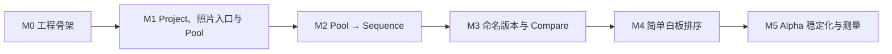

---
tags:
  - PhotoFlex
  - MVP
  - 开发流程
created: 2026-08-26
updated: 2026-08-26
status: draft
version: 0.5
---

# PhotoFlex MVP 开发流程方案

## 1. 开发目标

第一阶段不是把 PRD 中所有功能做完，而是尽快得到一个可供真实摄影师使用的序列版本 Alpha：

> 用户能从真实照片建立序列，保存至少两个命名版本，并通过 A/B Compare 说清版本差异。

开发按“可运行的纵向切片”推进。纵向切片是一次交付完整的小结果，例如“保存并重新打开一个 Project”，而不是先写完所有数据库、再写所有界面。

## 2. 工作顺序



M3 是第一阶段的核心证明。M3 未通过真实任务测试前，不开始排版、PDF、AI、协作或通用白板功能。

进入 M3 用户测试前必须出现三个相互独立、可以单独审查的证据提交：

1. `test: define workspace revision CAS`：固定 revision 单调递增语义，并通过双 Store/双标签页冲突测试；
2. `test: prove IndexedDB version transaction atomicity`：在真实 Chromium 中对双 object store 事务故障注入，证明全成或全败；
3. `perf: benchmark 500-item diff in Chromium`：在 production build 页面运行固定 fixture，提交原始测量结果，不用 Node/Vitest 数字代替。

## 3. 各切片的交付标准

### M0：工程骨架

交付：

- Vite + React + TypeScript 应用可运行；
- 在 `src/contracts/` 定义 ProjectId、PhotoId、SequenceItemId、VersionId、WorkspaceRevision、500 项上限和统一 `Result<T, E>`，由 `index.ts` 作为唯一公共导出入口；
- 建立 `Sequence`、`Whiteboard`、`Versioning`、`PhotoSource`、`ProjectStore` 和备份格式的完整接口与错误联合；业务模块、适配器和测试不得重定义同名契约；
- Browser 和 Memory 两种适配器可被应用启动时注入；
- 建立 `projects`、`versions`、`photo-index`、`source-grants`、`photo-thumbnails` 五个 IndexedDB object store；
- 建立 IndexedDB migration runner、数据库/工作区/备份三套独立 schema 版本，并完成 `0 → 1 → 2` 与 workspace `1 → 2` migration；
- 建立 Vitest、界面测试、Playwright 和 CI；
- 准备 30 张合法测试照片 fixture。

验收：

- 开发、测试、类型检查和生产构建都有单一命令；
- Memory 适配器能保存并读取一个空 Project，并能返回 not-found、conflict、quota-exceeded、corrupt-data 和 unavailable；
- IndexedDB 和 Memory 适配器通过同一套 ProjectStore/PhotoSource 契约测试；
- ProjectStore 把 revision 定义为工作区级单调整数：新项目为 0，写入在同一事务内 CAS，成功后只加 1；
- 两个 Store 实例同时从 revision 7 保存时，一个返回 revision 8，另一个返回 `conflict { expected: 7, actual: 8 }`，最终记录等于胜者且没有覆盖；
- migration `0 → 1 → 2`、workspace `1 → 2`、未知更高版本、迁移 abort、`versionchange` 关闭连接和 `blocked` 提示均有测试；迁移失败不得删除数据库；
- 核心模块中没有 `window`、DOM、Tauri 或 Rust 依赖。
- 编译级契约检查能证明 Whiteboard、Sequence 和 Versioning 使用同一个 SequenceItemId；不存在 `PhotoId[]` 形式的序列排序接口。

### M1：Project、照片入口与 Pool

交付：

- Project Home；
- 创建、打开、重命名 Project；
- 添加一个或多个 JPEG Source；
- Source 的 Loading、Ready、Partial、Permission Lost 状态；
- 用户取消、权限拒绝、权限丢失、不支持文件和 I/O 失败具有可区分结果；
- 重复选择同一个底层目录时复用已有 SourceId；不同 Source 中同名 relativePath 可并存；移动/重命名后的文件显示 `missing-file` 且不静默改绑；
- Contact Sheet 分页/虚拟浏览和大图预览；
- 从 Contact Sheet 将照片加入或移出 Project Pool；Pool 在 Project 与 Contact Sheet 间保持同步；
- `Add selected to sequence` 保留为禁用入口，并提示 Sequence 将在 M2 开放；
- PreviewLease 由缓存统一引用计数；虚拟列表与“当前图 ±1”预取窗口释放 lease 后不会提前 revoke 或长期泄漏 Object URL；
- 刷新后恢复 Project，并在需要时重新请求目录权限。

验收任务：

> 建立一个项目，添加两个包含同名 JPEG 的不同文件夹，从两个 Source 各找到一张照片；再次选择第一个目录不会新增 Source；移动其中一个文件后显示 missing-file，刷新后记录仍保留。

### M2：Pool → Sequence

交付：

- Pool 加入/移出 Sequence；
- Sequence 单张和批量拖动、删除、undo/redo；
- 横向、网格、全景和单张预览；
- 工作草稿自动保存。
- Undo/Redo 只在当前页面会话保留历史栈；撤销或重做后的草稿结果必须像普通命令一样进入串行保存队列。
- Undo/Redo 控件常驻提示会话限制，首次进入 Sequence 显示一次非阻塞说明；最后成功保存草稿作为崩溃恢复 checkpoint。
- Sequence 最多 500 项；超限添加整体失败并显示限制，不影响 Library/Pool 继续容纳大图库。

验收任务：

> 从 30 张照片建立至少 10 张的 Pool，再形成并修改一个 8 张序列；执行 moveA → moveB → Undo，等待“已保存”后刷新，恢复的是已撤销 moveB 的顺序且 Undo/Redo 历史为空。

边界验收：向已有 499 项的 Sequence 一次添加 2 项时，返回 `sequence-limit-exceeded`，序列仍保持 499 项；用户改为添加 1 项后成功。

### M3：命名版本与 Compare

交付：

- 保存命名版本；
- VersionId 唯一，名称允许重复并显示时间和短 ID；
- 版本快照不可变；
- SequenceVersion 独立存储，普通工作草稿保存不得重写历史快照；
- 创建版本前在事务外完成快照构造/校验；随后在覆盖 `projects + versions` 的单个 readwrite 事务中执行 CAS、写快照、更新 versionIds/revision；事务内禁止文件读取、解码、计时器、网络和无关 Promise；
- 继续修改草稿并保存第二版本；
- 任意选择两个版本比较；
- 显示 Added、Removed、Moved；
- Diff 使用 SequenceItemId，复杂度不得差于 O(n log n)；
- 打开历史版本时创建工作副本；
- 可选的简短版本 Memo。

验收任务：

> 保存 v1，调整顺序保存 v2，在 Compare 中指出差异，再打开 v1 修改并保存为新版本；v1 和 v2 均保持不变。

技术验收：双标签页 CAS 冲突不会覆盖胜者；真实 Chromium 在 `versions.add` 后主动 abort，重新打开时没有孤立快照、空 VersionId 或错误 revision；不允许创建第 501 项或包含 501 项的版本。500 项 Diff 在 production build 的 Chrome/Chromium 页面预热 5 次、测量至少 30 次，记录硬件/浏览器与 p50/p95，p95 ≤200ms；Node/Vitest 数字不作为 Gate。

产品验证门：至少 5 位目标用户完成真实 A/B 任务，其中至少 3 位能明确解释版本差异和修改理由。未达到时先修复工作流或重新判断需求，不用增加新功能掩盖问题。

### M4：简单白板排序

交付：

- 从当前 Sequence 打开临时白板；
- 单选、框选、移动、批量移动和删除；
- 平移/缩放视口；
- 使用固定卡片尺寸、中心 Y 分行和完整 tie-break 推导确定顺序；
- 第一次保存只显示卡片编号和只读线性预览，用户二次确认后才回写 Sequence；布局变化使旧预览失效；
- 放弃后 Sequence 完全不变。

验收任务：

> 在白板中把 12 张照片排成两行，保存后获得稳定线性顺序；再次进入、修改后放弃，原顺序不变。

身份验收：构造两个 `SequenceItemId` 不同但 `PhotoId` 相同的项目，两项在白板中可独立选择、移动和回写，保存后两项都存在且顺序正确。

启发式验收：覆盖完全重叠、接近同行阈值、卡片跨两行和故意斜排；同一布局重复推导结果完全一致，用户能在确认前看到最终编号并取消。

明确不验收便签、图形、连线、文字、旋转、协作、无限嵌套或出版布局。

### M5：Alpha 稳定化与测量

交付：

- 接入 PRD 3.5 所需的 opt-in 匿名事件；
- 补齐错误状态、空状态和权限恢复；
- 导出顶层带 `format` 和独立 `schemaVersion: 1` 的 `.photoflex.json` 项目备份并支持校验后恢复；
- 运行核心 E2E、键盘流程和浏览器兼容检查；
- 依次运行 500、2,000 和 10,000 张照片性能基线；
- 测量 200 个完整版本 × 每版 500 项时的 IndexedDB 占用、Compare 打开时间和备份体积；
- 用真实项目执行观察式测试并记录完成率、停顿和流失。

验收：

- 核心 E2E 连续通过；
- 无确认的数据丢失或原片改动；
- 备份不含原片、缩略图、绝对路径或文件句柄；损坏备份不会写入部分项目；
- 完整备份能以新的项目内 ID 原子导入，不覆盖已有项目，并在重新授权 Source 后恢复 Pool、草稿和全部版本；
- 缺少或非法 `schemaVersion` 返回 `invalid-backup`，未知数值版本返回 `unsupported-schema`；两者都不产生任何项目记录；
- 使用固定随机种子的 property-based/fuzz 测试输入随机字节、截断/深层 JSON、错误字段类型、重复 ID、悬空引用、超长数组和 501 项序列；所有失败均返回 typed error、无未处理异常，且五个 object store 前后完全一致；
- 10,000 张项目达到 PRD 3.5 的首屏与滚动目标，或明确缩小支持规模；
- 形成继续、调整或停止第一阶段的产品结论。

## 4. 每个需求的开发循环

每张任务卡都按以下顺序执行：

1. **写用户结果：** 一句话说明用户完成后能做什么；
2. **写验收例子：** 使用具体输入和可观察结果，避免“体验良好”一类模糊描述；
3. **列出失败模式：** 明确取消、权限、冲突、空间不足、损坏和 I/O 失败中哪些适用；
4. **先写失败测试：** 核心逻辑和缺陷修复先出现能复现问题的测试；
5. **实现最小闭环：** 只写通过验收所需代码；
6. **在真实界面检查：** 使用固定照片完成鼠标、键盘和触控板路径；
7. **运行质量检查：** test、typecheck、build、核心 E2E；
8. **记录决定：** 只有影响长期结构或产品边界的决定才写 ADR；
9. **交付切片：** 更新任务状态和用户可见变化。

涉及跨模块契约时，改动顺序固定为：先改 `src/contracts/` 的 canonical contract 和契约测试，再改实现，最后同步 PRD/架构文档中的行为说明。文档不得复制一套可独立演进的接口；如需展示代码，只引用 canonical contract 或明确标注为 M0 前草案。

## 5. 任务卡模板

```md
## 用户结果
作为长期项目摄影师，我可以……

## 范围
- 包含：
- 不包含：

## 验收例子
- Given：
- When：
- Then：

## 失败模式
- 错误类型：
- 用户看到的状态：
- 是否可重试：

## 测试
- 核心模块：
- 界面模块：
- E2E：

## 完成证据
- 测试命令与结果：
- 人工检查状态：
- 对应 PRD/指标：
```

## 6. 测试分工

| 测试 | 什么时候写 | 主要发现什么 |
|---|---|---|
| 核心模块测试 | 实现排序、撤销/checkpoint、500 项上限、版本、O(n log n) diff、白板推导/预览规则前 | 业务规则错误和回归 |
| 适配器契约测试 | 实现 IndexedDB/文件夹读取时 | CAS、真实事务原子性、migration、Source 身份、PreviewLease、网页与未来桌面行为不一致 |
| 界面模块测试 | 控件和状态完成时 | 选择、禁用、错误提示、键盘问题 |
| 核心 E2E | 每个纵向切片完成时 | 模块连接、重开、备份/恢复后流程无法完成 |
| 视觉检查 | 关键页面布局变化时 | 溢出、遮挡、照片比例错误 |
| 性能测试 | M3 起在 production build 的真实 Chromium 中运行 | 大量照片下掉帧、内存、解码、500 项 Diff 超时及 200×500 快照增长 |
| 备份 fuzz | M5 导入实现前 | 畸形输入崩溃、校验绕过和事务部分写入 |
| 用户任务测试 | M1、M3、M4 结束时 | 产品心智模型和真实价值问题 |

不要只测试 React 内部状态。排序和版本测试必须通过它们的公开接口断言最终顺序、版本内容和可观察错误。

## 7. Git 与合并流程

- `main` 始终保持可运行；
- 每个任务使用短分支，如 `feature/named-version`、`fix/source-restore`；
- 一次提交只表达一个清楚目的；
- 合并前必须通过 test、typecheck、build 和该切片核心 E2E；
- 不把 Spike 原型代码直接复制进正式应用；可以复用已验证的规则、测试案例和交互结论；
- 依赖升级和功能开发分开提交，便于定位问题；
- 未完成的实验用 feature flag 或独立分支，不在主流程放不可用按钮。

## 8. Definition of Done

一项功能只有同时满足以下条件才算完成：

- 对应用户结果可以从界面完成；
- 正常、空、失败和恢复路径有明确状态；
- 所有可预期失败出现在错误联合中，调用方穷尽处理；
- 核心规则和必要集成测试通过；
- TypeScript 没有类型错误，生产构建成功；
- 不直接读写原片，不把绝对路径或图片内容写入事件日志；
- 刷新或重开后的结果符合验收；
- Undo/Redo 的会话限制在界面可见；只丢弃历史栈，最后成功 checkpoint 和撤销/重做结果不会在刷新后复活；
- Sequence/Version 的 500 项硬上限由共享常量和错误联合执行，不在多个模块写魔法数字；
- 白板所有位置身份均使用 SequenceItemId，重复 PhotoId 不会被去重；
- 白板空间顺序有确定 tie-break，用户看到预览并二次确认后才回写；
- PhotoRef 使用 sourceId + normalizedRelativePath；重复 Source 去重，missing-file 不静默删除或改绑；
- PreviewLease 的创建、共享、释放和 revoke 责任明确并通过生命周期测试；
- revision 仅由 ProjectStore 以工作区级 CAS 增长；双标签页冲突不覆盖且不盲重试；
- 普通自动保存不重写不可变版本；版本创建在真实 IndexedDB 中符合原子事务约束，事务内没有外部异步工作；
- IndexedDB migration 从 v1 可运行，失败不删库，未知新 schema 不降级写入；
- 键盘操作和焦点可见；状态不只依赖颜色表达；
- PRD、任务卡或 ADR 中的相关决定已同步；
- 项目备份能够真实导入恢复，而不只是下载文件；备份 schema 缺失或不受支持时在写入前失败，fuzz 失败用例不产生部分记录；
- 没有顺手加入作品排版、PDF、AI、协作或通用白板能力。

## 9. 缺陷优先级

| 等级 | 定义 | 处理方式 |
|---|---|---|
| S0 | 原片被改动、项目数据损坏、版本被覆盖、无法恢复的数据丢失 | 立即停止用户测试，修复并重新验证 |
| S1 | 核心路径无法继续，或 Compare/保存结果不可信 | 当前切片解决，不带入下一切片 |
| S2 | 有替代路径，但明显影响排序判断 | 下一迭代优先处理 |
| S3 | 轻微视觉或文案问题 | 进入普通 backlog |

## 10. 何时写 ADR

ADR 是“架构决策记录”，用于留下长期影响选择的原因。只有以下情况需要写：

- 改变 ProjectStore 或 PhotoSource 接口；
- 改变版本不可变、分支或 diff 规则；
- 引入新的持久化格式或 schema migration；
- 改变已经确定的 Tauri 2 桌面框架；
- 引入会上传照片或项目内容的后端；
- 需要扩大原片访问权限。

按钮位置、颜色、局部 React 代码结构和可逆的小实现不写 ADR。

## 11. 第一阶段停止规则

出现以下任一情况，应暂停增加功能并回到用户研究或技术验证：

- 5 位目标用户无法展示真实的多版本序列问题；
- 用户完成 Compare 后仍不能比现有文件夹/PPT 方法更快解释差异；
- 没有至少 3 位用户愿意使用真实项目继续测试；
- 网页文件夹权限频繁丢失，使真实项目无法连续使用；
- 项目恢复或版本不可变无法可靠实现；
- 大量照片下必须依赖通用无限白板才能工作。

## 12. 开发入口

开始实施前，只需要把 M0 拆成可在一天内完成和验证的小任务。M0 完成后按 M1 → M2 → M3 顺序推进，不并行开发作品排版和 PDF 导出；项目 JSON 备份/恢复属于 M5 数据安全工作。

相关文档：

- [MVP PRD](./PRD_Sequence.md)
- [开发技术架构方案](./PhotoFlex%20MVP%20开发技术架构方案.md)
- [系统架构方案](./PhotoFlex%20MVP%20系统架构方案.md)
- [ADR-001：桌面端选择 Tauri 2](./ADR-001-Tauri-2-桌面端.md)
- [ADR-002：本地持久化并发、事务与迁移](./ADR-002-本地持久化并发事务与迁移.md)

网页 Alpha 完成后再建立 Tauri 桌面切片：先接入 TauriPhotoSource，再接入 TauriSqliteProjectStore，最后执行打包、文件安全、恢复、性能和 macOS Gate。桌面工作不与当前 M0–M5 并行。
