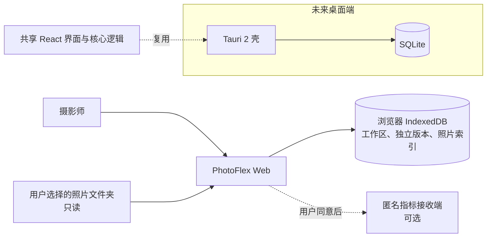
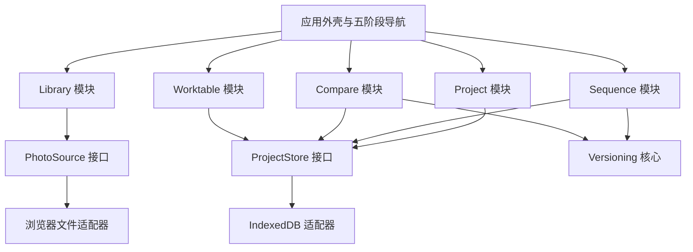
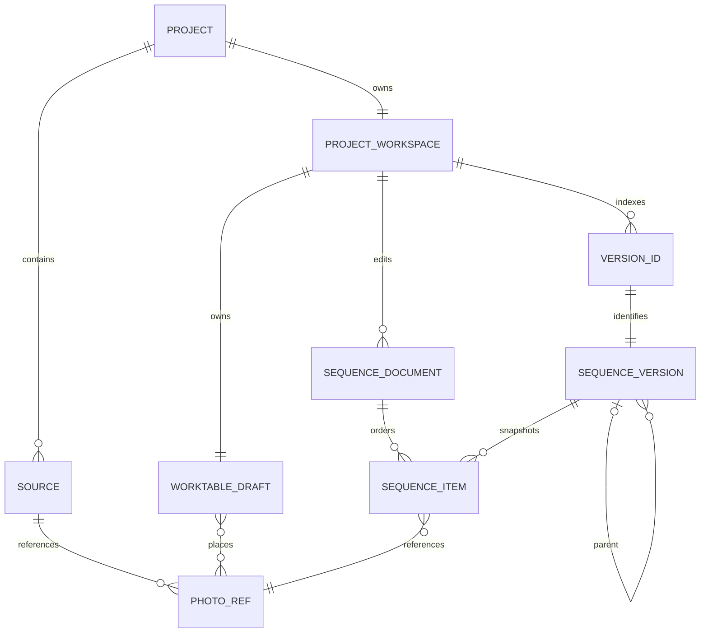
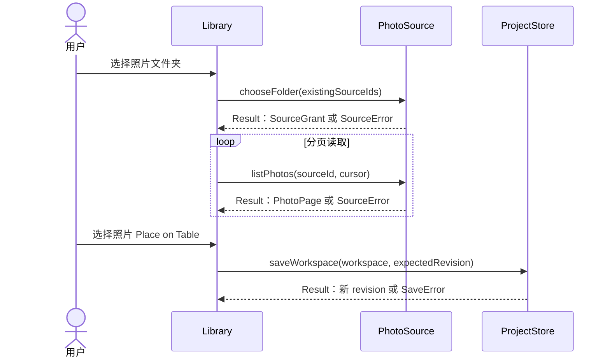
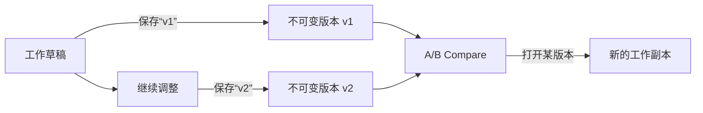
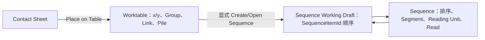
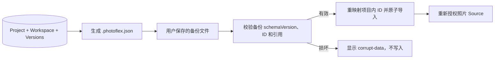

---
tags:
  - PhotoFlex
  - MVP
  - 系统架构
created: 2026-08-26
updated: 2026-09-08
status: draft
version: 0.5
---

# PhotoFlex MVP 系统架构方案

相关实施方案：[M3 Version / Compare](./M3_Version_Compare_Implementation_Plan.md)。

> 当前实现基线（2026-09-08）：用户工作区为 `Home / Project / Contact Sheet / Table / Sequence / Compare`。Pool 已由 `worktableDraft.entryOrder + placements` 替代，Whiteboard 用户界面取消。当前代码已实现 Table 的 Group、Link、Sequence Pile、Photo Preview / Pile Compare，以及 Sequence 的排序、Reading Unit、Segment、Overview、Read、Working Draft、Named Version、Save / Save As、Version Compare 与 Shuffle。

## 1. 系统一句话说明

PhotoFlex 第一阶段是一个运行在桌面浏览器中的本地优先照片序列工具。网页读取用户明确选择的照片文件夹，项目结构保存在浏览器本地；照片不上传，原片不被移动、重命名、覆盖或删除。

## 2. 系统上下文



第一阶段没有业务后端、登录系统和云端图库。静态服务器只负责发送 HTML、CSS 和 JavaScript，不接收照片。

## 3. 用户可见的五个工作区

| 工作区 | 用户任务 | 系统结果 |
|---|---|---|
| Project Home | 创建、打开、管理、备份和恢复项目 | 选择当前 Project 或导入备份 |
| Project / Contact Sheet | 添加 Source、浏览和预览照片 | 建立项目照片引用并将候选照片放到 Table |
| Sequence | 线性排序、网格观看、全景和大图判断 | 更新唯一工作草稿 |
| Table | 自由摆放、Group、Link、Pile、Preview 和 Photo Compare | 保存 Table-only 坐标与关系 |
| Version Compare（M3） | 选择两个 Named Version 并对照 | 只读显示差异，不修改历史 |

## 4. 系统模块图



### 模块责任

| 模块 | 负责 | 不负责 |
|---|---|---|
| Project | Project/Source 状态、切换项目 | 图片解码、排序逻辑 |
| Library | Contact Sheet、预览、照片分页、Pick / Reject | Table 坐标和 Sequence 顺序 |
| Worktable | Table 坐标、Group、Link、Pile、Preview、Photo Compare | Sequence 一维顺序 |
| Sequence | 工作草稿、排序、删除、undo/redo、观看模式 | 直接读文件系统 |
| Versioning | VersionId、不可变快照、打开副本、A/B diff | 修改历史版本 |
| Compare | Table Pile Compare 与 M3 Version Compare 的只读展示 | 编辑版本或 Table 关系 |
| ProjectStore | 工作区、CAS revision、独立版本、原子事务、schema 迁移、备份/恢复和失败结果 | 照片文件读取 |
| PhotoSource | 文件夹授权、照片枚举和预览 URL | 写入或删除原片 |

跨模块接口只在代码的 `src/contracts/index.ts` 及其直接导出文件中定义一次。本文只记录模块责任和行为承诺，不维护第二套 TypeScript 签名；Worktable、Sequence、Versioning、适配器和测试必须导入同一份 canonical contract。M0 代码尚未建立前，以《开发技术架构方案》的契约草案为准；M0 完成后以代码为准。

## 5. 核心数据关系



数据规则：

- `PhotoRef` 是原片引用，不是图片副本；其文件定位身份为 `sourceId + normalizedRelativePath`，PhotoId 是稳定内部 ID；
- 同一项目重复选择同一个底层目录时复用已有 SourceId 并刷新授权，不创建重复 Source；不同 Source 中的同名 relativePath 不冲突；
- 文件移动或重命名后旧引用标记为 `missing-file` 并保留在 Table、Sequence 和版本中，不按文件名静默重连或删除；Source 整体失去权限才标记 `permission-lost`；
- 同一 Photo 可以在 Table、工作草稿和多个版本中被引用；
- Sequence 中的每个位置使用独立 SequenceItemId，PhotoId 只表示照片身份；选择、移动、删除和版本比较都使用 SequenceItemId，不得用 PhotoId 去重；
- Project 可包含多个独立 Sequence，每个 Sequence 同时只有一个可编辑 Working Draft；
- ProjectWorkspace 只保存 VersionId 列表，不嵌入历史快照；
- `SequenceVersion` 以 VersionId 为主键独立存储，保存完整顺序且不依赖后来变化的草稿；
- Save As 的版本名在项目内唯一；查询、打开、比较和父版本关系全部使用 VersionId；
- 删除 Source 前必须显示其影响，第一阶段不提供删除原文件的能力；
- Source 权限失效时保留 PhotoRef、Table 和版本位置，并显示重新授权入口。

IndexedDB 使用六个独立 object store：

| Object store | 主要内容 | 变化方式 |
|---|---|---|
| `projects` | 可变 ProjectWorkspace | 自动保存时按 revision 更新 |
| `sequences` | SequenceDocument Working Draft | Sequence command 成功后按 sequence revision 更新 |
| `versions` | 不可变 SequenceVersion，以 VersionId 为 key | 创建版本时追加，不被自动保存重写 |
| `photo-index` | Source 下的 PhotoRef | Source 扫描时分页写入 |
| `source-grants` | 可恢复的浏览器文件夹授权 | 添加或重新授权 Source 时更新 |
| `photo-thumbnails` | 最长边 512px 的 WebP 缩略图缓存 | 缩略图首次生成时写入 |

存储同时维护三个独立版本号：IndexedDB 数据库版本控制 object store/index，ProjectWorkspace schemaVersion 控制工作区记录形状，备份 schemaVersion 控制可移植 JSON。当前代码基线为 IndexedDB v9、Workspace schema v7、Backup schema v2；顺序 migration runner 只在 `onupgradeneeded` 的 versionchange 事务中执行。v9/v7 增加持久化删除标记：Source 清理失败时项目保持可恢复，启动时继续删除。迁移失败不删除旧库；其他标签页必须响应 `versionchange` 关闭连接，升级被阻塞时明确提示用户关闭其他 PhotoFlex 标签页。

## 6. 四条关键运行流程

### 6.1 导入与筛选



### 6.2 保存两个版本并比较（M3 计划）



Compare 不直接改变 v1 或 v2。“打开版本”意味着复制为新的工作草稿，之后再次保存会生成新版本。

保存版本前先在事务外完成快照构造和校验。ProjectStore 随后打开同时覆盖 `projects`、`sequences` 与 `versions` 的单个 IndexedDB `readwrite` 事务，在关联的 IndexedDB request 回调中完成双 revision CAS、写入 SequenceVersion、更新 SequenceDocument/currentVersionId 并增加 revision。事务内不得读取文件、解码图片、等待计时器/网络或其他无关 Promise；只有 transaction `complete` 后才报告成功，`abort/error` 时全部回滚。

### 6.3 Table 与 Sequence 的边界



Table 的坐标和关系只属于 Worktable。移动、布局、Group、Link、Pile 或 Table Pile Compare 永远不会自动改写 `SequenceDocument.itemIds`；只有用户显式创建或编辑 Sequence 时才写入一维顺序。Sequence 的排序、Segment、Reading Unit 和 Read 不反向修改 Table 坐标。Table Pile Compare 与 M3 Version Compare 使用不同来源模型。

### 6.4 项目备份与恢复



备份顶层固定包含 `format: "photoflex-project-backup"`、独立的 `schemaVersion`、`exportedAt` 和仅供诊断的 `appVersion`。备份 schema 与 IndexedDB 中 ProjectWorkspace 的 schema 分别演进。第一阶段只接受备份 schema 1：缺失或非法版本视为损坏，未知数值版本视为不支持，两者都在写入前终止；未来版本必须先在内存迁移、再完整校验并原子导入，不能静默猜测字段。

备份只包含 PhotoFlex 项目结构、版本，以及被引用照片的 `sourceId + normalizedRelativePath` 最小清单；不包含原片、缩略图、绝对路径或浏览器文件句柄。导入时生成新的 ProjectId，并一致重映射 VersionId、SourceId、PhotoId 和 SequenceItemId，避免覆盖已有项目。项目备份/恢复是安全能力，与摄影书/PDF 作品导出无关。

## 7. 数据保存与恢复

### Revision 与并发

`ProjectWorkspace.revision` 是工作区级非负单调整数：创建项目为 0，每次成功写入加 1。`saveWorkspace` 和 M3 的统一版本保存接口都在写事务内先读取当前记录并执行 compare-and-swap：只有当前 workspace/sequence revision 等于调用方的 expectedRevision 才能写入，否则不改变任何数据并返回 expected/actual conflict。

两个标签页同时从 revision 7 开始编辑时，第一个成功写成 8，第二个必须冲突，不能最后写入覆盖、自动合并或用旧 revision 盲重试。冲突后暂停该项目保存队列、保留本地未保存状态，并提示“项目已在另一标签页或窗口修改”；用户确认后重新加载。未来 Tauri 多窗口沿用同一语义。

具体决定见 [ADR-002：本地持久化并发、事务与迁移](./ADR-002-本地持久化并发事务与迁移.md)。

### 正常保存

1. 用户操作产生新的内存状态；
2. 系统显示“保存中”；
3. 完成一次排序命令后进入串行保存队列；Project 名称和 Memo 使用 300–500ms 防抖；
4. `ProjectStore.saveWorkspace` 用最后成功返回的 revision 作为 expectedRevision，在 IndexedDB 写事务中完成读取、CAS 和工作区写入；
5. 成功后返回新 revision，界面显示“已保存”；
6. 冲突、空间不足或 I/O 失败时不覆盖旧数据，保留当前内存状态并显示可区分的处理入口。

Undo/Redo 只在当前页面会话有效，意思是“历史栈不写入 IndexedDB”，不是“撤销后的结果不保存”。每次 Undo/Redo 都产生新的 SequenceDocument 草稿状态，并与普通移动/删除命令一样进入同一个串行保存队列；如果 moveB 正在保存，undo(moveB) 排在其后，只有撤销结果落盘后才能显示“已保存”。非冲突的瞬时失败可由用户从最后成功的 revision 重试最新状态；revision conflict 必须停止队列并要求重新加载，不能盲重试。刷新后恢复最后成功保存的 SequenceDocument，同时清空撤销和重做历史。

最后成功保存的草稿被定义为隐式 checkpoint。Sequence 工具栏的 Undo/Redo 控件必须常驻说明“撤销记录仅保留到本次关闭/刷新”，首次进入时再显示一次非阻塞提示；“已保存”表示崩溃后至少能恢复该 checkpoint。它是明确的 MVP 限制，不作为隐藏在文档里的免责约定。

页面关闭前的 flush 只能 best-effort，因此“保存中 / 已保存 / 未保存”状态必须始终可见；若用户在撤销结果仍显示“保存中/未保存”时强制关闭页面，重新打开只能保证恢复最后成功保存的状态。

### 重新打开

1. 从 IndexedDB 分别恢复 ProjectWorkspace、版本摘要，并按需读取完整版本；
2. 尝试恢复 Source 文件夹权限；
3. 权限失效时显示占位和“重新选择文件夹”；
4. 使用 `sourceId + normalizedRelativePath` 重新连接 PhotoRef；
5. Source 无权限时标记 `permission-lost`；Source 可访问但路径不存在时标记 `missing-file`；
6. 无法连接的照片保留原位置，不静默删除，也不按同名文件自动改绑。

浏览器权限和存储可能被用户清除，因此网页 Alpha 不能承诺与桌面数据库相同的长期可靠性。这个限制应在用户首次导入时直接说明，并提供项目 JSON 备份与恢复作为最低限度兜底。

## 8. 安全与隐私

- 原片目录只读，产品没有移动、重命名、覆盖或删除原文件的命令；
- 界面和事件日志不接收完整绝对路径；
- 默认不上传照片、缩略图、Memo 正文或文件名；
- 匿名事件只记录模块、动作、成功/失败、数量和耗时；
- Source 授权必须由用户手动发起；
- Object URL 由 BrowserPhotoSource/PreviewCache 创建并持有，界面只持有可幂等释放的 PreviewLease；最后一个 lease 释放后最多进入 16 项 idle LRU，超限从最旧项 revoke；Source 失效和页面卸载时全部释放；
- 删除 Project 只删除 PhotoFlex 的本地项目数据，不删除照片文件。
- JSON 备份不包含原片、缩略图和绝对路径；导入前先完成全部校验，失败时不写入部分数据。

## 9. 性能策略

| 场景 | 策略 |
|---|---|
| Contact Sheet | 分页查询、虚拟列表、只解码可见区域及少量 overscan |
| Sequence | 状态只保存 ID；拖动时使用 transform，放置后一次提交 |
| Worktable | 只挂载视口附近照片；框选计算使用完整轻量坐标数据 |
| 大图预览 | PreviewCache 为当前图及前后各一张持有 lease；切换时复用仍在窗口内的 URL，并立即释放离开窗口的 lease |
| Compare | UI 只传两个 VersionId；按需加载快照；Added/Removed 用 Map/Set，Moved 用 O(n log n) 最长递增子序列；照片按可见范围加载 |

开发阶段先用 30 张固定 fixture 验证闭环，再逐步扩大到 500、2,000 和 10,000 张图库。Contact Sheet 和 Table 可以容纳大图库，但第一阶段的 SequenceDocument 和 SequenceVersion 使用 500 项硬上限。一次添加若会超过 500 项，命令整体拒绝且不部分写入，界面显示当前数量、上限和本次尝试数量；用户仍可从 Contact Sheet 改选较少照片。因为无法创建超过 500 项的版本，Compare 输入也不会超过 500 项。

两个 500 项版本的 Diff 在目标硬件上 p95 ≤200ms；10,000 张图库指标不等于支持 10,000 项序列 Diff。纯状态引擎耗时不能代替真实浏览器帧率测试。

Diff Gate 必须运行在 production build 的真实 Chrome/Chromium 页面中，记录浏览器/系统/硬件，预热 5 次后至少测量 30 次并报告 p50/p95。Vitest 或 Node 中的纯状态耗时只能用于回归。命名版本采用完整快照，项目版本存储按“版本数 × 每版项目数”线性增长；M4 额外测量 200 个版本 × 500 项时的数据库占用、Compare 打开和 JSON 备份大小。

## 10. 部署结构

```text
静态托管
└── PhotoFlex Web 构建产物
    └── 用户浏览器
        ├── React 界面与核心模块
        ├── IndexedDB 工作区、版本与照片索引
        └── 用户授权的本地照片 Source
```

第一阶段发布不需要应用服务器。若启用匿名指标，只增加一个独立、可关闭的事件接收端，不让它参与项目保存或核心流程。

## 11. 未来桌面端迁移

桌面端迁移只改变系统外圈：

| 网页实现 | 桌面实现 | 保持不变 |
|---|---|---|
| BrowserPhotoSource | TauriPhotoSource | Project、Library、Sequence、Compare 界面 |
| IndexedDbProjectStore | TauriSqliteProjectStore | 数据模型、错误联合和项目存储接口 |
| 浏览器 Object URL | 受控代理 URL | photo ID 与相对路径关系 |
| 静态网页入口 | Tauri 2 壳 | React 应用和纯 TypeScript 核心 |

桌面框架已选择 Tauri 2。正式 renderer、文件安全、数据库恢复和 macOS Gate 仍需在桌面 Alpha 前完成；若出现硬门失败，优先缩小 Table 或数据规模，再按 ADR 的复议条件重新评估。

具体决策见 [ADR-001：桌面端选择 Tauri 2](./ADR-001-Tauri-2-桌面端.md)。

## 12. 第一阶段系统验收

系统达到可测试 Alpha 的最低条件：

- 用户能在不解释术语的情况下完成 Project → Source → Contact Sheet → Table → Sequence；
- 能保存两个不同命名版本，并在 Compare 中选择它们；
- 打开历史版本不会改变原版本；
- 版本名可以重复，但 VersionId 始终唯一，Compare 使用 VersionId；
- 工作草稿自动保存不会重写既有版本快照；
- 界面明确提示 Undo/Redo 历史仅限当前会话；刷新后恢复最后 checkpoint 并清空历史；
- Undo/Redo 的结果进入同一保存队列；等待“已保存”后刷新不会让被撤销的操作复活；
- Sequence 第 501 项被明确拒绝且不发生部分写入，Contact Sheet/Table 仍可继续容纳大图库；
- 两个 500 项版本的 Diff 达到 p95 ≤200ms；
- Table 以 placement 保存稳定坐标与关系；同一 PhotoId 可在 Sequence 中多次出现且不会去重或丢失，Table 移动不会改变序列；
- Group、Link、Pile 和 Table Pile Compare 均保持 Table-only 语义，不自动驱动 Sequence 顺序；
- 刷新后项目结构和版本可恢复；
- 项目可以导出带独立 `schemaVersion: 1` 的 JSON，并以新 ProjectId 完整恢复；缺失、未知或损坏的 schema 在任何写入前被拒绝；
- Source 权限丢失不会导致 Table、序列或版本记录消失；
- 同一 Source 重复选择不会产生重复记录；文件移动后显示 missing-file，不会静默连接到同名文件；
- 两个标签页从同一 revision 保存时只有一个成功，另一方收到包含 expected/actual 的 conflict；
- 真实 Chromium 故障注入证明版本写入与 versionIds/revision 更新要么同时成功、要么同时回滚；
- IndexedDB v7、Workspace schema v6 的 migration runner 可执行；升级失败不删库，未知新版本不降级写入；
- PreviewLease 共享 URL 时不会提前 revoke，离开可见/预取窗口并淘汰后不会泄漏；
- 自动测试覆盖 Table → Sequence → v1 → 修改 → v2 → Version Compare → 重开 → 备份/恢复的闭环；
- 畸形/随机备份输入返回明确错误并保持六个 object store 完全不变；
- 没有原片写入能力。
