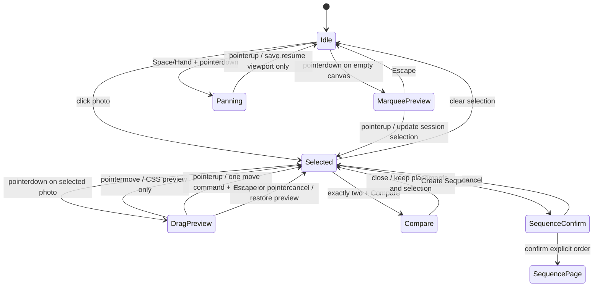

# PhotoFlex Worktable：产品与模块设计基线

> 状态：产品方向与三项关键决策已确认；前端设计稿确认后进入实现  
> 日期：2026-08-30  
> 范围：用 Table 取代 Pool / Whiteboard 用户界面，保留独立 Sequence  
> 关联 PRD：[`docs/PRD_Sequence.md`](./PRD_Sequence.md) v0.2

## 1. 结论

PhotoFlex 应只保留三个创作对象：

1. **Contact Sheet**：全量照片目录，负责浏览、筛选、Pick / Reject、临时批量选择。
2. **Table / Worktable**：候选照片的工作桌面，负责 membership、空间位置、分组、堆叠和比较。
3. **Sequence**：最终阅读顺序，负责精确的一维 item order、版本与 Read 模式。

`Compare` 是 Table 或 Sequence 发起的临时工具状态，不是第四套照片集合。旧 `Pool` 和旧 `Whiteboard` 不保留为用户可见概念，也不建立长期兼容别名。

推荐新建一个纯 TypeScript 的 `WorktableEditor` 深模块。它沿用现有 `SequenceEditor` 的 command / undo 约定，但只操作 Worktable 数据，不读取或写入 `SequenceDraft`。React 页只负责把 Pointer Events 解释成完整手势；一次拖拽结束后只提交一个 command、产生一个 undo step、触发一次持久化。

## 2. 当前实现与新方向的差距

### 2.1 已有可复用基础

| 现有能力 | 位置 | 可复用方式 |
|---|---|---|
| Contact Sheet 分页与虚拟网格 | `src/app/M1App.tsx`、`src/modules/contactSheet/` | 保留为全量目录；继续承载临时选择与预览 |
| 批量选择、Shift 范围选择 | `ContactSheetPage` | 将 `Add to Pool` 改成 `Place on Table` |
| 缩略图 / Preview lease 生命周期 | `PhotoSource`、`PhotoThumb`、`PreviewOverlay` | Table 卡片和 Compare 复用读取能力 |
| Workspace CAS revision | `ProjectStore.saveWorkspace` | 每个成功 Worktable command 后保存 snapshot |
| Memory / IndexedDB 两个 adapter | `MemoryProjectStore`、`IndexedDbProjectStore` | 继续作为持久化 seam 和 contract test 对象 |
| Sequence command 形状 | `src/contracts/sequence.ts` | 复用 `snapshot / execute / undo / redo / canUndo / canRedo` 约定 |
| 缺失文件错误类型 | `SourceError`、`PhotoIssue` | Table 仍渲染 placement，只把照片内容替换成 placeholder |

### 2.2 必须改变的部分

| 领域 | 当前实现 | 差距 / 后果 |
|---|---|---|
| 导航 | `Home / Project / Contact Sheet / Sequence / Compare`，后二者禁用 | 缺少一级 `Table`；`Compare` 不应是一级集合页 |
| Contact Sheet | 只有 `All / Selected`，并写入 `poolPhotoIds` | 缺少排序/筛选、Pick / Reject、持久化 Pin 和 `Place on Table` |
| Pool UI | Project 和 Contact Sheet 右侧都有 `PoolPanel` | 会与 Table 形成重复集合；应整体移除而不是改个标题继续嵌套 |
| Pool 领域 | `addToPool / removeFromPool` 只做幂等数组增删 | 没有坐标、z-index、布局、undo / redo；不适合作为 Worktable seam |
| Pool 交互 | HTML5 drag data，Pool 中的批量选择没有可用移除动作 | 不能支撑自由画布手势，也不满足一次拖拽一个 command |
| Whiteboard contract | 从 `SequenceItem[]` 打开，以 `SequenceItemId` 摆放，还能 `deriveOrder / commit` 回 Sequence | 与“桌面移动不能改变 Sequence”冲突；应退役而不是扩展 |
| Sequence | 只有 contract，没有 editor 实现、页面或路由 | command 形状可复用，但 M2 仍需真正实现模块与页面 |
| Compare | 只有禁用导航和旧 PRD 描述 | 需要区分 Table 的两张照片比较与 Sequence 的版本比较 |
| 持久化 | Workspace v2 只有 `poolPhotoIds`、`sequenceDraft`；IndexedDB v3 | 没有 Table、photo decision / pin、Table resume viewport 或迁移 |
| Resume | 只支持 `project / contact-sheet` | 缺少 Table 与 Sequence 页面恢复状态 |
| Missing | Contact Sheet 组件内临时记录 missing；Source 删除会删除 photo index 并清空 Pool membership | Table placement 不能跟随 photo index 被清除；至少要保留 photoId 和位置 |
| 测试 | Pool 只有两个数组测试；无 Sequence / Whiteboard 实现测试 | 缺少 command 历史、手势提交、坐标转换和持久化迁移测试 |
| 代码组织 | `M1App.tsx` 约 1,400 行，页面、扫描协调、保存与 UI 混在一起 | Table 不应继续堆进该文件；应从新模块和独立页面开始 |

### 2.3 PRD 冲突

`docs/PRD_Sequence.md` v0.2 已完成术语和漏斗更新：

- `Pool` → `Table membership`；
- `Whiteboard` → 删除用户界面与漏斗节点；
- 新增 `photos_placed_on_table`、`table_layout_saved`、`table_compare_completed`；
- `Compare` 改为 Table / Sequence 内的 action；
- 页面关系改为 `Home → Project → Contact Sheet → Table → Sequence`。

## 3. 职责与状态归属

### 3.1 页面职责

| 操作 | Contact Sheet | Table | Sequence |
|---|:---:|:---:|:---:|
| 浏览所有已索引照片 | 主责 | 只看已放置 | 只看 sequence items |
| 筛选、按元数据排序 | 主责 | 可按 Table 状态过滤，不改位置 | 不负责 |
| 临时批量选择 | 是 | 是 | 是 |
| Pick / Reject | 主责，可在预览中操作 | 只显示，可快捷修改 | 只显示 |
| Place on Table | 主责 | 可从空态返回 Contact Sheet | 不负责 |
| 自由摆放 / 框选 / 平移 / 缩放 | 不负责 | 主责 | 不负责 |
| Grid / Row / Align | 不负责 | 主责 | 不负责 |
| Group / Stack | 不负责 | 主责 | 不负责 |
| 两张照片 Compare | 可从 Preview 发起（后续） | 主责 | 可从 Read 发起 |
| Pin | 可操作 | 可操作 | 可操作 |
| Create Sequence | 不负责 | 对显式选择发起 | 接收并确认顺序 |
| 精确一维排序 | 不负责 | 不负责 | 主责 |
| Sequence 版本 / Read | 不负责 | 不负责 | 主责 |

### 3.2 持久化领域状态

```text
ProjectWorkspace
├── photoStates[photoId]
│   ├── decision: unrated | pick | reject
│   └── pinned: boolean
├── worktableDraft
│   ├── membership / entryOrder
│   ├── x / y / z
│   └── groups / stacks（M2.2）
└── sequenceDraft
    └── SequenceItem[] 的精确一维顺序
```

状态不应混合：

- `selected` 是页面 session 状态，不持久化，也不进入 undo。
- `decision` 和 `pinned` 是 project-wide photo state，不属于 Worktable placement。
- `inTable` 由 `worktableDraft.placements[photoId]` 是否存在推导，不再保存另一个 boolean。
- `missing` 由 `PhotoSource` 读取结果推导；失败不能删除 placement 或 sequence item。
- viewport 可以写入 resume context，但 pan / zoom 不进入 authoring undo history。
- Compare 的 A / B 当前槽位是临时 session 状态，退出即清空；照片的 Pin 不清空。

## 4. 推荐 Worktable 深模块

### 4.1 为什么是新的 module

推荐外部 seam：`src/modules/worktable/`。

- React 不直接修改 placement 数组。
- Worktable 不依赖 React、PointerEvent、PhotoSource、IndexedDB 或 Sequence。
- 所有 authoring 不变量集中在一个 implementation 中。
- UI 和测试都只通过同一 interface 操作。
- 删除该 module 后，幂等 membership、批量移动、z-order、自动布局和历史规则会重新散落到多个调用方，说明它在提供真实 depth。

不推荐：

- 扩展 `WhiteboardSorter`：其 interface 已经表达了错误的 Sequence 耦合。
- 给 `pool.ts` 逐个加 helper：调用者仍要理解并拼装所有行为，module 会很浅。
- 让 React state 成为领域真相：手势预览、undo 和持久化时机会相互缠绕。

### 4.2 M2.1 最小 TypeScript 类型

```ts
import type { PhotoId, ProjectId, Result } from "../../contracts";

export interface WorldPoint {
  readonly x: number;
  readonly y: number;
}

export interface WorktablePlacement extends WorldPoint {
  readonly photoId: PhotoId;
  readonly z: number;
}

export interface WorktableDraft {
  readonly projectId: ProjectId;
  // 只表示加入桌面的稳定先后，不代表 Sequence，也不随 x/y 改变。
  readonly entryOrder: readonly PhotoId[];
  readonly placements: Readonly<Record<PhotoId, WorktablePlacement>>;
}

export type WorktableLayout =
  | { readonly kind: "grid"; readonly columns?: number; readonly gap: number }
  | { readonly kind: "row"; readonly axis: "x" | "y"; readonly gap: number }
  | {
      readonly kind: "align";
      readonly edge: "left" | "center-x" | "right" | "top" | "center-y" | "bottom";
    };

export type WorktableEditCommand =
  | {
      readonly type: "place";
      readonly photoIds: readonly PhotoId[];
      readonly at: WorldPoint;
      readonly layout?: Extract<WorktableLayout, { readonly kind: "grid" | "row" }>;
    }
  | {
      readonly type: "move";
      readonly photoIds: readonly PhotoId[];
      readonly by: WorldPoint;
    }
  | {
      readonly type: "arrange";
      readonly photoIds: readonly PhotoId[];
      readonly layout: WorktableLayout;
    }
  | { readonly type: "bring-to-front"; readonly photoIds: readonly PhotoId[] }
  | { readonly type: "remove"; readonly photoIds: readonly PhotoId[] };

export type WorktableCommandError =
  | { readonly kind: "unknown-placement"; readonly photoId: PhotoId }
  | { readonly kind: "duplicate-photo-id"; readonly photoId: PhotoId }
  | { readonly kind: "invalid-coordinate" }
  | { readonly kind: "invalid-layout" };

export interface WorktableEditor {
  snapshot(): WorktableDraft;
  execute(command: WorktableEditCommand): Result<WorktableDraft, WorktableCommandError>;
  undo(): WorktableDraft;
  redo(): WorktableDraft;
  canUndo(): boolean;
  canRedo(): boolean;
}
```

Interface 行为约定也是 interface 的一部分：

1. `place` 对已在 Table 的照片幂等跳过；同一请求内部的重复 ID 返回错误。
2. `move / arrange / bring-to-front / remove` 遇到非 membership ID 时整条 command 失败，不产生部分写入。
3. 所有坐标必须是有限数值；viewport scale 不写进 placement。
4. 每次成功 `execute` 只压入一个 undo step；失败和 no-op 不压入。
5. 新 command 成功后清空 redo history。
6. `remove` 只移除 Worktable membership，不调用 `PhotoSource`，不影响原片、Pick、Pin 或 Sequence。
7. `entryOrder` 只在 place / remove 时改变；move / arrange 永不改变它。
8. undo history M2.1 只保存在当前 session；持久化的是 command 后的 snapshot，不持久化历史栈。

### 4.3 Pointer gesture seam

```text
pointerdown
  → TablePage 建立 transient Gesture（起点、选中 IDs、原坐标）
pointermove × N
  → 只更新 CSS transform 预览，不 execute，不写 IndexedDB
pointerup / pointercancel
  → 计算一个 world-space delta
  → editor.execute({ type: "move", photoIds, by })
  → 成功后 saveWorkspace(snapshot)
```

Selection、marquee rect、drag preview、active pointer ID 都属于 React session，不属于 `WorktableDraft`。这样“一次完整拖拽只产生一个 command / undo step”是结构性结果，而不是靠节流碰运气。

### 4.4 坐标转换

viewport 数学集中在 `src/modules/worktable/viewport.ts`，不要散落在 event handlers：

```ts
export interface WorktableViewport {
  readonly originX: number;
  readonly originY: number;
  readonly zoom: number;
}

export function screenToWorld(
  screen: WorldPoint,
  viewportBounds: DOMRectReadOnly,
  viewport: WorktableViewport,
): WorldPoint;

export function worldToScreen(
  world: WorldPoint,
  viewportBounds: DOMRectReadOnly,
  viewport: WorktableViewport,
): WorldPoint;

export function zoomAroundScreenPoint(
  viewport: WorktableViewport,
  anchor: WorldPoint,
  nextZoom: number,
): WorktableViewport;
```

`DOMRectReadOnly` 只出现在 viewport utility，不进入 WorktableEditor。卡片使用普通 React DOM，位置用 `transform: translate3d(...)`；Pointer Events 配合 pointer capture。M2.1 不引入物理碰撞、随机旋转或通用 graph canvas。

### 4.5 M2.2 Group / Stack 扩展

在 M2.1 interface 稳定后，再增加 cluster union；不需要提前把空字段写进第一版 UI：

```ts
export type WorktableClusterId = Brand<string, "WorktableClusterId">;

export type WorktableCluster =
  | {
      readonly id: WorktableClusterId;
      readonly kind: "group";
      readonly photoIds: readonly PhotoId[];
    }
  | {
      readonly id: WorktableClusterId;
      readonly kind: "stack";
      // 从底到顶的显式顺序；不是 Sequence order。
      readonly photoIds: readonly PhotoId[];
    };
```

新增 command 只需要三类：`create-cluster`、`dissolve-cluster`、`reorder-stack`。MVP 不允许 cluster 嵌套，一张照片最多属于一个 cluster。Group 表示一起移动但都可见；Stack 表示紧凑重叠且有明确顶部照片。两者都不能隐式修改 Sequence。

## 5. 与 Sequence 的 seam

Worktable module 不 import `SequenceDraft` 或 `SequenceEditor`。连接发生在应用层的显式 use case：

```text
Table selection
  → Create Sequence
  → 顺序确认条（horizontal confirmation strip）
  → 用户确认 / 调整顺序
  → 为每张照片创建新的 SequenceItemId
  → SequenceEditor.execute({ type: "add", items, at })
```

默认顺序不能按当前 x/y 自动推导。建议确认条初始使用 `entryOrder.filter(selected)`；如果以后支持“按桌面阅读路径生成”，必须成为一个明确命名的动作，并在生成前预览结果。Stack order 也只能在用户明确选择“Use stack order”时使用。

`SequenceItemId` 与 `PhotoId` 保持分离：同一照片可以被不同 Sequence item 引用，Table 则每个 PhotoId 只有一个 placement。

## 6. 持久化与迁移

### 6.1 MVP 推荐

先继续使用现有 `ProjectStore` seam，把两个 draft 作为同一 workspace record 中的独立字段：

```ts
interface ProjectWorkspace {
  // ...existing project/source fields
  readonly photoStates: Readonly<Record<PhotoId, ProjectPhotoState>>;
  readonly worktableDraft: WorktableDraft;
  readonly sequenceDraft: SequenceDraft;
}
```

“独立字段”已保证 Table x/y 不会成为 Sequence order 的来源。M2 暂不新增 `worktables` object store，理由是：

- 现有 workspace CAS、project delete、backup 和 Memory adapter 都可直接复用；
- 一次 pointer gesture 只保存一次，MVP 数据量下没有证据需要高频独立表；
- 新 object store 会引入跨 store 一致性和更多 migration 工作，但当前没有第二个实际读取模式需要它。

如果 profiling 证明 workspace snapshot 过大，再把 `WorktableDraft` 抽到独立 store；WorktableEditor interface 不需要变化。

### 6.2 从 Pool 的一次性迁移

建议：

1. `WORKSPACE_SCHEMA_VERSION: 2 → 3`；
2. `INDEXED_DB_SCHEMA_VERSION: 3 → 4`；
3. migration 将 `poolPhotoIds` 按原数组顺序转换为 Worktable `entryOrder`；
4. 用固定、确定性的 grid 生成初始 x/y/z；
5. 写入 `photoStates: {}`；
6. 删除 `poolPhotoIds`，不要长期双写，也不要留下 `inPool` 兼容字段；
7. `ProjectSummary.poolCount` 改为 `tableCount`；
8. 更新 `isWorkspace`、Memory/IndexedDB contract tests、migration test 和 backup round-trip。

迁移函数必须是纯函数并使用固定参数，确保同一旧 workspace 每次得到同一布局。

### 6.3 Missing 与 Source remove

Table 渲染流程应先读 placement，再尝试读照片：

```text
placement 存在 + thumbnail 成功 → 普通卡片
placement 存在 + photo-not-found → 同位置 missing placeholder
placement 不存在 → Table 不渲染
```

当前 `BrowserPhotoSource.removeSource` 会删除 photo index；ProjectPage 还会删除对应 Pool membership。迁移后不能照搬后一步去过滤 `worktableDraft` 或 `sequenceDraft`。即使索引被清除，placement 和 sequence item 也要保留。若产品希望 missing placeholder 继续显示文件名和尺寸，还需保留一份轻量 `PhotoManifestEntry`；否则第一版只能显示稳定 PhotoId 和“文件不可用”。

## 7. Table 页面信息架构

### 7.1 导航

```text
Home / Project / Contact Sheet / Table / Sequence
```

- `Compare` 从一级导航移除。
- 在 Project 内，只要已有 Table membership 就可直接进入 Table。
- Contact Sheet 的照片显示 `ON TABLE` 状态，但不因此改变筛选或 Sequence。

### 7.2 页面布局

```text
┌──────────────────────────────────────────────────────────────────┐
│ Project name / TABLE        Saved · 42 photos       Undo  Redo   │
├──────────────────────────────────────────────────────────────────┤
│ Select  Hand | − 75% + | Fit | Grid | Row | Align | More         │
├──────────────────────────────────────────────────────────────────┤
│                                                                  │
│                         infinite work area                       │
│             [photo]       [photo][photo]                         │
│                    ┌── marquee / selection ──┐                   │
│                    └─────────────────────────┘                   │
│                                                                  │
├──────────────────────────────────────────────────────────────────┤
│ 2 selected   Compare   Pin   Group/Stack   Create Sequence  Remove│
└──────────────────────────────────────────────────────────────────┘
```

- 顶栏：页面身份、保存状态、数量、undo / redo。
- 工具栏：Select / Hand、viewport、确定性布局操作；只显示常用动作。
- 画布：照片、missing placeholder、stack/group 边界和 selection ring。
- Context bar：仅在选择后出现；动作随 1 张、2 张、多张选择变化。
- 空态：解释 Table 用途，并提供 `Go to Contact Sheet`，不再显示 Pool tray。

### 7.3 选择数量对应动作

| 选择 | 主要动作 |
|---|---|
| 0 | Select / Hand、zoom / pan、Fit all、Undo / Redo |
| 1 | Preview、Pin、Bring to front、Remove from Table |
| 2 | Compare、Align、Group / Stack、Create Sequence |
| 3+ | Grid / Row / Align、Group / Stack、Create Sequence、Remove |

`Remove from Table` 必须使用此措辞，避免用户误以为会删除原片。执行后 Pick / Reject、Pin 和现有 Sequence 引用保持不变。

## 8. 交互状态图



快捷键建议：

| 动作 | 键 |
|---|---|
| Select / clear | `Esc` |
| 临时 Hand | hold `Space` |
| 删除 Table membership | `Delete / Backspace`，先确保焦点不在输入框 |
| Undo / Redo | `Ctrl/Cmd+Z` / `Ctrl/Cmd+Shift+Z` |
| Preview | `Enter` |
| Pin | `P` |
| Compare | 两张选中时 `C` |
| Fit all | `0` |

## 9. 测试策略

### 9.1 Worktable interface tests

所有领域测试通过 `WorktableEditor` interface：

1. place 保留请求顺序并幂等跳过已存在照片；
2. move 多张照片保持相对距离；
3. 一次批量 move 只需一次 undo 即完整回退；
4. 新 command 清空 redo；失败/no-op 不进入历史；
5. arrange grid / row 在相同输入下结果确定；
6. remove 只改变 membership / entryOrder；
7. bring-to-front 保持 z 唯一且顺序稳定；
8. 非有限坐标和未知 placement 原子失败；
9. M2.2 cluster 不嵌套、一张照片最多属于一个 cluster；
10. Worktable snapshot 的变化永不修改 Sequence fixture。

不要为内部 reducer、inverse command 或 history stack 再铺一层脆弱测试；interface 是测试表面。

### 9.2 Viewport tests

- `worldToScreen(screenToWorld(p))` 往返误差；
- zoom around pointer 后锚点 world coordinate 不漂移；
- 不同容器 offset、zoom 和负 world coordinate；
- marquee 的 screen rect 正确转换为 world rect。

### 9.3 Persistence contract tests

同一组 contract tests 跑 Memory 与 IndexedDB adapter：

- Worktable round-trip 与 CAS conflict；
- v2 `poolPhotoIds` → v3 `worktableDraft` 的确定性迁移；
- Table 和 Sequence 各自保存后互不改变；
- missing photo / removed source 后 placement 与 sequence item 仍在；
- project delete 与 backup 覆盖 Worktable 数据。

### 9.4 React integration / E2E

- `pointermove` 多次、`pointerup` 一次，只调用一次 `execute` 和一次 save；
- pointercancel 不提交；
- marquee、Ctrl/Cmd、Shift 选择组合；
- 两张 Compare 退出后坐标不变；
- reload 后恢复 placement 和 viewport，undo history 为空；
- Contact Sheet sort/filter 不改变 Worktable 或 Sequence；
- Remove from Table 后原片仍可在 Contact Sheet 打开；
- missing placeholder 保留位置并提供 reconnect 入口。

## 10. MVP 任务拆分

### M2.0 — 术语与数据地基

- 更新 PRD、导航与事件命名；
- 新建 Worktable contracts / editor 和 interface tests；
- 增加 workspace schema migration；
- 将旧 Pool 数据一次性迁移为 Table，退役 Whiteboard contract；
- 将新的页面/领域代码放到独立文件，不继续扩大 `M1App.tsx`。

### M2.1 — Table 基础闭环

- Contact Sheet：Pick / Reject、`ON TABLE`、`Place on Table`；
- Table route、空态、普通 DOM 卡片与 missing placeholder；
- 单选、多选、Shift/Ctrl/Cmd、marquee；
- Pointer Events 拖动与一次手势一个 command；
- pan / zoom / Fit all 和集中坐标转换；
- Grid / Row / Align、Bring to front、Remove from Table；
- undo / redo、save-after-command、reload 恢复；
- Memory / IndexedDB / integration / E2E 测试。

### M2.2 — 摄影师判断工具

- Group、Stack、stack order；
- 两张照片 Compare overlay；
- project-wide Pin；
- Create Sequence 顺序确认条；
- Sequence Editor / route / 精确一维排序与 Read 基础。

### M2.3 — 延伸表达

- Table snapshot / named checkpoint；
- memo / paper note；
- relationship label（先标签，不做自动图谱）；
- print-size simulation。

明确不在前三期：真实物理碰撞、随机旋转、AI 自动关系、通用 Relationship View、多人协作、复杂 canvas/WebGL 重写。

## 11. 主要风险与应对

| 风险 | 影响 | 建议 |
|---|---|---|
| `M1App.tsx` 继续膨胀 | 手势、保存、来源扫描互相影响 | Table 从独立 page/module 开始；只抽取实际共享的 Preview/PhotoThumb |
| workspace 多处并发保存 | anchor、memo、Table command 可能产生 CAS conflict | 应用层增加串行 workspace save coordinator；WorktableEditor 不负责 I/O |
| CSS transform 与 pointer 坐标混用 | 拖动偏移、zoom 后跳动 | 所有 hit test 和 delta 先转 world space；只在渲染末端转 screen |
| Source remove 删除 photo index | missing placeholder 丢失名称/尺寸 | placement 永不随 index 删除；决定是否增加轻量 PhotoManifest |
| Create Sequence 顺序含混 | 用户误以为空间位置会自动排序 | 必须经过顺序确认条；默认 entryOrder，不读取 x/y |
| Group 与 Stack 语义重叠 | 用户不知道动作结果 | Group = 一起移动且全可见；Stack = 紧凑重叠且有内部顺序 |
| 大 Table DOM 数量 | 拖动和缩放掉帧 | 先用真实 200–500 张 profiling；证据出现后再做 viewport culling |
| undo 与持久化期望不一致 | reload 后无法继续 undo | M2.1 明示 history 为 session-only；若要跨重启再单独设计 command log |

## 12. 已确认的三个产品决策

1. **旧 Pool 数据迁移：已确认。**  
   自动放到 Table 的确定性 Grid，保留原 Pool 顺序作为 `entryOrder`；迁移完成后删除 `poolPhotoIds`，不长期双写。

2. **Pin 跨重启持久化：已确认。**  
   Pin 作为 project-wide research annotation，且不限制只能 Pin 两张；Compare 始终使用当前显式选择的两张。

3. **Create Sequence 默认顺序：已确认。**  
   打开顺序确认条，初始用 Table `entryOrder` 中的选中子序列；绝不按 x/y 自动推导。用户可在确认条中重排后创建。

本文件与 PRD 现在共同构成 M2 的产品与模块设计基线。下一步等待前端设计稿；设计稿确认后，再把视觉与交互细节转成 M2.0 / M2.1 implementation checklist 并开始生产实现。
