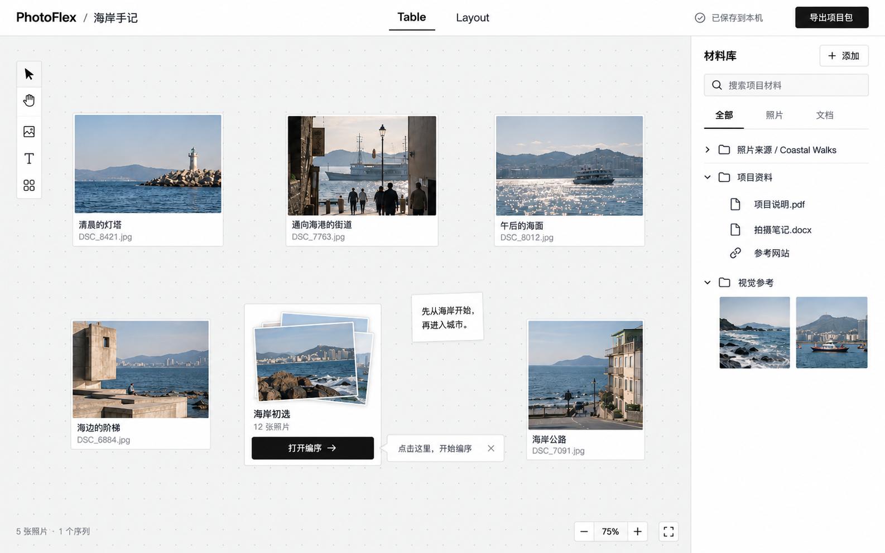
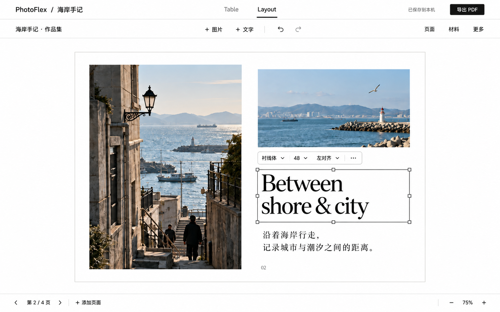

# PhotoFlex 用户迭代改动文档

日期：2026-09-15  
修订：V2，依据用户反馈统一现有网站黑白视觉；Sequence 完全覆盖页面且移除底部照片栏；Layout 改为按需展开工具。  
状态：设计提案，供视觉评审与后续开发使用；本文不表示功能已实现。  
适用阶段：个人、本机优先；支持完整备份与迁移。  
核心方向：Table 整理材料，Sequence 编排阅读顺序，Layout 自由图文排版。

## 1. 本轮目标与依据

### 1.1 用户反馈

- 很多用户没有发现 Sequence，因而没有使用编序功能。
- 部分用户认为右侧图片库多余。
- 希望把文档、资料夹和参考材料集中到项目中。
- 排版需求已确认为：任意拖放图片和文字的自由图文排版。
- 第一阶段以个人本机使用为主，项目需要能完整备份并迁移。

### 1.2 当前实现观察

- `TableCanvas.tsx` 中 pile 单击触发选择及底部顺序条，双击进入独立 Sequence 页面。
- `TablePage.tsx` 的顺序条初始隐藏；创建 pile 后没有自动进入 Sequence。
- 右侧 `SourceBrowser` 主要承担照片来源浏览、重新连接、选片及放入 Table。
- Sequence 已有照片、文字页、空白页、双页组合、版本和阅读模式。
- 项目结构保存在 IndexedDB；原片主要通过本地目录或文件句柄读取。
- 现有项目备份为 JSON，包含结构和照片清单，不包含原片文件内容。
- 现有 PDF 使用照片预览，文字页先绘制为图片；自由排版需要补充独立的输出能力。

以上是代码观察。入口难发现的具体原因、材料库的实际需求强度，仍需用用户任务验证。

### 1.3 设计决定

1. 同一网站、同一项目，Table 与 Layout 是两个主要工作模式。
2. Sequence 通过 Table 中的 pile 打开，呈现为完全覆盖页面的黑色工作层，不显示底部照片栏。
3. pile 保留明确、常驻的「打开编序」按钮；创建成功后直接进入编序。
4. 右侧升级为可收起的项目材料库，保留照片来源及 Contact Sheet 的可达入口。
5. Layout 使用独立白色画布，共享项目材料；页面列表、材料和详细属性按需展开。
6. 材料文件保存与可迁移项目包一起建设。

## 2. 视觉示例

图片是本轮概念视觉示例，展示界面层级与主要状态；准确文案、数据行为和验收以本文为准。图片中的示例照片为生成内容。

### 2.1 Table：pile 入口与材料库



阅读重点：沿用现有网站的白色导航、黑色文字、细边框与浅灰桌面；pile 上的黑色「打开编序」按钮；旁边精简的白底文字提示；右侧资料列表。去掉彩色强调、米黄色纸张、装饰性步骤条与厚重阴影。

### 2.2 Sequence：在 Table 上打开黑色编序层


阅读重点：纯黑背景完全覆盖页面，原桌面、导航和材料栏不可见；主画面只保留大幅照片及黑色留白；直接拖动主画面照片排序；顶部提供阅读、创建排版和关闭。底部仅保留简短操作提示、位置及翻页箭头，没有缩略图、照片栏或栏位占位。

### 2.3 Layout：自由图文排版工作区



阅读重点：白色工作区与白色页面，细灰边线区分纸张；取消常驻两侧面板和标尺；只显示一行工具、选中对象的简短工具条，以及底部页码和缩放。详细属性、材料、页面列表按需打开。

## 3. 信息架构与用户路径

| 位置 | 职责 | 主要入口 |
| --- | --- | --- |
| Project | 项目概况、项目包导入导出、资料与原片连接状态 | 项目名称、项目列表 |
| Table | 整理照片、材料引用、笔记、分组与 pile | 项目默认工作模式 |
| Contact Sheet | 浏览来源照片、筛选并放到桌面 | 材料库的照片来源 |
| Sequence | 顺序、留白、文字页、双页和阅读 | pile 的「打开编序」 |
| Layout | 自由图片框、文本框、多页排版和输出 | 顶部 Layout；Sequence 的「创建排版」 |

典型路径：打开项目 → 添加材料／选择照片 → 放到 Table → 创建 pile → 自动进入 Sequence → 调整顺序 → 创建 Layout → 排版 → 导出 PDF。

用户也可以直接创建空白 Layout，从材料库放入图文，不强制先创建 Sequence。顶层 Layout 入口首次进入显示空状态与「新建排版」，存在多份文档时显示文档列表。

## 4. Table 与 Sequence 整合

### 4.1 Table 布局

- 顶部：品牌、项目名称、Table / Layout、保存状态、导出项目包和帮助。
- 桌面：现有空间整理能力；保持浅灰点阵和精简工具，使用白色控件与黑色文字；右下角缩放与适应视口。
- pile：预览叠图、名称、照片数量、常驻「打开编序」按钮。
- 右侧：可收起、可调宽的材料库；按项目记住展开状态。
- 不常驻装饰性工作流步骤条；把一次性白底文字提示放到真实可用的操作旁。
- 新设计的常规桌面不常驻底部 Sequence 顺序条，排序集中在黑色工作层。迁移时同步移除重复入口和空白占位。

### 4.2 pile 操作规则

| 操作 | 结果 |
| --- | --- |
| 单击 pile 主体 | 选择；显示适用的桌面上下文操作 |
| 拖动 pile 主体 | 移动位置，不打开编序 |
| 单击「打开编序」 | 打开该 pile 的 Sequence |
| 双击 pile 主体 | 快捷打开同一 Sequence |
| 键盘聚焦打开按钮后 Enter / Space | 打开同一 Sequence |
| 创建 pile 成功 | 自动打开新 Sequence |
| 创建失败 | 保留创建输入，显示失败原因与重试入口 |

按钮事件不能同时触发 pile 拖动。打开与拖动必须依靠完成的手势区分，不在 pointerdown 时打开工作层。

### 4.3 黑色工作层

- 黑色工作层覆盖应用视口 100% 宽高；无外围边距、圆角边框或透出的桌面。实现为页面内覆盖层，不要求进入浏览器系统全屏。
- 顶部显示 pile 名称、编序／阅读文字切换、保存状态、创建排版和关闭；简洁黑底白字，不使用大型胶囊切换器。
- 编序模式：直接拖动主画面照片或完整阅读组合调整顺序，插入位置以细白线反馈；拖到左右边缘可继续浏览序列。点击选择后的「前移／后移」作为精确操作及键盘可达替代。
- 底部不显示照片栏、缩略图条或其占位；只在黑底上显示小号的操作提示、当前位置和前后箭头。
- 主画面同时展示当前内容与相邻内容；现有双页作为完整阅读单元移动，拆分需先执行明确的拆分操作。
- 阅读模式：在同一个工作层内减少工具干扰，不再叠加第二层弹窗；按现有阅读单元展示。
- 「创建排版」提供名称和页面规格，生成后进入 Layout；不跳转第二个网站。
- 关闭按钮和浏览器返回恢复 Table；桌面位置、缩放、选中项保持。
- Esc 优先结束当前文本编辑／局部操作，再关闭工作层，避免输入时误退出。
- 不以点击黑色空白区域作为关闭方式，空白属于编序工作区。
- 工作层打开后桌面不可接收拖动和快捷键；焦点限制在层内，关闭后回到原打开按钮。
- 保存中的操作交由同一个项目写入协调器处理；保存失败时提供明确状态及重试，不能显示「已保存」。

### 4.4 保留现有能力

序列重排、文字页、空白页、双页、撤销重做、命名版本、比较与阅读能力继续可达。低频的版本与比较放入工作层工具菜单，不为减轻视觉而删除数据能力。旧 Sequence 地址应解析为对应项目中的工作层；直接访问时也能返回所属 Table。

## 5. 加强引导

原则：让入口本身可理解，再用一次性的情境提示帮助首次使用。

| 时机 | 提示文案 | 行为与结束条件 |
| --- | --- | --- |
| 首次空桌面 | 「添加照片或资料，开始整理项目」 | 主按钮添加材料；成功放入内容后消失 |
| 首次有多张照片且无 pile | 「选中照片，创建一个序列」 | 锚定可用的创建入口；支持关闭 |
| 已有 pile，但尚未打开过 | 「点击这里，开始编序」 | 在「打开编序」旁显示小型白底细边框提示，含关闭；打开成功或主动关闭后结束 |
| 首次进入编序 | 「拖动照片调整顺序」 | 显示为主画面内简短文字；首次成功重排后淡出，不引入照片栏或气泡卡片 |
| 首次进入空白 Layout | 「拖入图片，或添加一个文本框」 | 指向材料库和文字工具；首次加入元素后结束 |

- 同一时刻最多显示一个引导；支持「知道了」和「不再提示」。
- 是否已看过提示按设备记录；提示关闭后不随每次进入项目重复出现。
- 帮助菜单提供重新查看使用说明。
- 未完成上一步时不弹出后续步骤；不强制观看整套教程。
- 「打开编序」及必要的文字按钮始终存在，不依赖引导或悬停才出现。

## 6. 材料库

### 6.1 第一版内容

| 材料类型 | 初版能力 |
| --- | --- |
| 项目照片 | 保留来源浏览、选片、放到 Table／Layout |
| PDF | 保存副本、预览、下载、以卡片引用到 Table |
| 参考图片 | 保存副本、缩略图、预览、拖入桌面或 Layout |
| Word 等文档附件 | 保存副本、显示文件信息、下载后用本地应用打开 |
| 链接 | 保存网址和用户标题；打开原网页，不表示已离线归档网页内容 |
| 笔记 | 简单文本编辑，并可引用到桌面 |
| 资料夹 | 新建、改名、移动材料；作为项目内部的逻辑分类 |

第一版不要求 Word 在线编辑、OCR、全文搜索或网页抓取。材料库搜索先覆盖名称与笔记文本。

### 6.2 文件与引用

- 一份材料具有稳定的材料 ID；Table 卡片和 Layout 图片框通过 ID 引用。
- 同一材料可以重复放置，各实例独立保存坐标、尺寸和裁切。
- 「从桌面移除」只移除实例；「从材料库删除」作用于材料本身。
- 删除被引用材料时，列出影响并要求用户明确处理；不能静默造成页面缺图。
- 重命名资料夹或材料不会改写原片目录，也不会改变材料 ID。
- 状态区分「已保存副本」「本地文件引用」「文件待重新连接」。

### 6.3 Layout 中的材料库

Layout 顶部提供「材料」入口，点击后按需展开右侧材料抽屉，共享同一份项目材料。拖入图片后选中新实例，用户可关闭抽屉回到宽阔画布。详细属性通过选中工具条的更多入口打开；材料与详细属性共用右侧空间，同一时间只打开一个。PDF 与文档作为参考资料使用，第一版不把它们自动转换成可编辑版面对象。

## 7. 本地保存、项目包与迁移

### 7.1 本轮选择

- 沿用 IndexedDB 保存项目结构、资料夹、材料元数据、序列、版本和排版文档。
- 新导入的文档和参考图保存为独立 Blob 记录；不把整个文件编码进每份项目 JSON。
- 原片保持既有只读引用方式，常规编辑不重复复制整个照片目录。
- 缩略图是可重建的派生数据，不等同于原文件。
- 当实际材料体量或读写测试证明有必要时再考虑 OPFS；本轮不同时实现两套文件存储后端。

浏览器存储不能充当唯一归档。IndexedDB、OPFS 都受浏览器存储管理约束；用户清除网站数据会影响本地内容。保存状态应写「已保存到本机」，项目包状态单独显示。

### 7.2 项目包定义

采用版本化 ZIP 容器，可使用 `.photoflex.zip` 后缀，内部建议为：

```text
manifest.json       # 格式版本、文件清单、材料映射与归档范围
project.json        # 项目、桌面、资料夹与笔记
sequences.json      # 序列与版本
layouts.json        # 排版文档、页面与对象
assets/             # 实际原文件，以稳定 ID 对应
```

「项目内容完整包」包含所有已导入材料，以及 Table、Sequence、保留版本和 Layout 实际引用的照片原文件。来源目录中仅被扫描、未被项目使用的照片默认不包含；导出界面必须用自然语言解释范围，并提供「包含来源目录全部照片」选项。

链接材料归档网址和标题，不承诺归档目标网站。文件访问句柄与访问授权不可作为跨电脑恢复依赖。

### 7.3 导出与导入体验

1. 导出前显示照片和材料数量、范围、预计大小、缺失文件及所需重新授权。
2. 缺少必要文件时，提供重新连接；若允许继续，则明确标记为不完整包，不能显示「完整归档成功」。
3. 大项目导出显示进度、取消及失败原因；写出方式须结合实际文件大小评估，避免默认把所有原片同时加载到内存。
4. 导入校验格式版本、文件清单和引用关系；解压路径限于受管资产位置。
5. 导入为独立项目，重新建立材料引用；不覆盖现有项目。
6. 恢复后显示材料数量、缺失项和结果，并能直接进入 Table 或 Layout。
7. 项目包应使用干净浏览器／另一台电脑验证，不能只用原电脑仍然有效的文件授权测试。

不在本轮加入账号、云同步、多人协作或对象存储。原有结构备份继续可导入，并明确其不包含原文件。

## 8. Layout 自由排版

### 8.1 第一版范围

- 多份排版文档、多页、新增／复制／删除／重排页面。
- 页面尺寸、横竖方向、页面背景和页边距参考线。
- 图片框自由移动、缩放、裁切与等比约束。
- 文本框自由移动、缩放、字体、字号、行距、颜色和段落对齐。
- 元素多选、对齐、层级前后、锁定和删除。
- 位置与尺寸数值输入；拖动对齐辅助线。
- 撤销／重做、本机保存、PDF 导出。

第一版暂缓：长文跨文本框自动流排、复杂矢量路径、字体市场、实时协作、CMYK／专色／印刷打样系统。

### 8.2 布局

| 区域 | 内容 |
| --- | --- |
| 顶栏 | 小型项目名称、Table / Layout、保存、导出 PDF；白底黑字 |
| 文档工具行 | 文档名称、添加图片／文字、撤销重做、页面、材料、更多 |
| 左侧 | 默认收起；点「页面」后展开页面列表，图层放在更多中 |
| 中间 | 白色工作区和白色页面，以细灰边线分隔；选中对象显示黑色边框和小控点 |
| 右侧 | 默认收起；材料与详细属性按需展开，共用一处抽屉 |
| 选中对象 | 就近显示精简工具条，例如字体、字号、对齐与更多；不一次铺开所有数值字段 |
| 底部 | 当前页／总页数、上一页／下一页、添加页面、缩放；不常驻缩略图条 |

桌面示例按 1440px 以上视口设计。默认不显示标尺、两侧面板和完整属性表；这些能力在需要时调用。较窄窗口以浮层展开所需面板。第一阶段以桌面编辑为验收对象，不将完整手机编辑纳入本轮承诺。

### 8.3 必须明确的编辑行为

- 图片保持原始素材不变，位置、框尺寸与裁切参数保存在 Layout 实例中。
- 单击文本框选择，双击进入文字编辑；文字编辑中的快捷键不触发画布删除等操作。
- 多页文档可拥有不同内容，但第一版统一页面规格；改规格要显示对现有内容的影响。
- 超出文本框的内容显示溢出标记；导出前提示解决，不能静默裁掉文字。
- 页外元素保留编辑位置，但导出只输出页面范围；可见参考线不导出。
- 删除最后一页后保留一张空白页。
- 导出时可选择全部页或指定页，显示文件名称和输出进度。

### 8.4 Sequence 到 Layout

- 一份 Sequence 可生成多份 Layout，也可直接创建空白 Layout。
- 创建时记录来源 Sequence ID 与当时版本／快照，复制顺序关系，继续共享照片资产。
- Sequence 中的留白、文字及双页组合转换为相应页面内容；首次生成采用简单版式，用户随后自由调整。
- 后续修改 Sequence 不自动改动已排版文档。
- 第一版再次采用新顺序时，通过「从当前序列新建排版」生成新文档，不实现自动合并两份已编辑版面。

### 8.5 PDF 输出

屏幕预览和输出共用页面几何、裁切与排版规则。文字需验证字体嵌入／替代及中文表现，图片按页面物理尺寸计算有效分辨率，显示低分辨率提示。不能直接把当前 2048 预览图导出流程视为完整自由排版输出引擎。

## 9. 视觉规范

| 项目 | 建议 |
| --- | --- |
| Table 底色 | 沿用现有浅灰桌面和极淡点阵，不加米黄纸张质感 |
| Layout 底色／页面 | 白色 `#FFFFFF`，页面通过细灰边线区分，无灰色工作台底板 |
| 面板 | 白色、细灰边线；优先使用现有控件样式 |
| 正文与主要按钮 | 近黑 `#1A1917`；主要按钮用白字 |
| Sequence | 纯黑 `#000000` 全覆盖，白字与中性灰辅助文字，无底部照片栏 |
| 强调方式 | 黑色下划线、边框、反白按钮；不新增陶土色等装饰强调色，照片保留原色 |
| 圆角／阴影 | 遵循现有细边框小控件，弱化圆角与阴影；全覆盖工作层无圆角 |
| 界面字体 | 延续 Inter 与中文无衬线回退；正文建议不小于 14px |
| 作品字体 | Layout 页面可使用衬线体，区别于应用界面 |

状态不能只靠颜色区分：选中状态同时使用边框／控点，错误附文字。键盘焦点清楚可见，图标按钮提供名称，主要动作显示文字。真实实现时检查对比度与缩放后的可读性。

## 10. 开发切分与现有代码落点

| 范围 | 已有代码 | 建议落点 |
| --- | --- | --- |
| pile 与入口 | `TablePage`、`TableCanvas`、`useTableGestures` | 常驻动作、手势区分、创建后打开 |
| Sequence 工作层 | `SequencePage`、`SequenceReadMode`、`sequenceSession` | 复用编辑逻辑，提取呈现外壳，维护单份活动编辑状态 |
| 路由与恢复 | `router`、`M1App`、`useTableWorkspaceLifecycle` | 旧链接、返回、焦点及桌面视口恢复 |
| 材料库 | `SourceBrowser`、`BrowserPhotoSource` | 保留照片来源能力，增加通用材料记录与引用 |
| 持久化 | `IndexedDbProjectStore`、`indexedDbSchema`、`projectBackup` | 材料与 Layout 数据迁移、Blob、项目包 |
| Layout | 新增独立编辑模块 | 页面与对象模型、编辑历史、界面、输出 |

不把自由排版坐标直接塞入现有 SequenceItem。Sequence 管顺序与阅读关系，Layout 管页面与图文几何。复用照片读取与项目持久化；不要为弹层复制第二套 Sequence 文档。只在进入 Layout 时加载其编辑代码。

## 11. 迭代顺序与验收

### P0：Sequence 可发现与 Table 整合

- 常驻「打开编序」、创建后进入、完全覆盖页面的黑色工作层、直接拖动主画面排序、无底部照片栏、黑白情境引导。
- 保留重排、阅读、版本与比较；处理路由、关闭与桌面恢复。
- 验收：拖 pile 不误开；点击入口和键盘入口都能打开；工作层覆盖整个应用视口且无底部照片栏；主画面拖动与前移／后移均可重排；关闭再打开顺序一致；浏览器返回恢复桌面。
- 观察 5 位未接受操作说明的目标用户完成「创建序列并调整顺序」；建议目标为至少 4 位独立完成。记录卡点，不把小样本结论当成总体统计。

### P1：材料库与可迁移归档

- 文档／参考图副本、逻辑资料夹、基础预览、引用及删除语义。
- 项目包导出与导入、原片缺失处理、旧备份兼容。
- 验收：材料重复引用不重复存文件；移除卡片不丢材料；干净环境只靠完整项目包恢复 Table、序列、版本和全部约定材料。

### P2：Layout 完整工作闭环

- 白底黑字的独立工作区、图片与文字自由排版、多页、编辑历史与持久化；页面、材料、属性按需展开，默认不铺开双侧面板。
- 从 Sequence 创建、共享材料、PDF 输出；项目包同时支持 Layout。
- 验收：移动／裁切／文字排版在重新打开后保持；Sequence 后续变化不改旧 Layout；导出的页数、尺寸、图片裁切和中英文文字与预览一致。

性能验证使用真实目标项目的照片、PDF 和页面体量，记录尺寸与设备。文件数量上限、单附件限制等阈值经测量确定，不在设计阶段任意宣称。

## 12. 本轮交付与后续确认

本轮交付三张 UI 概念图、本说明与图像生成提示词记录。未修改生产应用代码。

后续评审重点：pile 按钮与引导是否足够明显；没有照片栏时主画面拖动和长序列浏览是否顺手；Layout 按需调用页面、材料与属性是否容易发现；真实用户的材料体量与主要文件类型。

参考资料：

- [浏览器存储配额与清理机制](https://developer.mozilla.org/en-US/docs/Web/API/Storage_API/Storage_quotas_and_eviction_criteria)
- [OPFS 的用途与限制](https://developer.mozilla.org/en-US/docs/Web/API/File_System_API/Origin_private_file_system)
- [V2 图像编辑提示词及交付记录](../design-output/user-iteration-2026-09-15/README-v2.md)
