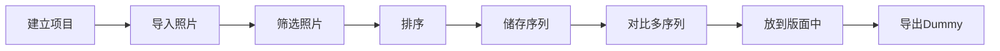
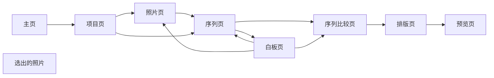

---
tags:
  - PhotoFlex
  - PRD
  - 产品需求
  - MVP00
created: 2026-08-25
updated: 2026-08-25
status: draft
version: 0.1
---
# PhotoFlex_Sequence MVP产品需求文档

## 一、版本说明

- 20260830 第二版，改变MVP思路，做数字桌面，缩窄MVP验证范围。
- 20260825 第一版，生成构思MVP。

## 二、背景与目标

### 2.1. 背景
为了验证Photoflex的可行性与吸引第一波Photoflex的用户，将开发第一个网页版MVP，提供摄影师一个用于摆放、摆弄照片的数字桌面，为摄影师选片提供便利，并且帮助摄影师为照片排序。

### 2.2. 目标
- 为摄影师提供一个数字的桌面工具，用于观看、摆弄需要打印出来的照片；
- 提供免费、易用的照片排序工具；
- 提供更好的观看照片视角；
- 验证PHOTOFLEX的可行性；
- 吸引第一波用户

具体功能上线：
1. 照片导入、预览、选择
2. 数字照片桌
3. 照片对比
4. 照片序列，观看视角切换
5. 照片阅读模式
6. 序列对比

#### 2.2.1 目标指标


#### 2.2.2 北极星指标
> **活跃项目中，创建第二个命名序列版本且至少完成一次 A/B 比较的项目比例。**，预计大于60%


## 三、 用户场景

### 3.1 用户画像

    会进行长期项目创作的摄影师、摄影爱好者、摄影专业学生。

### 3.2 场景故事

- 用户带有一堆已经经过后期的照片，希望能够将这些散乱的照片形成结构化的叙事/序列
- 他们点进这个网页，建立起一个可能的项目名称，导入需要建构的照片库，从这些庞杂的照片中筛选出符合一个主题的照片池
- 从这照片池中选出照片进行排序，储存这一次排序；重新换一个序列，储存，多个版本进行对比，挑出最满意的一个序列
- 做一些记录
- 把这个序列放到版面中看看变成书看起来怎么样
- 导出，形成一个小的摄影书dummy。

### 3.3 价值分析

这个产品可以有效填补当前市面上没有专为项目摄影师打造的轻量级的照片观看、排序产品的空缺。
1. 可以验证摄影师是否真的有这个需求（看使用人数，预测100人）
2. 验证序列的比较是必须的（需要看生成版本指标，预计每个人每个项目要生成5个以上）
3. 可以拿来做每日审美积累工作。

### 3.4 核心体验路径

### 3.5 产品指标预测


| 指标 | 目标 | 测量方法 | 层级 |
|---|---:|---|---|
| 点击进入网页人数 | >200 | 在发布后的 4 周窗口内，用匿名访客 ID 去重，统计进入 MVP 首页并成功加载的独立访客数；剔除机器人和重复刷新 | 流量层 |
| 新老访客比例 | 老访客>70% | 统计窗口内按匿名访客 ID 去重的访客，`老访客数（窗口内非首次访问）/总独立访客数`；同时记录新访客数作为分母校验 | 流量层 |
| 建立项目并导入照片的人数 | >80% | 观察式可用性测试；正式 MVP 用 `project_created` 且成功导入至少 1 张照片的独立访客数 / 进入首页的独立访客数 | 转化层 |
| 建立序列并拖动照片保存的人数 | >80% | 记录 `sequence_created`、`photo_reordered`、`sequence_saved`；完成三事件的独立访客数 / 成功导入照片的独立访客数 | 转化层 |
| 进入白板进行排序的人数 | >70% | 记录 `whiteboard_opened`；进入白板的独立项目数 / 已保存首个序列的独立项目数 | 转化层 |
| 使用白板排序的平均时间 | >2 min | 记录 `whiteboard_opened` 到 `whiteboard_saved` 的活跃时长；连续无操作超过 60 秒暂停计时，报告均值并同时报告中位数 | 行为层 |
| 使用沉浸式观看的人数 | >70% | 记录 `immersive_view_opened`；使用沉浸式观看的独立项目数 / 已保存首个序列的独立项目数 | 转化层 |
| 在序列阶段停留的平均时间 | >5 min | 以 `sequence_opened` 到离开序列或会话结束计算活跃时长；无操作超过 60 秒暂停，按项目统计均值和中位数 | 行为层 |
| 活跃项目产生第二个命名版本 | ≥ 60% | `named_version_created` 事件；创建过首个命名版本的活跃项目中，创建至少两个不同命名版本的项目数 / 分母项目数 | 行为层 |
| 活跃项目使用 A/B Compare | ≥ 60% | `compare_opened` 且加载两个版本的事件；创建过至少两个命名版本的活跃项目中完成 Compare 的项目数 / 分母项目数 | 行为层 |
| 在不同版本使用Memo记录的人数 | ≥ 30% | `memo_saved` 关联到两个或以上不同版本；完成第二版本的活跃项目中满足条件的项目数 / 分母项目数 | 行为层 |
| 导出dummy的人的百分比 | >=10% | 记录 `export_started`、`export_succeeded`；至少成功导出 1 次 PDF 的活跃项目数 / 创建过至少一个已保存序列的活跃项目数；只计成功，不计点击按钮 | 行为层 |
| 原文件误改、误移、误删 | 0 次 | hash 对照、事件审计、用户报告 | 技术层 |
| 10,000 张已索引照片浏览 | 首屏已有缩略图 ≤2 秒，滚动无持续卡顿 | 使用固定 10,000 张代理图 fixture，在目标硬件上重复 3 次 benchmark；记录暖启动、首屏显示、滚动帧率、内存峰值和失败率 | 技术层 |
| 数据丢失 | 0 个确认事件 | 对强制关闭、索引中断、导出失败和重开恢复做故障注入；核对项目快照、序列版本和 Memo，所有确认事件进入 Alpha/Beta 缺陷记录 | 技术层 |

转化漏斗按以下顺序记录每一步的进入人数、完成率和流失率：`landing_viewed` → `project_created` → `photos_imported` → `sequence_saved` → `whiteboard_saved` / `immersive_view_opened` → `version_2_created` → `compare_completed` → `export_succeeded`。所有比例必须在指标名称中明确分母，避免把访客、用户和项目混用。

**测量口径：**

- **统计窗口：** 流量和转化指标默认按发布后 4 周统计；行为指标按项目统计，并单独报告访客数、项目数和完成该阶段的分母。
- **匿名标识：** 不要求登录时使用匿名访客 ID、项目 ID 和版本 ID；同一访客可创建多个项目，因此用户指标与项目指标不可直接相加。
- **活跃项目：** 统计窗口内至少完成一次照片导入，并至少打开过一次序列编辑器的项目。
- **完成事件：** 只有状态真正持久化成功才记为完成；按钮点击、页面打开或导出开始不等于完成。
- **样本解释：** 早期样本量较小时同时展示绝对数 `n`，不只展示百分比；不足 30 个有效项目时，行为比例只作为方向性信号，不作为稳定结论。

### 3.6 路径规划

> MVP后将加入灵感箱、思考箱、材料箱等，用于记录文字与材料；
> 将有一个作品仓库保存已经做好的Dummies；
> 将会升级白板，使其更加自由流畅，但不必加入与摄影项目无关的功能；
> 将会有两个不同路径开始一个项目（照片先行/问题（主题）先行）；
> 后续会接入AI来辅助项目研究、问答等；
> 希望能够同步开发网页端与桌面端，核心技术栈最好可以相容；
> 最远的远景是搭建一个社区平台，希望这个网站有接入新搭的社区网站的可能（用户通用、作品能够连接过去）。

## 四、概要设计

### 4.1 模块设计

```mermaid
subgraph Class[档案管理]
    Proj[项目模块]
    Photo[照片库模块]
    Pool[待排序照片模块]
subgraph Browse[浏览]
    Big[大图模块]
subgraph Seq[序列]
    Sequence[序列模块]
    White[白板模块]
subgraph Compare[比较]
    SC[序列比较模块]
    Memo[Memo模块]
subgraph Dummy[Dummy]
    Preview[预览模块]
    Design[排版模块]
Export[导出模块]
```
1. 档案管理：HOME模块、项目模块、照片库模块、待排序照片模块
2. 浏览：大图模块
3. 序列：序列模块、白板模块
5. 比较：序列比较模块、Memo模块
6. Dummy：预览模块、排版模块
7. 导出：导出pdf模块

### 4.2 功能清单

- HOME模块：
1. 新建项目资料夹
2. 管理多个项目资料夹（重命名、删除等）
3. 登录
4. 筛选/搜索项目资料夹

- 项目模块：
1. 添加照片资料夹
2. 管理照片资料夹（Remove、Delete）
3. 打开照片资料夹，进入contact sheet
4. 预览Project Pool

- 照片库（contact sheet）模块：
1. 选择照片（全选、反选、移除）进入project pool
2. 大图预览（可在预览状态选择、移除照片、可放大细节）
3. 预览Project Pool

- Project Pool模块
1. 预览照片大图
2. 选择、反选、全选、移除照片
3. 作为一个自由模块收起、展开（参考milanote的Unsorted）
4. 加入文字memo作为一个照片进入sequence
5. 滚动

- Sequence模块
1. 拖动照片变换位置顺序
2. 预览大图
3. 增删序列中的照片（全选、反选）
4. 标记照片顺序
5. 命名序列
6. 按着ctrl多选照片
7. 键盘左右键横向移动
8. 放缩画面
9. 放缩照片
10. 一键打乱
11. 进入白板入口
12. 进入compare
13. 进入dummy 
14. 右侧悬浮pool模块作为照片来源（可收起）

- 白板模块
1. 自由左键拖曳照片、调整照片大小
2. 右键拖曳视角，（键盘上下左右键）
3. 视角大小放缩（快捷键ctrl+滚轮）
4. 双击照片预览大图（左右键上下一张）
5. 右侧悬浮pool模块作为照片来源（可收起）
6. 改变顺序若保存则需记录到sequence
7. delete删除照片

- 比较模块
1. 展示两个序列（上下进行对比）
2. 点击单个序列进行沉浸式序列浏览
3. 为序列增加memo
4. 储存整个序列

- Dummy排版模块
1. 选择单页、双页版面，将目前的照片序列单张照片放在一个白色版面的中间
2. 版面上照片可自由移动，调整大小
3. 可从pool中增加照片到版面上
4. 可在版面上编辑文字

- Dummy预览模块
1. 以翻书的方式翻阅排好的dummy
2. 可选单页、双页视角

- 导出模块
1. 将dummy导出pdf

### 4.3 页面关系图


**Pool**不是一个单独页面，而是一个嵌套在Proj, Photo, Sequence, White的模块

### 4.4 交互图


### 4.5 产品原则

1. **原片零写入**：核心操作不移动、重命名、覆盖或删除原片。
2. **创作判断属于用户**：产品提供观看条件、差异和问题，不给艺术质量分数。
3. **版本优于覆盖**：已保存的创作节点不可被静默改写。
4. **恢复优于提醒**：项目管理服务于重新进入创作，不以签到和任务完成率驱动用户。
5. **本地核心独立成立**：无网络、无 AI 也能完成 MVP 闭环。
6. **先做专用编辑器**：序列、比较和输出是第一等对象；通用白板、社区和复杂排版延后。
7. **错误可解释、工作可恢复**：长任务可取消重试，部分失败不抹掉成功结果。


## 五、 详细设计


参考
photoprism、sequence：zine&books、Photo Book Noir； Miro； Milanote
