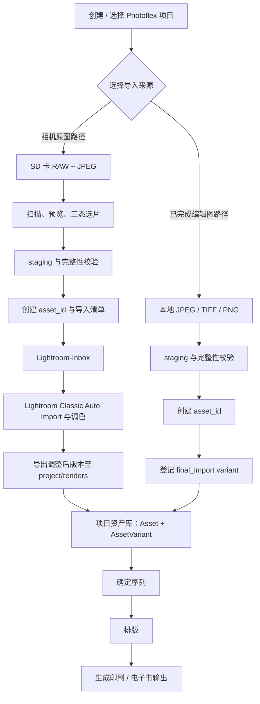

# Photoflex：SD 卡选片、导入与 Lightroom 衔接

> 文档用途：记录 Photoflex 的一个独立功能模块——“从 SD 卡快速预览、选片、只复制选中原图，并无缝进入 Lightroom Classic”的产品和技术决策。本文应足以让新的 session、开发者或 agent 在不依赖聊天上下文的情况下继续设计与实现。
>
> 状态：方案阶段（尚未实现）  
> 推荐方向：Windows 桌面应用优先；Lightroom Classic Auto Import 作为第一版衔接方式；Lightroom 插件留给后续阶段。

---

# 第一部分：工作流、路径与开发方案

## 1. 问题定义

摄影师从 SD 卡导入照片时，当前流程通常是：

```text
SD 卡 → 将整张卡复制到本地 → 在 Lightroom 导入 → 生成预览 → 再筛选
```
该流程有三个痛点：

1. 原图很大（例如单张 JPEG 约 30 MB），在 SD 卡上逐张预览缓慢。
2. 为了选片而先复制全量原图，会消耗本地空间和时间；手动在多个文件夹之间复制/粘贴也容易遗漏或重复。
3. 即使原图已经在本地，还需要再手动打开 Lightroom 导入窗口并配置目标位置。

Photoflex 不应替代 Lightroom 的调色或 Catalog；它应补上 Lightroom 之前的“快速入片与选片”环节。

## 2. 功能定位
```text
Photoflex：SD 卡 → 本地照片库之间的高速、可恢复、可审计导入器
Lightroom Classic：照片 Catalog、调色、关键词、编辑与正式导出到Photoflex
Photoflex: 实现已编辑图片的项目管理、白板排序、摄影术排版、导出功能
```

核心原则：

- 不要求先复制整张 SD 卡。
- 原图默认只读，不在 SD 卡上删除或改名。
- 预览优先、复制延后；只复制用户确认的照片。
- Lightroom 的 Catalog 必须由 Lightroom 自己维护；Photoflex 不直接读写 `.lrcat` 数据库。
- 每次导入必须可追踪：来源卡、选片清单、复制结果、目标目录、Lightroom 交接状态。

## 3. 推荐目标工作流

```text
[插入 SD 卡]
      ↓
[Photoflex 扫描文件与元数据]
      ↓
[快速网格预览 / 当前选中图代理预览]
      ↓
[标记：keep / pending_keep / reject]
      ↓
[确认导入批次与目标项目]
      ↓
[仅复制“保留”原图到本地 .staging]
      ↓
[完整性校验：文件大小 + 可选哈希]
      ↓
[原子移动至 Lightroom 监视文件夹]
      ↓
[Lightroom Classic 打开时自动入 Catalog 并移动至正式照片库]
```

### 3.1 从导入到书籍输出：项目连续性工作流

本节定义一张照片从进入 Photoflex 到被编入序列、放入版面、生成书籍输出的完整生命周期。它是导入器、项目管理和后续排版模块之间的交接契约：后续实现不得依赖聊天记录或某个固定目录来推断资产身份。

#### 3.1.1 系统边界与数据所有权

- **Photoflex 是主系统**：负责项目、资产身份、资产版本、序列、排版和书籍输出的记录与关系。
- **Lightroom Classic 是相机原图的 Catalog 与调色系统**：它负责导入后的 Catalog 记录、Develop 调色及其自身的 Collection；Photoflex 不替代这些能力。
- 相机原图进入 Lightroom 后，Photoflex 与 Lightroom 必须引用**同一份正式原图**。为“交回 Photoflex”再复制一份新的原图是禁止的；Photoflex 接收的是导出的渲染版本。
- 禁止直接读写 Lightroom `.lrcat`。第一版只通过 `Lightroom-Inbox` 与用户指定的导出目录衔接，后续插件也不得改变原图所有权或 `asset_id`。
- 每张照片首次进入 Photoflex 时即生成稳定的 `asset_id`。文件名、磁盘目录、Lightroom Catalog 记录和 Lightroom Collection 都是可变引用，不能作为唯一身份。
- 同一张照片可以有多个版本（variant），但所有版本必须归属于同一个 `asset_id`。版本是“同一资产的不同可用文件”，不是新的照片资产。
- 缩略图和代理图仅是可失效、可重建的缓存；它们不能作为排版、印刷或电子书输出源。

#### 3.1.2 端到端工作流



所有路径均从“创建或选择项目”开始。项目是资产、批次、序列、版面和输出的归属单位；导入不能先落入无归属的临时照片库，再靠文件夹名称猜测属于哪个项目。

#### 3.1.3 两条导入路径

**路径 A：相机原图路径（从 SD 卡导入 RAW + JPEG）**适用于尚未编辑的相机原图。相机直接拍摄的 JPEG 仍属于此路径，不能因为其格式是 JPEG 而被视为已完成编辑图。

```text
SD 卡扫描
  → 快速预览
  → 三态选片：keep / pending_keep / reject
  → 仅复制 keep 文件到 staging
  → 文件大小校验（可选哈希校验）
  → 创建 asset_id、Import Manifest 与配对关系
  → Lightroom-Inbox
  → Lightroom Classic Auto Import 与调色
  → 导出调整后版本至 <project>/renders/
  → 登记 lightroom_render variant
  → ready_for_sequence
```

- 必须识别同名 RAW/JPEG 配对及关联 XMP 边车文件；配对关系记录在导入清单中，不能只靠日后文件名推断。
- 只有校验成功的完整文件才可进入 `Lightroom-Inbox`。Lightroom 未启动时，批次保持 `ready_for_lightroom`，而不是假称已完成调色。
- 首次登记原图时，资产的 `origin` 为 `camera_sd`，编辑状态从 `imported` 进入 `needs_lightroom_render`；只有登记了可用的 `lightroom_render` 后才能进入 `ready_for_sequence`。

**路径 B：已完成编辑图路径（本地成片直接导入）**适用于已经在 Lightroom、Photoshop 或其他工具中完成调色/修图的 JPEG、TIFF、PNG 等成片。

```text
选择本地文件
  → staging
  → 文件大小校验（可选哈希校验）
  → 创建 asset_id
  → 注册 final_import variant
  → ready_for_sequence
  → 项目、序列、排版、书籍输出
```

- 此路径绝不能送进 `Lightroom-Inbox`。
- 默认复制到 `<project>/assets/`，以保证项目可携带；可选“链接外部文件”模式，但必须在打开项目、进入序列或生成输出前检测并标记丢失路径。
- 如果用户尝试通过此路径导入 RAW，必须提示切换至“相机原图路径”，或要求先导出渲染版本。
- 首次登记时，资产的 `origin` 为 `external_finished`；校验通过并注册 `final_import` variant 后直接进入 `ready_for_sequence`。

#### 3.1.4 资产身份、版本与状态

```text
Asset
- asset_id：永久身份，不依赖路径或文件名
- project_id
- origin：camera_sd / external_finished
- editorial_status：imported / needs_lightroom_render / ready_for_sequence / sequenced / placed

AssetVariant
- variant_id
- asset_id
- kind：original / lightroom_render / final_import / print_render
- path 或 external_link
- integrity_status
- source：photoflex / lightroom / external
- revision、created_at
```

- `original` 是正式相机原图的记录；同名 RAW/JPEG 和 XMP 的关联由导入清单和配对字段表达，不得用缓存替代。
- `lightroom_render` 是从 Lightroom 导出到 `<project>/renders/` 的调整后版本；它保留原 `asset_id`，不会产生新的 Asset。
- `final_import` 是通过本地成片路径导入的可排版版本；它同样只属于一个既有或新建的 Asset。
- `print_render` 是为印刷生成的派生版本。它是输出前的技术文件，不改变原始编辑决定，也不替代可继续编辑的 `lightroom_render` 或 `final_import`。
- `import_selection_state`（`keep` / `pending_keep` / `reject`）只描述相机导入时的选片决定；`editorial_status` 描述项目生命周期，两者必须独立。

#### 3.1.5 从资产库到序列、排版与书籍输出

项目资产库只接纳已具备可用排版版本的资产，即 `editorial_status = ready_for_sequence`。序列、版面和输出必须保存对身份与版本的引用，而不是复制文件或绑定绝对路径：

```text
SequenceItem
- sequence_id
- asset_id
- selected_variant_id
- order、caption、editorial_note

LayoutPlacement
- layout_id / page_id
- asset_id
- variant_id
- frame、crop、rotation、caption_style

BookOutput
- book_id
- source_layout_revision
- output_path
- format：print_pdf / epub / web_pdf / image_package
- generated_at
```

1. 用户从资产库选择 `ready_for_sequence` 资产，创建或编辑序列；同一 `asset_id` 可以出现在多个序列，且不复制原图。
2. 排版以序列或资产库为输入，页面中的 `LayoutPlacement` 记录 `asset_id + variant_id`、裁切和版式参数。替换导出版本时，系统应提示是否切换所引用的 variant，而不是静默改变已排好的页面。
3. 生成书籍时，从已锁定的版面修订生成 `print_render`、PDF 或电子书包；输出记录其来源版面修订，以支持重新生成和可追溯性。
4. 在输出前必须校验每个被引用 variant 的完整性和路径可用性。原图、渲染文件或外部链接丢失时，阻止或明确降级输出，不能以缩略图或代理图替代。

#### 3.1.6 建议项目目录与可携带性

```text
Photoflex Projects/
└─ <project-name>/
   ├─ project.json
   ├─ imports/<batch-id>.json
   ├─ assets/                 # 默认存放本地成片导入的 final_import
   ├─ renders/                # Lightroom 与其他编辑器导出的可用渲染版本
   ├─ sequences/
   ├─ layouts/
   └─ outputs/                # 书籍、PDF、电子书和印刷交付物
```

相机正式原图的路径由项目的 `photo_library_root` 和 Lightroom Auto Import 的目标目录共同配置，并在 Asset 中记录；它不必复制进项目目录。这样既保持与 Lightroom 的同一份正式原图，又让本地成片、渲染版本、排版文件和输出随项目携带。任何外部链接都必须保留上次验证时间和失效状态。

#### 3.1.7 建议同步修改 PRD Import

以下是应写入 `PRDs/PRD Import.md` 的具体修订建议；在实际实现前，应将其从“后续扩展”提升为可验收需求：

| 位置 | 建议修改 | 原因 |
|---|---|---|
| PRD 5：导入确认页 | 增加“导入来源”入口（`camera_sd` / `external_finished`）、项目必选、外部文件复制/链接选择与 RAW 拦截提示。 | 让两条路径在进入导入器时即被明确区分。 |
| PRD 6：新增 FR-08「项目资产生命周期」 | 定义 `asset_id`、`origin`、`editorial_status`、variant 注册、版本替换确认、丢失外部路径检测和缓存不得用于输出。 | 将身份与状态机从导入批次扩展到项目生命周期。 |
| PRD 6：新增 FR-09「序列、排版与书籍输出」 | 定义 SequenceItem、LayoutPlacement、BookOutput 对 `asset_id + variant_id` 的引用；输出前完整性检查；输出与版面修订可追溯。 | 防止排版模块重新以路径或复制文件建立另一套身份。 |
| PRD 7：扩展数据模型 | 为 Asset 增加 `origin`、`editorial_status`；为 AssetVariant 增加 `variant_id`、`integrity_status`、`external_link`、`revision`；新增 Sequence、SequenceItem、Layout、LayoutPlacement、BookOutput。 | 使数据模型能落实工作流。 |
| PRD 8：可恢复性与安全 | 增加“项目重新打开时检查外部链接和输出所需版本”；明确缩略图/代理图不可作为任何最终输出源。 | 把项目可携带性和输出可靠性变为非功能约束。 |
| 验收标准 | 增加跨路径验收：一张 SD 卡来源照片导出后进入序列；一张本地成片直接进入同一序列；两者均可被放入同一版面并生成可追溯 PDF，且不新增重复 Asset。 | 验证两条路径真正汇合，而非仅各自导入成功。 |

### 3.2 Lightroom 是否需要一直打开？

不需要。

- SD 卡扫描、预览、标记、复制到本地暂存区均由 Photoflex 独立完成。
- Lightroom Classic 只在“自动导入到 Catalog”这一步需要打开。
- 若 Lightroom 未启动，Photoflex 可将已校验的文件留在 `Lightroom-Inbox` 中，待 Lightroom 下次启动后处理。

Lightroom Classic 的 Auto Import 监视一个空文件夹，检测到新照片后会将其导入 Catalog 或 Collection，并移动至设定的最终目录；它不会监视子文件夹。因此监视文件夹必须是临时收件箱，而不是长期照片库。

参考： [Adobe：Auto-import photos into Lightroom Classic](https://helpx.adobe.com/lightroom-classic/desktop/import-photos/import-photos-automatically.html)

## 4. 预览与性能策略

### 4.1 JPEG 约 30 MB 的现实限制

JPEG 不是 RAW，但 30 MB JPEG 仍然是高像素原图。要进行 100% 放大、确认微小细节或精确对焦，必须读取并解码大量数据；软件无法完全跳过 SD 卡与读卡器的物理吞吐上限。

优化目标不是“让每一张 30 MB JPEG 都瞬间完整显示”，而是：

> 只为用户看得到、停留过或标记为候选的照片，读取一次原图；其余照片只用轻量预览。

### 4.2 三级预览

| 层级 | 使用场景 | 数据来源 | 目标 |
|---|---|---|---|
| L1：网格缩略图 | 首屏、连续滚动 | JPEG EXIF 内嵌缩略图；缺失时生成小图 | 尽快显示构图概览 |
| L2：屏幕预览 | 当前选中、连续浏览 | 原 JPEG 下采样生成约 1600–2048 px 代理图 | 判断构图、曝光、基本清晰度 |
| L3：细节检查 | 放大、100% 检查 | 原 JPEG | 判断对焦和局部细节 |

### 4.3 缓存策略

- 缩略图、代理图和索引写入本地 SSD 缓存，不复制原始照片。
- 缓存键建议包含：卡标识、相对路径、文件大小、修改时间；必要时追加快速内容哈希。
- 按视口优先：先加载当前网格可见照片，再预读后续 1–2 屏。
- 任务可取消：快速滚动时，取消已经离开视口的低优先级解码任务。
- SD 卡读取并发应有上限（建议起点 2–4 个并发任务），避免并发过多导致读卡器随机读取变慢。
- 缓存需支持容量上限、按卡清除、自动过期和手动“清理预览”。

### 4.4 硬件边界

读取速度最终还受 SD 卡规格和读卡器限制。若卡支持 UHS-II 而读卡器只支持 UHS-I，预览和代理生成会被读卡器限制。产品界面应显示当前卡与读卡器的实际读速测量，而非承诺固定速度。

## 5. 文件安全与导入事务

### 5.1 两阶段复制

不能把正在复制的照片直接写进 Lightroom 监视文件夹；否则 Lightroom 可能在文件尚未完整时开始导入。

推荐事务：

```text
SD 原图
  → 复制到本地 .staging（临时名，例如 .partial）
  → 校验文件大小；可选 SHA-256 / 快速哈希
  → 原子改名或同卷移动
  → Lightroom-Inbox
```

### 5.2 文件配对与命名

第一版至少识别：

- 单独 JPEG
- RAW + JPEG 同名配对（为未来兼容预留）
- `.xmp` 边车文件
- 同名冲突

默认命名策略应为“保留原始文件名”，并按导入批次放入逻辑项目目录。若用户需要统一命名，必须先显示预览映射表，避免覆盖。

### 5.3 失败恢复

每个导入批次存储可恢复状态：

```text
scanned → selected → copying → verifying → ready_for_lightroom → imported / failed / paused
```

应支持：

- SD 卡意外拔出后暂停并提示。
- 重插同一张卡后从未完成文件继续。
- 目标磁盘空间不足时停止后续复制，不删除已校验文件。
- 文件损坏、重名、无权限时展示可操作的单项错误。
- 用户明确确认前，绝不自动删除 SD 卡文件。

## 6. Lightroom 衔接方案对比

| 方案 | 描述 | 优点 | 局限 | 结论 |
|---|---|---|---|---|
| A. Auto Import 监视文件夹 | Photoflex 将已校验文件写入 Lightroom-Inbox | 无需插件；实现快；由 Lightroom 正常入库 | Lightroom 需启动；监视文件夹不能有子文件夹 | **第一版推荐** |
| B. 手动批量导入 | Photoflex 复制到本地项目目录，用户之后在 Lightroom 选择 Import | 结构最自由 | 保留第二次手动操作 | 适合作为回退模式 |
| C. Lightroom Classic 插件 | 通过 `.lrplugin` 菜单、元数据和 Catalog 工作流集成 | 更深的项目/Collection 连接 | Lua 开发与测试成本更高；Lightroom 运行时依赖 | 第二阶段或之后 |
| D. 直接写 Catalog | 修改 `.lrcat` 数据库 | 看似省步骤 | 高损坏风险，官方不支持 | **禁止** |

Lightroom Classic 导入的本质是为 Catalog 创建照片记录及文件链接，而不是单纯“把文件放进文件夹”。

参考： [Adobe：Import photos from a folder on a hard drive](https://helpx.adobe.com/lightroom-classic/desktop/import-photos/import-photos-video-catalog.html)

## 7. 平台与技术路径对比

| 路径 | 优点 | 风险/代价 | 适合度 |
|---|---|---|---|
| Windows 桌面应用（Tauri + React + Rust） | 本机文件权限；高效后台任务；安装包和内存负担相对小；适合 SD 卡与缓存 | 需维护 Rust 与前端两层 | **推荐** |
| Windows 桌面应用（Electron + React/TypeScript） | JS/TS 生态成熟；原型更快；文件/窗口能力完整 | 运行时和内存开销通常较大 | 可作为团队偏 JS 时的备选 |
| 纯网页/PWA | 分享与协作界面容易 | SD 卡探测、长时间复制、本地缓存、Lightroom 衔接受浏览器限制 | 不适合核心导入器 |
| 先做 Lightroom 插件 | 直接在 Lightroom 内出现菜单 | 无法独立解决 SD 卡预览；Lua SDK 学习成本；依赖 Lightroom 已打开 | 不适合第一步 |

Tauri 可让网页前端在受限权限下访问本地文件系统，适合只向用户请求特定照片目录与 SD 卡路径的桌面应用。[Tauri 文件系统与权限文档](https://v2.tauri.app/plugin/file-system/)

Electron 同样支持桌面应用的 Node.js 主进程和原生系统能力，适合需要完全采用 JavaScript/TypeScript 的团队。[Electron process model](https://www.electronjs.org/docs/latest/tutorial/process-model)

## 8. 推荐架构

```text
┌────────────────────────────────────────────┐
│ React / TypeScript UI                       │
│ 卡片网格、全屏预览、选择、导入队列、设置     │
└───────────────────┬────────────────────────┘
                    │ 安全 IPC
┌───────────────────▼────────────────────────┐
│ Rust Core                                   │
│ 扫描、元数据、缩略图队列、代理、复制、校验   │
└───────┬───────────────────┬────────────────┘
        │                   │
┌───────▼───────┐   ┌───────▼────────────────┐
│ SQLite        │   │ 本地文件系统            │
│ 卡/照片/批次  │   │ Cache / Staging / Inbox │
└───────────────┘   └───────────┬────────────┘
                                │
                     ┌──────────▼───────────┐
                     │ Lightroom Classic     │
                     │ Auto Import / Catalog │
                     └──────────────────────┘
```

建议模块：

- `device`：SD 卡检测、卡指纹、可移除设备状态。
- `scanner`：遍历照片、建立索引、解析 EXIF。
- `preview`：缩略图提取、代理生成、缓存与任务优先级。
- `selection`：标记、筛选、批量操作。
- `importer`：目标路径、暂存、复制、校验、断点恢复。
- `lightroom_bridge`：监视文件夹交接与状态提示。
- `storage`：SQLite 数据模型与缓存清理。

## 9. 开发阶段与决策门

### 阶段 0：技术验证（POC）

验证三个高风险点：

1. 能否从目标相机的 JPEG 快速读取可用缩略图。
2. 从 SD 卡生成 1600 px 代理图的实际速度。
3. Lightroom Auto Import 是否能按预期消费 `Lightroom-Inbox` 文件。

产出：真实读速数据、缓存容量数据、相机样本兼容性清单。

### 阶段 1：本地导入 MVP

实现 SD 卡扫描、网格、选择、仅复制选中照片、暂存校验和导入批次记录。此阶段不要求 Lightroom 集成。

### 阶段 2：Lightroom 自动交接

实现监视文件夹配置、写入前完整性检查、交接状态、Auto Import 操作指南与失败提示。

### 阶段 3：效率功能

增加键盘选片、候选筛选、代理缓存策略、速度监控、磁盘空间估算、重复/模糊检测。

### 阶段 4：深度集成

视用户价值决定是否开发 Lightroom Classic `.lrplugin`：项目元数据、Collection 映射、回写选片状态、导出协作。

---

# 第二部分：详细 PRD

## PRD 1. 功能名称

**Photoflex Importer：SD 卡快速选片与 Lightroom 交接**

## PRD 2. 背景与目标

Photoflex 的此模块服务于摄影师从拍摄结束到开始调色之间的阶段。用户希望在不占用整张卡复制空间的前提下，快速预览、选出保留照片，并将其安全地导入本地照片库与 Lightroom Classic。

### 目标

- 让用户无需完整复制 SD 卡即可完成初筛。
- 只复制用户选择的原图。
- 消除或显著减少 Lightroom 的第二次手动导入步骤。
- 让每个导入批次安全、可恢复、可追踪。

### 非目标（第一版不做）

- 不替代 Lightroom Develop 调色。
- 不直接编辑 Lightroom Catalog 数据库。
- 不在 SD 卡上自动删除文件。
- 不提供云同步、多设备协作或在线相册。
- 不保证对所有相机格式提供同样的内嵌预览质量。
- 不在第一版做 AI 自动选片结论；可保留数据接口。

## PRD 3. 目标用户

| 用户 | 场景 | 核心需求 |
|---|---|---|
| 独立摄影师 | 单次拍摄后从 SD 卡挑选照片 | 快速看图、少复制、可靠入库 |
| 摄影爱好者 | 家庭/旅行照片整理 | 简单、不会误删、看得懂进度 |
| 长期项目创作者 | 多次拍摄汇入同一项目 | 项目归属、导入记录、后续排版连接 |

## PRD 4. 用户故事

1. 作为摄影师，我插入 SD 卡后，希望立即看到照片网格，而不是等待整卡导入。
2. 作为摄影师，我希望用键盘快速标记保留/跳过，并只复制保留的原图。
3. 作为摄影师，我希望在复制开始前看到照片数量、总容量、目标位置和预估空间需求。
4. 作为摄影师，我希望复制被中断后可以恢复，而不是重新开始或猜测哪些已完成。
5. 作为 Lightroom 用户，我希望照片在我打开 Lightroom Classic 后自动进入 Catalog，而不用再次手动选择文件。
6. 作为谨慎用户，我希望 SD 卡原图在我明确确认前绝不被删除。
7. 作为项目创作者，我希望知道某张照片来自哪张卡、哪次导入及哪个项目。

## PRD 5. 核心页面与交互

### 5.1 首页 / 设备页

显示：

- 已连接 SD 卡名称、容量、可用空间、估计照片数量。
- 是否存在可恢复的上次导入批次。
- “开始扫描”与“继续导入”入口。
- 本机 Lightroom-Inbox、最终照片库与缓存空间健康状态。

### 5.2 选片页

必须支持：

- 网格缩略图、滚动虚拟化、首屏优先加载。
- 单击选中；双击/空格进入预览。
- 保留、候选、跳过三种状态。
- 键盘导航与快捷键（首版建议：方向键、空格、`P` 保留、`X` 跳过、`U` 取消标记）。
- 按状态筛选、显示已选数量和容量。
- 当前照片代理预览加载状态。

### 5.3 导入确认页

必须显示：

- 保留照片数量、总原图大小、可用磁盘空间。
- 目标项目名称与目标文件夹。
- Lightroom 交接模式：`Auto Import` 或 `仅复制到本地`。
- 命名策略、是否同时复制 XMP/配对文件。
- “开始导入”按钮及不可逆操作提示。

### 5.4 导入队列页

必须显示：

- 批次状态、总进度、当前文件、速度、预计剩余时间。
- `scanned / selected / copying / verifying / ready_for_lightroom / imported / paused / failed` 状态。
- 单项错误与重试操作。
- 暂停、恢复、取消（取消不得删除已校验的已导入文件）。
- Lightroom 未启动时的“等待 Lightroom 处理”说明。

### 5.5 历史页

显示过去批次：来源卡、时间、项目、选片数、目标路径、Lightroom 状态、失败项目与恢复入口。

## PRD 6. 功能需求

### FR-01：设备识别与扫描

- 识别 Windows 可访问的可移除存储设备。
- 用户必须显式选择 SD 卡根目录；不自动扫描所有磁盘。
- 扫描 JPEG；架构需为 RAW、XMP 和视频预留文件类型能力。
- 解析基础 EXIF：拍摄时间、像素尺寸、方向、相机型号、文件大小。
- 扫描结果持续保存，可在应用重启后恢复。

验收：插入含 1,000 张 JPEG 的已知 SD 卡时，用户可在扫描未结束前看到已发现照片的网格。

### FR-02：预览、缓存与性能

- 优先尝试读取 JPEG 内嵌缩略图。
- 仅为视口内照片生成/加载缩略图。
- 用户选中照片后，以高于后台扫描的优先级生成代理预览。
- 缓存只保存缩略图/代理图，不保存完整原图。
- 用户可配置缓存目录和最大容量。

验收：在目标测试卡与硬件上，首屏缩略图和连续浏览速度应被记录；产品以实测指标展示，不承诺跨硬件固定秒数。

### FR-03：选择状态

- 每张照片有 `keep`、`candidate`、`skip`、`unmarked` 状态。
- 状态随批次持久化。
- 支持单张、范围和批量状态变更。
- 导入默认仅包含 `keep`；用户可在确认页选择是否包含 `candidate`。

验收：重启应用后，同一张卡重新插入仍可恢复选择状态；若文件已变化，必须标记为待确认。

### FR-04：导入与完整性

- 导入前检查目标磁盘可用空间。
- 每个文件先写至暂存区，完成后校验大小；高级设置可启用哈希校验。
- 文件只有在校验通过后才进入 Lightroom-Inbox 或最终目标目录。
- 支持同名冲突策略：跳过、重命名、停止并询问；默认停止并询问。
- 复制过程可暂停与恢复。

验收：复制中拔出 SD 卡后，系统显示可恢复状态；未完成文件不会被交给 Lightroom。

### FR-05：Lightroom Classic Auto Import 交接

- 用户可设置并验证一个空的 Lightroom-Inbox 路径。
- 提示用户在 Lightroom Classic 中启用 Auto Import，并设置最终目录与 Collection。
- Photoflex 仅在文件校验成功后写入 Inbox。
- UI 清楚区分“已进入 Inbox”和“Lightroom 已处理”；第一版不宣称能可靠读取 Catalog 内部状态。

验收：在已正确配置的 Lightroom Classic 环境中，写入 Inbox 的完整 JPEG 被 Lightroom 自动移动并出现在目标 Catalog/Collection 中。

### FR-06：安全与隐私

- 不上传照片、不要求网络连接。
- 不自动删除或格式化 SD 卡。
- 删除缓存必须与原图删除明确区分。
- 日志不得写入照片内容；可记录路径、文件名、大小和错误码。

## PRD 7. 数据模型（建议）

```text
Card
- id
- volume_label
- volume_serial_or_fingerprint
- first_seen_at

Photo
- id
- card_id
- relative_path
- file_name
- file_size
- modified_at
- capture_at
- width / height / orientation
- selection_state
- preview_cache_key

ImportBatch
- id
- card_id
- project_id (nullable)
- source_root
- staging_root
- target_root
- lightroom_inbox_root
- mode
- status
- created_at / updated_at

ImportItem
- id
- batch_id
- photo_id
- source_path
- staging_path
- destination_path
- status
- bytes_copied
- verify_method
- error_code / error_message
```

## PRD 8. 非功能需求

| 类别 | 要求 |
|---|---|
| 平台 | Windows 优先 |
| 离线 | 扫描、预览、选择、复制必须可离线工作 |
| 稳定性 | 应用崩溃或 SD 卡拔出后可恢复批次 |
| 性能 | 视口优先、可取消后台任务、缓存可控 |
| 安全 | 用户显式选择路径；最小文件权限；不写 Lightroom Catalog |
| 可观测性 | 本地导入日志、每项状态与错误原因 |
| 可访问性 | 键盘导航、明确焦点、状态颜色之外另有文本/图标 |

## PRD 9. 风险与缓解

| 风险 | 影响 | 缓解 |
|---|---|---|
| 相机 JPEG 无可用内嵌缩略图 | 首屏预览变慢 | 后台生成小图；记录相机兼容性 |
| SD 卡/读卡器慢 | 代理生成与复制慢 | 视口优先、限并发、显示实际吞吐、推荐匹配读卡器 |
| Lightroom 未打开 | 自动入库延迟 | 显示 Inbox 等待状态；保留队列 |
| Lightroom Auto Import 配置错误 | 照片未入库或目标不对 | 启动前路径检测、明确设置向导、回退为仅复制模式 |
| 复制中断 | 文件不完整 | `.staging` + 校验 + 可恢复状态机 |
| 用户误以为缓存是原图 | 数据丢失风险 | UI 强制区分“缓存”和“原图”；删除提示明确 |
| 同名文件覆盖 | 数据损失风险 | 默认停止并询问；禁止静默覆盖 |

## PRD 10. 成功指标（上线后定义）

- 用户从插卡到看见第一屏缩略图的时间（按硬件分桶）。
- 每次导入中“只复制选中原图”节省的空间比例。
- 导入批次完成率与恢复成功率。
- 用户是否仍需要手动打开 Lightroom Import 窗口。
- Auto Import 交接失败率。

## PRD 11. 后续扩展

- AI 辅助：模糊、闭眼、相似构图、重复图提示（只做建议，不自动删除）。
- RAW 支持、RAW+JPEG 配对策略、视频支持。
- Lightroom Classic 插件：Collection 映射、项目元数据、导出回写。
- Photoflex 项目与排版模块：把已选照片直接排列为 contact sheet、序列或书籍页面。
- 双备份目标：导入时同时写入主库和备份盘。
- 使用哈希的跨卡去重与导入历史匹配。

## PRD 12. 待确认决策

以下问题应在实现前确认：

1. 首发仅支持 JPEG，还是同时要求 RAW+JPEG？
2. 最终照片库目录规则：按日期、按项目、还是用户自定义？
3. 用户是否希望候选照片也复制到本地，还是只复制保留照片？
4. 是否默认启用文件大小校验，哈希校验是否作为可选高级功能？
5. Lightroom Classic 是否是首发唯一目标；是否需要兼容云端版 Lightroom？
6. 导入完成后，SD 卡文件是否只提示用户自行清理，还是提供“已双备份后可安全格式化”的检查清单？

---

## 附录：开发时的建议提示词

```text
请基于 Photoflex_Import_Workflow_and_PRD.md 实现阶段 0 / 阶段 1 的最小原型。
先不要接入 Lightroom 插件、云同步或 AI 选片。
必须保持 SD 卡只读、缓存与原图分离、复制使用 staging + 校验、状态可恢复。
```
