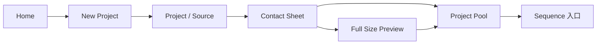

# PhotoFlex M1 交互说明

> 版本：M1 / 2026-08-27  
> 适用画面：Home Page（有项目 / 无项目）、New Project Dialogue、Project Page、Contact Sheet、Full Size Preview  
> 设计稿：[PhotoFlex Figma](https://www.figma.com/design/VhqX4TvzZ1Dl6vDS9owRTD/Photoflex_frontend?node-id=8-56)  
> 产品依据：`PhotoFlex_PRD_v2.md`、`photoflex-core-prototype` 研究原型

## 1. M1 目标与范围

M1 只完成“建立项目并开始选片”的第一段可运行闭环：

本轮必须让用户理解：

1. 一个 Project 可以包含多个照片资料夹（Source）。
2. Contact Sheet 只显示当前 Source 的照片。
3. Project Pool 属于整个 Project，可以收集不同 Source 的照片。
4. 所有操作只修改 PhotoFlex 项目数据，不移动、不重命名、不覆盖或删除原片。
5. 大量照片在后台读取时，用户可以先使用已经就绪的照片。

M1 不展开 Sequence 与 Compare 的内部编辑流程；Project Pool 在本轮可用，但“Add selected to sequence”只保留禁用入口并说明将在 M2 开放。Login 也不应阻塞本地 MVP 工作流。

## 2. 全局交互规则

### 2.1 顶部导航

| 导航项 | 点击行为 | 可用条件 |
|---|---|---|
| Photoflex | 返回 Home | 始终可用 |
| Home | 打开项目列表 | 始终可用 |
| Project | 打开当前 Project 的 Source 管理页 | 已有当前 Project |
| Contact Sheet | 回到最近一次有效的 Source、筛选与滚动位置 | 当前 Project 至少有一个可用 Source |
| Sequence | 打开当前 Sequence；没有 Sequence 时进入空状态 | 当前 Project 已建立 |
| Compare | 打开版本比较 | 至少存在两个命名版本；否则禁用并说明原因 |
| Login | M1 仅作占位，不影响本地功能 | 不作为 M1 验收项 |

- 当前页面使用红色下划线和加粗文字表示。
- 禁用项不能只降低透明度；悬停或聚焦时应说明缺少的前置条件。
- 从其他页面返回时恢复最近有效的 Source、筛选、滚动位置与照片选择上下文。

### 2.2 按钮与任务状态

- 主操作使用黑底按钮；次操作使用描边按钮；删除、移除等危险操作不得使用普通主按钮样式。
- 提交中的按钮进入 Loading，并阻止重复提交；不能用全屏 Loading 遮住已经可用的数据。
- 成功反馈使用非阻塞 toast，例如：`12 photos added to Project Pool`。
- 错误反馈必须同时说明：发生了什么、原数据是否安全、下一步能做什么。

### 2.3 三种照片状态必须分开

| 状态 | 含义 | 建议视觉 | 是否持久化 |
|---|---|---|---|
| Selected | 当前页面为了执行批量操作而临时选中 | 红色描边 + 勾选图标 | 否 |
| In Pool | 已加入当前 Project 的虚拟照片池 | 灰阶或明确的 `In Pool` 标记 | 是，仅写项目数据库 |
| In Sequence | 已加入当前 Sequence | 序列标记或序号 | 是，仅写项目数据库 |

同一张照片可以同时处于三种状态。不能只使用同一种红色勾选表达三种不同含义。

### 2.4 Pool 共通规则

- Pool 是 Project 级模块，不是独立页面；切换 Source 时内容保留。
- 点击 Pool 标题或右侧箭头可收起 / 展开；收起后至少保留 `Project Pool`、照片数量和展开箭头。
- Pool 内部独立滚动，不带动主页面回到顶部。
- 加入、移除或选择 Pool 照片后，保持 Pool 自己的滚动位置。
- 双击 Pool 中的照片时，进入 Full Size Preview

## 3. Home Page

### 3.1 无项目状态

对应：`Home Page (Without Projects).svg`

| 元素 | 用户操作 | 系统反馈 |
|---|---|---|
| 顶部 `New project` | 点击 | 打开 New Project Dialogue |
| 空状态 `New project` | 点击 | 与顶部按钮完全相同 |
| Search projects | 输入 | 无项目时保持空状态，不报错 |

- 首次进入先显示项目列表 Loading 骨架；确认没有项目后才显示 `NO PROJECTS YET`。
- 空状态必须始终提供可继续的动作。
- 后续若加入 `Open existing` / `Restore backup`，应作为次级入口，不改变本页主流程。

### 3.2 有项目状态

对应：`Home Page (With Projects).svg`

#### 项目卡片

- 整张卡片可点击，也可通过 Tab 聚焦后按 Enter 打开。
- 卡片显示项目封面、项目名和恢复摘要。
- 项目封面默认使用照片库中的第一张照片，若没有照片则使用示例图片，当改变照片库时也随之更动照片。
- 点击项目卡片：
  - 有有效上次工作位置时，恢复上次页面、滚动、缩放和选择上下文；
  - 上次对象已失效时，进入 Project Page，并说明降级原因；
  - 新项目没有历史上下文时，进入 Project Page。
- 打开失败时项目不能从 Home 静默消失；卡片进入可修复状态并提供重新定位项目目录。

#### 搜索

- 输入后即时按项目名称过滤，不区分大小写，首尾空格忽略。
- 搜索框有内容时可一键清除；按 Esc 清空搜索。
- 无匹配结果时显示 `No matching projects` 和 `Clear search`，但保留 `New project`。

#### 状态与排序

- 默认按最近打开时间倒序。
- `正在编辑` 表示存在活动 Working Copy；`可恢复到上次工作位置` 表示存在有效恢复上下文。
- 搜索和排序只影响显示，不修改项目内容。

## 4. New Project Dialogue

对应：`New Project Dialogue.svg`

### 4.1 打开与关闭

- 从 Home 的任一 `New project`，或 Project 左栏的 `+ New Project` 打开。
- 打开后焦点自动进入 Project name；焦点被限制在弹窗内。
- `×`、`Cancel` 或 Esc 关闭并丢弃本次未提交输入。
- 点击遮罩不关闭，避免误触丢失已填写内容。
- 关闭后焦点回到触发弹窗的按钮。

### 4.2 字段规则

| 字段 | 必填 | 规则 | 错误反馈 |
|---|---:|---|---|
| Project name | 是 | 去除首尾空格后不能为空；建议最多 80 字符 | 字段下方显示 `Enter a project name` |
| Photo folder | 是（M1 入口） | 通过系统目录选择器选择一个可读资料夹，允许空资料夹 | 文件夹不可读、权限失效或未发现支持格式 |
| Project memo | 否 | 多行文本；创建后写入项目 Memo | 失败时保留输入，不清空弹窗 |
| Expected photo count | 否 | 只接受正整数；仅作项目预期信息，不限制真实照片数量 | 非正整数时就地提示 |

#### Browse folder

- 打开桌面系统原生目录选择器，只申请读取权限。
- 用户取消系统选择器时返回弹窗，已填字段保持不变。
- 选中后显示可读路径；在点击 Create project 前不开始完整索引。
- M1 首次只选择一个 Source；创建后可在 Project Page 继续添加多个 Source。

### 4.3 Create project

- Project name 和 Photo folder 均有效时按钮可用。
- 点击后按钮进入 `Creating…`，禁止重复提交。
- 成功后：
  1. 创建 Project 与首个 Source 记录；
  2. 关闭弹窗；
  3. 进入新项目的 Project Page；
  4. Source 立即显示为 Loading，后台开始扫描；
  5. 不等待全部照片读取完成。
- 创建或授权失败时弹窗保持打开，保留全部字段，并提供重试或重新选择目录。
- 弹窗底部持续说明：`Original files will never be moved or modified.`

## 5. Project Page

对应：`Project Page.svg`

### 5.1 左侧 Project 列表

- 当前项目使用红色指示条和红色项目名。
- 点击其他项目切换当前 Project，并恢复该项目自己的 Source、Pool、Sequence 和版本状态。
- 切换项目不会覆盖或清空先前项目的工作。
- `+ New Project` 打开 New Project Dialogue。

### 5.2 Add photo folder

- 点击后打开系统目录选择器；选择成功即新增一个独立 Source。
- 新 Source 先以 Loading 卡片出现；已读取照片可立即打开浏览。
- 重复选择同一个 Source 不重复创建照片资产，应提示已存在并允许 Refresh。
- 用户取消选择器不产生新 Source，也不影响已有任务。

### 5.3 Source 卡片

每个 Source 独立显示：文件夹名称、Source 短 ID、已发现 / 已索引 / 跳过 / 失败数量、读取状态和可用操作。M1 不在页面显示绝对路径。

| 状态 | 页面行为 | Open 行为 |
|---|---|---|
| Ready | 显示完成数量 | 进入该 Source 的 Contact Sheet |
| Loading | 显示进度；后台继续 | 已有可用照片时允许进入，否则禁用 |
| Partial | 显示成功、跳过和失败数量，并提供 Retry | 进入已成功照片的 Contact Sheet |
| Offline | 说明代理、Pool、Sequence 和 Memo 仍可用；提供 Relink | 有缓存时允许进入；缺图显示占位 |
| Permission Lost | 提供 Re-authorize / Browse folder | 重新授权前只使用现有缓存 |
| Empty | 说明支持格式并允许换目录 | 禁用 |
| Error | 保留已成功结果，提供错误清单与 Retry | 有成功结果时仍可进入 |

#### Open

- 点击进入当前 Source 的 Contact Sheet。
- 返回 Project Page 后保持之前的 Source 列表滚动位置。

#### `…` 菜单

M1 至少包含：Refresh、Relink / Re-authorize、Remove Source。

- Remove Source 必须二次确认，并显示准确 Source 名称和 Source 短 ID。
- 确认文案明确说明：不会删除原片；停止后续扫描；已保存版本仍保留历史占位。
- 移除失败时不清空 Source 卡片，允许重试。

### 5.4 Project Memo

- 点击 Memo 区域进入编辑。
- 输入后本地自动保存，建议 500–800 ms debounce；离开字段时立即 flush。
- 正常保存不显示 Saving / Saved 状态；只有保存失败时提示错误。
- 保存失败时保留本地草稿，并允许重试或复制文本。

### 5.5 Project Pool

- 右侧 Pool 汇总当前 Project 来自所有 Source 的照片。
- 点击缩略图切换“准备加入 Sequence”的临时选择；红框与勾选只表示本次临时选择。
- `Add selected to sequence` 在 M1 保留为禁用入口，并说明 Sequence 将在 M2 开放。
- Pool 内的临时选择与 Contact Sheet 的 Selected 独立；M1 不执行 Pool → Sequence 写入。

## 6. Contact Sheet

对应：`Contact Sheet.svg`

### 6.1 Source 导航

- 左栏显示当前 Project 的所有 Source；当前 Source 使用红色指示条。
- 左栏点击左侧箭头可收起 / 展开；收起后至少保留 `PROJECT`和展开箭头。页面元素根据空位调整
- 点击 Source 切换网格，Project Pool 不改变。
- Source 为 Loading / Partial 时显示已经可用的照片和持续更新的数量，不能用 Loading 遮住网格。
- 切换 Source、筛选或从预览返回时尽量恢复各自的滚动锚点。

### 6.2 筛选标签

| 标签 | 含义 |
|---|---|
| All | 当前 Source 中符合现有筛选的全部照片 |
| Selected | 当前页面临时选中的照片；M1 不提供星级或 Unrated 筛选 |

- 切换标签不自动清空临时选择。
- 当前结果为空时说明原因，并提供返回 All 或清除筛选。
- PRD 的正式判断状态为 Pick / Maybe / Hold / Exclude；M1 不应把星级评分直接写回原片或 XMP。

### 6.3 照片选择

- 单击整张缩略图切换 Selected；双击不进入预览，避免与选择冲突。
- Shift + 单击选择连续范围；Ctrl/Cmd + 单击增减单张。
- Selected 使用红色描边与勾选图标，并实时更新 `Selected N`。
- `Select all` 作用于当前筛选结果的当前已加载页；按钮旁或 toast 必须明确范围。
- `Invert` 反选同一范围。
- 使用方向键移动照片焦点，Space 切换 Selected，Enter 打开 Full Size Preview。
- 选择变化后保持网格滚动位置。
- 可拖动照片进入pool将照片加入pool

### 6.4 打开大图

- 单击 View 按键进入Full Size Preview
- 照片聚焦后按 Enter 打开 Full Size Preview；Space 只切换 Selected。

View 入口只打开 Full Size Preview，不改变 Selected 或 Pool 状态。

### 6.5 Add to Pool

- 没有 Selected 时按钮禁用。
- 点击后将照片批量加入当前 Project Pool；这是虚拟关系，不复制原片。
- 已在 Pool 的照片幂等跳过，不创建重复项。
- 成功反馈需列出：新增数量、已存在数量、失败数量。
- 成功后清除本次 Selected，保持 Contact Sheet 滚动位置，并立即更新右侧 Pool 数量和缩略图。
- 加入失败时保留 Selected，允许重试。

### 6.6 右侧 Pool 与 Sequence 交接

- Pool 可收起 / 展开，并独立滚动。
- Pool 收起时布局跟随页面空间变动（分割线长度、按键位置、单行照片数量等）
- Pool 缩略图的临时选择与 Contact Sheet 的 Selected 是两个独立 selection scope。
- `Add selected to sequence` 在 M1 为禁用按钮，并提示 Sequence 将在 M2 开放；它不作用于 Contact Sheet 网格选择。
- 从pool将照片拖回contact sheet部分移除照片在pool的状态

### 6.7 大图库表现

- 网格使用虚拟化或分页，不能一次创建全部照片节点。
- 低清代理先显示，高档代理异步替换；替换时不能造成明显布局跳动。
- 单张代理失败只影响该缩略图，显示占位、文件名和 Retry，不阻塞整个网格。

## 7. Full Size Preview

对应：`Full Size Preview.svg`

### 7.1 打开与上下文

- 预览作为当前页面之上的覆盖层打开，不创建新的浏览器历史页面。
- 左上角显示当前序号与照片 ID，例如 `PHOTO 05 / PF_2418`。
- 计数顺序来自打开预览时的当前 Source + 当前筛选结果。
- 打开预览不自动改变 Selected、Pool 或 Sequence。

### 7.2 浏览

| 操作 | 行为 |
|---|---|
| 左 / 右界面箭头 | 上一张 / 下一张 |
| 键盘 ← / → | 上一张 / 下一张 |
| Space | 在 Fit 与 100% 之间切换 |
| 鼠标滚轮 | 放大缩小 |
| Esc 或右上角 × | 关闭并返回来源页面 |

- 到达第一张或最后一张时对应箭头禁用，不触发浏览器前进 / 后退。
- 切图时预取相邻照片；高档代理未就绪时先显示低档，不出现空白闪屏。
- 任何横图、竖图、方图默认完整 Fit，不裁切。
- 关闭后恢复来源页面的滚动位置、筛选与选择状态，并把焦点还给原缩略图。

### 7.3 Add to Pool

- 从 Contact Sheet 打开时，底部按钮根据状态显示 `Add to Pool` 或 `Remove from Pool`。
- 点击后保持预览打开，立即同步右侧 Pool、Contact Sheet 标记与 Pool 数量。
- Remove from Pool 只删除虚拟成员关系，不删除照片资产或原片。
- 从 Compare 的历史版本进入预览时为只读，不显示会修改历史版本的操作。

### 7.4 关闭方式

- 点击 × 或 Esc 关闭。
- 点击照片外的暗色遮罩不关闭，避免浏览或缩放时误退。

## 8. 共通页面状态

| 状态 | M1 行为 |
|---|---|
| Loading | 显示进度或骨架；旧数据和已完成照片继续可用 |
| Empty | 说明为什么为空，并提供一个可以继续的动作 |
| Offline | 说明哪些功能仍可用、哪些暂不可用，并提供 Relink |
| Permission Lost | 保留缓存和项目编辑结果，提供重新授权目录 |
| Partial | 保留成功照片，列出失败数量，允许进入与重试 |
| Error | 不清空输入、选择或已成功结果；提供 Retry / Details |
| Recovery | 明确将恢复的 Project、Source 或路径，禁止静默替换 |

## 9. 键盘与可访问性

- 所有按钮、项目卡片、Source 卡片、筛选标签和照片缩略图均可通过 Tab 到达。
- 可见焦点不能只依赖颜色；勾选、Offline、Partial 等状态同时提供文字或图标。
- 弹窗与预览打开时使用 focus trap；关闭后焦点返回触发元素。
- 图片提供可访问名称，至少包含文件名、序号、Source 和 Pool 状态。
- 键盘核心路径：Home 打开项目 → Project 打开 Source → Contact Sheet 选择 → Preview → Add to Pool。

## 10. 数据与安全边界

1. 浏览资料夹只申请读取权限。
2. Project name、Memo、Pool、选择状态和 Sequence 只写 PhotoFlex 项目数据。
3. 不移动、不重命名、不覆盖、不删除原片，也不默认写 XMP。
4. 移除 Source、从 Pool 移除、从 Sequence 移除是三种不同语义，文案必须明确。
5. 后台任务取消后保留已经成功的扫描和代理结果；继续时不得创建重复资产。

## 11. M1 验收路径

1. 在无项目 Home 点击 New project。
2. 输入项目名，选择照片资料夹，填写可选 Memo 和预期张数。
3. 创建后立即进入 Project Page，并看到首个 Source 为 Loading。
4. 在读取未结束时打开已经可用的 Contact Sheet。
5. 单击选择照片，通过 Preview 查看横图和竖图并用方向键连续浏览。
6. 在预览或网格中加入 Project Pool，确认 Source 切换后 Pool 仍保留。
7. 再添加第二个 Source，并从第二个 Contact Sheet 向同一个 Pool 加照片。
8. 收起与展开 Pool；滚动、选择和加入后保持上下文。
9. 查看 Pool 中的 `Add selected to sequence` 禁用状态及 M2 提示。
10. 模拟 Partial、Offline、Permission Lost，确认已完成结果、Memo 和原片均安全且存在恢复出口。

## 12. 当前设计需补的交互标注

以下项目不要求新增完整页面，但在进入前端开发前应在 Figma 中补充状态或注释：

1. Contact Sheet 缺少独立 Preview 入口；不能用双击代替。*已解决*
2. 红色勾选目前同时容易被理解为 Selected 与 In Pool，需要增加持久 Pool 标记。*入pool的照片变成灰色显示已在Pool中*
3. Source 卡片尚未画 Offline、Permission Lost、Empty 和 Error 状态。*按照Ready，Loading等字体做，都以红色圆圈表示*
4. Home 尚未画搜索无结果、最近项目路径失效和 Open / Restore 入口。*按照页面风格自行设置，保持色彩风格一致*
5. Project Memo 正常自动保存不显示状态，失败时显示错误并保留草稿。*已确定*
6. 顶部 Login 不属于本地 MVP 核心路径，应保持非阻塞。 *先作为图标放置，不用管*
7. 星级展示与 PRD 的 Pick / Maybe / Hold / Exclude 存在语义差异；M1 已移除星级展示，后续需单独确认正式判断控件。 *已确定*
