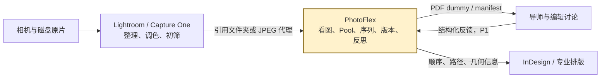
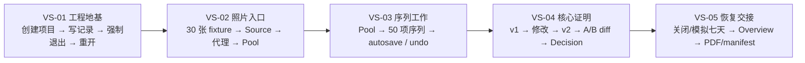
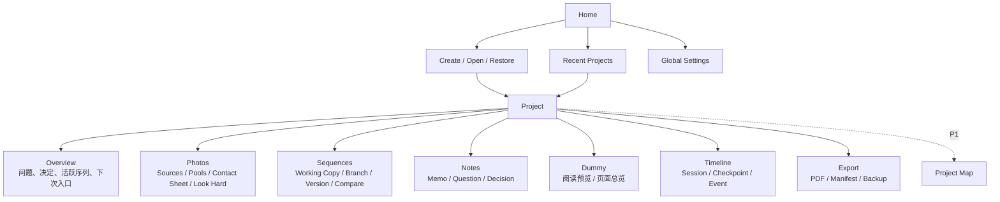
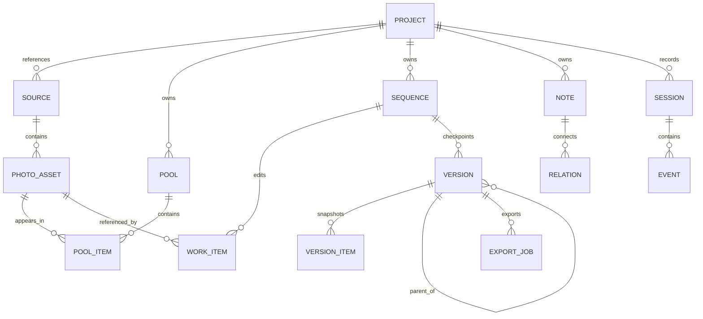
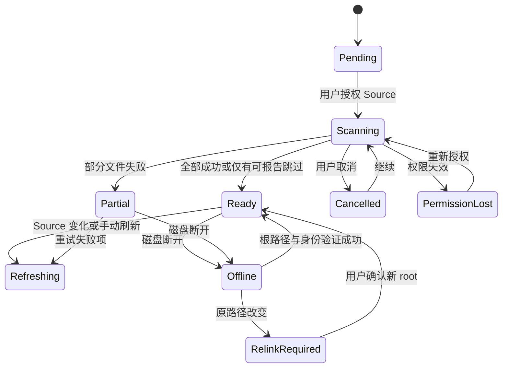
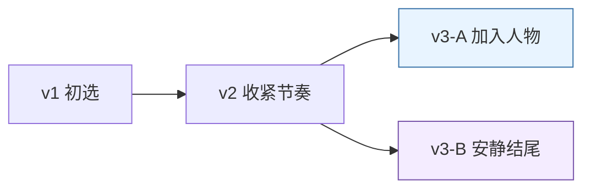
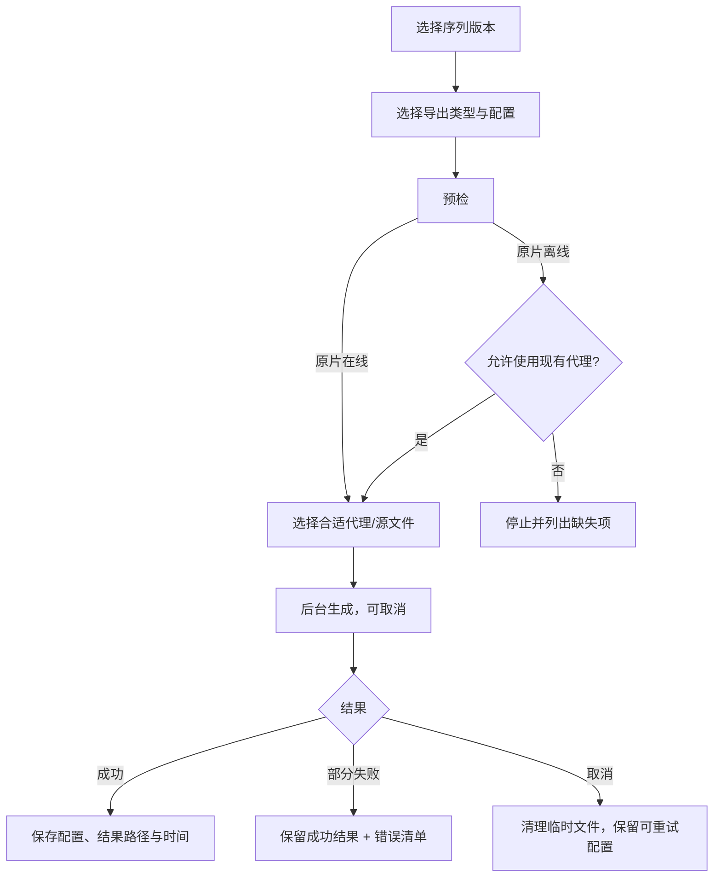
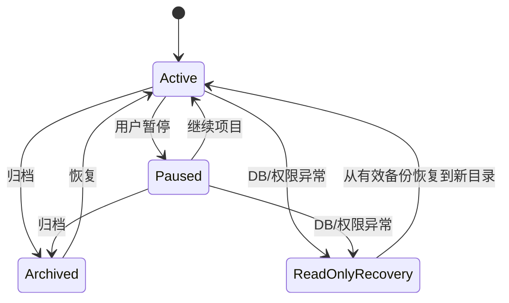

---
tags:
  - PhotoFlex
  - PRD
  - 产品需求
  - MVP
created: 2026-08-18
updated: 2026-08-18
status: draft
version: 0.4
---

# PhotoFlex 产品需求文档（PRD）

> 产品定位：Lightroom / Capture One 之后、InDesign 之前，面向长期摄影项目的本地优先视觉编辑工作台。  
> 上位依据：[[PhotoFlex 项目企划评估与竞品分析]]、[[PhotoFlex 详细项目企划与技术方案]]  
> 实施依据：[[PhotoFlex 开发流程与路线图]]  
> 决策记录：[[PhotoFlex 开发日志]]  
> 当前阶段：Phase 0 — 用户问题与技术可行性验证；尚未开始产品代码。

---

## 0. 文档控制

### 0.1 文档目的

本文是 PhotoFlex 的产品需求基线，用于统一产品设计、交互设计、工程实现、测试验收和用户研究。它回答：

- 为谁解决什么问题；
- MVP 必须完成哪些用户结果；
- 每项能力在正常、异常和恢复场景下如何表现；
- 什么证据可以证明需求已经完成；
- 哪些内容仍是假设，不能提前当成事实。

技术选型、代码结构和具体依赖以《详细项目企划与技术方案》和后续 ADR 为准；若技术实现与本 PRD 的用户结果冲突，应先更新决策记录，再修改需求基线。

### 0.2 术语与状态

| 标记 | 含义 |
|---|---|
| 已确认 | 已在现有项目文档中形成明确决定 |
| 暂定 | 有推荐方案，但仍需用户研究或技术 spike 验证 |
| 待决策 | 缺少证据；不得静默转为开发范围 |
| MVP | 用于证明核心价值的首个完整产品版本 |
| P1 | MVP 指标成立后加入的工作流闭环能力 |
| P2 | 商业化、规模化或长期差异化能力 |
| Out | 当前明确不做 |

> 命名约定：`Phase 0–8` 表示开发阶段，`MVP / P1 / P2` 表示产品范围，避免把“Phase 0”和“P0 优先级”混为一谈。

### 0.3 变更规则

- 新增或删除 MVP 能力，必须说明它是否强化“多版本序列与上下文恢复”核心闭环；
- 影响原片安全、项目格式、版本不可变性或恢复能力的变更，必须写 ADR；
- 用户研究推翻需求时，保留原决策和证据，不覆盖历史；
- 每个正式需求使用稳定 ID；实现、测试和 issue 应引用该 ID；
- 未标明验收标准的需求不能进入开发。

### 0.4 Grill-me 收紧结论

这轮审问的目的不是继续增加功能，而是确认“什么必须先被证明”。以下结论作为当前 PRD 的默认基线：

| 决策 | 当前结论 | 不能假装已解决的部分 |
|---|---|---|
| 首个证明对象 | 长期项目摄影师的多版本序列探索 | 首个付费人和定价仍待验证 |
| 核心价值 | 第二个序列版本 + A/B 比较 + 修改理由 + 重新进入 | Look Hard 单独是否有足够价值仍需测试 |
| 首个垂直切片 | 30 张测试照片 → Pool → 序列 → v1/v2 → diff → 关闭重开 | 10,000 张只属于性能门，不是首个功能目标 |
| 产品形态 | 单用户、本地优先、无云端依赖的桌面应用 | Windows/macOS 首发顺序和框架要过技术门 |
| 导入边界 | 文件夹引用与 JPEG/常见渲染代理优先 | RAW 直读、网络盘和 Lightroom 插件不提前承诺 |
| Compare 默认 | 并排 + 同步滚动 + 差异列表 | 对齐/叠加是否更好由原型测试决定 |
| 版本策略 | 完整 snapshot、可分支、无自动 merge | 版本删除和备份代理策略需真实项目验证 |

#### 不允许在核心证明前发生的扩张

- 不先做 Project Map、社区、实时协作、AI 视觉搜索或支付体系；
- 不因为导入困难就把 PhotoFlex 变成 DAM；
- 不因为用户想要“更自由”就引入通用无限白板；
- 不因为 PDF 看起来不够专业就进入 InDesign/印前替代；
- 不用“页面数量、导入照片数或 AI 调用次数”替代序列版本价值指标。

#### 默认值的有效期

以上默认值只允许支撑原型和技术 spike。Phase 0 结束时，必须用真实用户证据或书面 ADR 更新它们；没有证据的默认值不能进入“已确认”栏。

---

## 1. 产品摘要

### 1.1 一句话定位

> **PhotoFlex 是为长期摄影项目设计的本地视觉编辑工作台：它不移动原片、不替用户做艺术判断，而是帮助摄影师看懂照片、探索不同序列、记住修改原因，并在数周或数月后继续创作。**

### 1.2 产品问题

长期摄影项目的材料和思考通常散落在 Lightroom/Capture One、磁盘文件夹、PPT/Milanote、纸样、PDF、聊天和个人笔记中。现有工具能分别完成调色、文件管理、排版或沟通，却很难持续回答：

1. 当前有哪些序列方向，它们具体差在哪里？
2. 为什么某张照片被加入、移除或移动？
3. 现在最重要的未决问题和待补拍缺口是什么？
4. 暂停两周或两个月后，如何快速恢复上次的判断语境？
5. 导师或编辑的反馈究竟针对哪个版本、哪一张照片或哪一个跨页？

### 1.3 核心产品假设

> 如果摄影师能低摩擦地建立多个序列版本、看见版本差异、记录修改理由，并快速恢复项目上下文，那么 PhotoFlex 会比“Lightroom + 文件夹 + PPT/Milanote”更适合长期摄影项目的视觉编辑阶段。

这是假设，不是已证实结论。Phase 0 必须用真实项目验证，而不是用抽象购买意愿验证。

### 1.4 工作流位置



### 1.5 产品原则

1. **原片零写入**：核心操作不移动、重命名、覆盖或删除原片。
2. **创作判断属于用户**：产品提供观看条件、差异和问题，不给艺术质量分数。
3. **版本优于覆盖**：已保存的创作节点不可被静默改写。
4. **恢复优于提醒**：项目管理服务于重新进入创作，不以签到和任务完成率驱动用户。
5. **本地核心独立成立**：无网络、无 AI 也能完成 MVP 闭环。
6. **先做专用编辑器**：序列、比较和恢复是第一等对象；通用白板、社区和复杂排版延后。
7. **错误可解释、工作可恢复**：长任务可取消重试，部分失败不抹掉成功结果。

---

## 2. 目标、非目标与成功标准

### 2.1 MVP 产品目标

| ID | 目标 | 用户结果 |
|---|---|---|
| OBJ-01 | 安全建立项目 | 用户可引用真实照片，不担心原片被改动 |
| OBJ-02 | 改善观看 | 用户能以不同观看条件重新认识已有照片 |
| OBJ-03 | 支持叙事探索 | 用户能建立、分支并比较至少两个序列版本 |
| OBJ-04 | 保留判断语境 | 修改理由、问题和决定能关联到具体对象与版本 |
| OBJ-05 | 快速恢复 | 暂停 7 天后，用户能在 60 秒内知道上次做了什么和下一步是什么 |
| OBJ-06 | 完成讨论交接 | 用户能导出可阅读 dummy 和可追溯序列清单 |

### 2.2 明确非目标

- 不替代 Lightroom/Capture One 的 RAW 显影、调色和完整 DAM；
- 不替代 InDesign 的专业印前、母版、CMYK 和印厂输出；
- 不做 AI 艺术评分、自动最佳选片或自动最佳序列；
- 不做任意对象、任意插件的通用无限白板；
- 不做开放社交 feed、点赞排行或推荐算法；
- 不默认上传照片，不直接读写 Lightroom `.lrcat`；
- MVP 不做实时多人协作和跨设备云同步。

### 2.3 北极星指标

> **活跃项目中，创建第二个命名序列版本且至少完成一次 A/B 比较的项目比例。**

指标口径：

- `活跃项目`：在观察周期内至少完成一次照片浏览或序列编辑会话；具体周期暂定 30 天，需在 Alpha 前确认；
- `命名版本`：用户主动执行 Save Checkpoint 形成的不可变快照，不含 autosave；
- `完成比较`：同时选择 A/B 两版本并停留或交互达到有效阈值；阈值暂定 20 秒或产生一条 Decision，需用户测试校准；
- Alpha 阶段优先通过访谈和本地研究日志计算；任何远程 analytics 必须明确 opt-in。

### 2.4 MVP Beta 成功门槛

| 指标 | 目标 | 测量方法 |
|---|---:|---|
| 从文件夹建立项目并创建首个序列 | 70% 用户在 10 分钟内完成 | 观察式可用性测试 |
| 活跃项目产生第二个命名版本 | ≥ 50% | Alpha 项目审查 / opt-in 事件 |
| 活跃项目使用 A/B Compare | ≥ 30% | Alpha 项目审查 / opt-in 事件 |
| 两版比较并记录检查点 | 5 分钟内完成 | 任务测试 |
| 暂停 7 天后恢复核心上下文 | ≥ 80% 在 60 秒内完成 | 七天恢复测试 |
| 原文件误改、误移、误删 | 0 次 | hash 对照、事件审计、用户报告 |
| 10,000 张已索引照片浏览 | 达到第 14 节性能线 | benchmark |
| 数据丢失 | 0 个确认事件 | Alpha/Beta 缺陷记录 |

### 2.5 反指标与护栏

- 不以 DAU、连续签到、每日任务完成率作为核心成功指标；
- 不以“用户导入照片数量”代替序列探索价值；
- 不以 AI 调用次数衡量创作质量；
- 任何增长指标都不能覆盖原片零写入、版本不可变和可恢复性三条红线。

---

## 3. 用户定义

### 3.1 核心用户 A：长期项目摄影师

| 维度 | 描述 |
|---|---|
| 项目周期 | 3 个月至数年 |
| 现有工具 | Lightroom/Capture One + 文件夹 + PPT/Milanote/纸样/InDesign |
| 核心痛点 | 序列版本分散、修改理由丢失、暂停后难恢复 |
| 关键顾虑 | 原片安全、学习成本、是否打乱现有调色流程 |
| 成功时刻 | 能明确说出 A/B 两版差异、为什么修改和接下来缺什么 |

**JTBD**：当我反复尝试一个摄影项目的叙事时，我希望快速建立和比较多个序列，并保留每次修改的理由，以便逐渐理解项目而不被工具打断。

### 3.2 核心用户 B：导师 / 摄影编辑（P1）

| 维度 | 描述 |
|---|---|
| 工作方式 | 同时跟进多个摄影师和多个版本 |
| 核心痛点 | 评论对象和版本不明确；反馈散落在聊天和 PDF 中 |
| MVP 参与方式 | 屏幕共看、PDF dummy、导出摘要 |
| P1 成功时刻 | 评论能定位版本/照片/跨页，并进入下一轮 Decision |

### 3.3 次要用户：摄影学生 / 工作坊

- 痛点通常明显，但个人支付能力较弱；
- 可能通过导师、院校或课程席位进入；
- 需要项目模板和提示，但不能把非线性创作变成强制阶段表。

### 3.4 暂不服务用户

- 以高速交付、批量修图和相册销售为主的婚礼/商业工作室；
- 需要企业 DAM 审批、品牌权限和大团队资产治理的组织；
- 主要诉求是 RAW 显影、修图、印前或公开社交曝光的用户。

### 3.5 关键使用场景

| ID | 场景 | 触发 | 期望结果 |
|---|---|---|---|
| UC-01 | 从已有照片发现项目 | 用户已有多次拍摄和初筛结果 | 建立 Pool 与第一版序列 |
| UC-02 | 从问题出发持续拍摄 | 用户先有主题/核心问题 | 问题、拍摄、照片和 Gap 形成关联 |
| UC-03 | 比较两个叙事方向 | 用户对顺序或选图犹豫 | 看见增删移动并记录决定 |
| UC-04 | 长时间暂停后回来 | 7–30 天未打开项目 | 60 秒内恢复上次上下文 |
| UC-05 | 与导师/编辑讨论 | 需要分享当前版本 | 输出明确版本的 PDF 与摘要 |
| UC-06 | 外接盘离线后继续工作 | 原片盘未连接 | 使用代理和占位继续查看、记录和排序 |

---

## 4. 范围与发布分层

### 4.1 MVP 范围

1. 项目建立、打开、归档、备份与恢复；
2. 本地照片引用、索引、代理缓存、离线与根目录重连；
3. Source、Photo Pool、Contact Sheet、项目内筛选；
4. Look Hard 单张、双张、Survey 和墙面观看；
5. 序列编辑：Photo、Blank、Text、Gap、Divider；
6. autosave、undo/redo、命名 Checkpoint、分支和 A/B 比较；
7. Memo、Question、Decision 与对象关联；
8. Overview、会话记录、客观变化和 Continue Last Session；
9. 基础单页/双页 dummy、PDF、CSV/JSON manifest、Markdown 摘要；
10. 设置、诊断、项目完整性检查和手动备份。

### 4.2 P1 范围

- Lightroom Classic 单向 handoff；
- 类型化 Project Map；
- 有限的页面 frame 布局编辑；
- 研究资料、带来源的 AI 文本助理；
- 私密不可变版本分享与结构化反馈；
- 可选本地视觉相似/语义检索。

### 4.3 P2 范围

- Lightroom 明确授权的回写、Capture One 桥接；
- 策展式摄影知识库、导师 review 商业模式；
- IDML 或更深的 InDesign 交接；
- 院校/团队管理；
- 经过独立评审的公开项目档案。

### 4.4 范围决策门

任何 P1/P2 功能进入开发前，必须同时满足：

1. MVP 核心指标没有因为现有可用性问题而失败；
2. 至少 5 位目标用户展示真实需求，而非只表达兴趣；
3. 新能力不会扩大原片写权限或破坏本地核心；
4. 有单独成功指标和退出条件；
5. 开发日志记录为什么现在做、什么情况下停止做。

### 4.5 交付顺序与首个垂直切片

完整 MVP 不是第一轮开发目标。工程必须按可运行的垂直切片推进，每个切片都同时包含界面、业务逻辑、数据库、错误处理和最小测试。



| ID | 切片 | 必须证明 | 退出条件 |
|---|---|---|---|
| SLICE-01 | 工程地基 | 项目包、SQLite、migration、日志和强制退出恢复成立 | 重开后测试记录存在；DB integrity check 通过 |
| SLICE-02 | 照片入口 | 只读 Source、30 张代理、Pool 和离线占位成立 | 原片 hash 不变；断盘后引用和顺序不丢 |
| SLICE-03 | 序列工作 | 50 项 Photo/Blank/Text/Gap 可排序并恢复 | 鼠标与键盘都能操作；一次用户意图一次 undo |
| SLICE-04 | 核心证明 | 用户能建立两个不同版本并解释差异 | snapshot 不可变；diff 可定位；Decision 有关联 |
| SLICE-05 | 恢复交接 | 暂停后仍能知道上次变化和下一步，并输出讨论材料 | Overview 首屏达标；PDF/manifest 对应指定版本 |

#### 切片门槛

- `SLICE-04` 未通过前，不开发 P1 能力；
- 10,000 张、500 项和 200 页是 benchmark 门，不应阻塞 30 张 fixture 的交互原型，但必须在对应阶段纳入回归；
- 每个切片完成后才能扩大 fixture、增加状态或引入第三方依赖；
- 若切片证明用户结果不成立，停止扩展技术实现，回到 Phase 0 重新访谈。

---

## 5. 信息架构与导航

### 5.1 信息架构



### 5.2 全局导航规则

| ID | 需求 | 验收标准 |
|---|---|---|
| NAV-01 | 项目内使用固定一级导航，不允许用户创建任意导航层级 | 一级区域保持在 6–8 个；新对象不会新增一级入口 |
| NAV-02 | 顶部持续显示项目名、当前对象、保存状态和 Save Checkpoint | 任一核心编辑页面均可看到；离开页面前不依赖猜测保存状态 |
| NAV-03 | `Ctrl/Cmd + K` 打开命令面板 | 可搜索并执行当前有权限的核心动作 |
| NAV-04 | 返回项目恢复上次有效视图 | 恢复模块、对象、scroll anchor、zoom 和 selection；对象失效时解释降级位置 |
| NAV-05 | 危险动作与日常动作视觉分离 | 删除、清空和恢复不与普通打开/保存共用相同主按钮样式 |
| NAV-06 | 键盘可到达所有核心功能 | 不使用鼠标也可完成看图、选择、排序、保存版本和退出 |

### 5.3 项目对象关系



---

## 6. 端到端核心旅程

### 6.1 首次核心闭环


### 6.2 新项目主流程

**前置条件**：用户有一个可读目录；目录中至少包含一种受支持图像或 Lightroom 导出的 JPEG 代理。

1. 用户选择“从已有照片开始”或“从核心问题开始”；
2. 填写项目名；核心问题和说明可跳过；
3. 选择项目保存位置；系统创建 `.photoflex/` 目录；
4. 用户授权一个或多个 Source；
5. 系统立即进入项目，不等待全部索引完成；
6. Photos 页面显示进度、已可用照片、跳过和错误数量；
7. 用户可在索引继续时浏览已完成照片并写 memo；
8. 第一次建立序列后，系统以非阻塞方式提示保存 Checkpoint；
9. 用户完成第二个版本并进入 Compare，形成核心价值时刻。

### 6.3 七天恢复流程

1. 用户打开 Recent Project；
2. Overview 在 5 秒内显示可用首屏；
3. 首屏回答：上次时间、上次客观变化、最近版本、Open Questions、Next Action；
4. 用户点击 Continue Last Session；
5. 系统恢复最近有效模块和视口；
6. 若 Source 离线，用户仍可使用缓存继续序列和文字工作；
7. 若原对象已归档，系统进入最近有效父对象并说明原因。

---

## 7. 详细功能需求

## 7.1 项目生命周期

### 用户故事

> 作为摄影师，我希望项目数据和原片分离保存，以便安全移动、备份和恢复项目，而不复制或破坏原片。

### 需求表

| ID | 优先级 | 需求 | 验收标准 |
|---|---|---|---|
| PROJ-01 | MVP | 新建空白、已有照片、核心问题三种入口 | 三种入口创建同一项目结构，仅初始引导不同 |
| PROJ-02 | MVP | 项目名与项目目录名分离 | 改项目显示名不移动或重命名磁盘目录 |
| PROJ-03 | MVP | 项目保存为可见 `.photoflex/` 目录 | 目录包含 manifest、数据库、缓存、附件、导出、备份和日志分区 |
| PROJ-04 | MVP | 打开最近项目或从磁盘定位项目 | 无效路径显示可修复状态，不从最近列表静默消失 |
| PROJ-05 | MVP | 归档项目 | 归档后默认从活跃列表隐藏，磁盘内容不删除，可恢复 |
| PROJ-06 | MVP | 从最近列表移除 | 只移除入口，不删除项目目录；界面明确说明 |
| PROJ-07 | MVP | 删除磁盘项目 | 独立危险流程、二次确认并显示精确路径；默认不提供快捷入口 |
| PROJ-08 | MVP | 查看项目和缓存占用 | 分别显示 DB/附件、缓存、导出和备份大小 |
| PROJ-09 | MVP | 清理缓存 | 只删除可重建代理；不得删除 DB、附件、导出、备份或原片 |
| PROJ-10 | MVP | 导出可移动备份包 | 先 checkpoint 与 integrity check；默认不含原片 |
| PROJ-11 | MVP | 从备份恢复 | 恢复到新目录，不覆盖现有项目；冲突时要求用户选择 |
| PROJ-12 | MVP | schema migration | migration 前自动备份；失败时停止写入并提供只读恢复 |

### 异常与恢复

| 场景 | 产品行为 |
|---|---|
| 项目目录只读 | 以只读模式打开；显示无法 autosave 的持续警告 |
| manifest 损坏 | 尝试从 DB 读取最小身份；不自动覆盖；提供恢复入口 |
| DB integrity check 失败 | 停止写入，列出备份，允许导出诊断和原 DB 副本 |
| migration 中断 | 保留迁移前备份；下次打开识别未完成迁移并安全回滚/重试 |
| 项目目录被移动 | 只要内部结构完整即可打开；更新 Recent 路径 |

## 7.2 Source、导入、索引与代理缓存

### 用户故事

> 作为已有 Lightroom/Capture One 工作流的用户，我希望 PhotoFlex 只引用照片并在后台建立可用代理，以便马上开始看图，同时确信原片不会被修改。

### 支持边界

| 类型 | MVP 行为 |
|---|---|
| JPEG / PNG / WebP | 直接读取并生成代理 |
| 基础 TIFF | 技术 spike 通过后直接生成代理；失败时列入错误报告 |
| Lightroom 导出 JPEG | 推荐路径，作为调色和方向基准 |
| RAW | 可读取基础元数据则记录；MVP 不承诺直接渲染，提示提供 JPEG 代理 |
| 视频 / 音频 | 忽略并计入“不支持文件”，不阻塞扫描 |
| 损坏图像 | 创建错误占位，不丢失路径和重试入口 |

### 导入状态机



### 需求表

| ID | 优先级 | 需求 | 验收标准 |
|---|---|---|---|
| IMP-01 | MVP | 一个项目添加多个 Source | 每个 Source 独立显示路径、状态、统计和操作 |
| IMP-02 | MVP | Source 仅申请读取权限 | 产品核心没有移动、重命名、删除或覆盖原片命令 |
| IMP-03 | MVP | 后台扫描不阻塞 UI | 扫描 10,000 文件时可浏览已完成项、编辑序列和保存 memo |
| IMP-04 | MVP | 显示任务进度 | 显示发现、已处理、成功、跳过、失败和预计剩余；预计值不可靠时可省略 |
| IMP-05 | MVP | 扫描可取消和继续 | 取消后已成功结果保留；继续不重复创建资产 |
| IMP-06 | MVP | 导入幂等 | 同一 Source 重复扫描不会产生重复 `photo_id` |
| IMP-07 | MVP | 资产使用稳定内部 ID | 路径变化不改变 sequence/pool 引用；重连成功后原位置保持 |
| IMP-08 | MVP | 代理分 256/1024/2048 档 | 网格优先低档，Viewer 预取高档；缺档时自动降级 |
| IMP-09 | MVP | 代理写入防半文件 | 写临时文件后原子提交；崩溃后半文件可识别并重建 |
| IMP-10 | MVP | Source 离线模式 | 统一提示 Offline，不连续弹错；现有代理、序列和 memo 可用 |
| IMP-11 | MVP | 根目录重连 | 先 UUID、再指纹、最后人工确认；禁止只按文件名批量误连 |
| IMP-12 | MVP | 文件变化检测 | 更新代理并记录事件；不静默改变已保存版本的资产身份 |
| IMP-13 | MVP | 重复候选提示 | 快速指纹相同标为候选；不自动删除或合并用户文件 |
| IMP-14 | MVP | 原片零改动验证 | fixture 扫描前后 hash、路径、大小和 mtime 一致 |
| IMP-15 | MVP | 错误清单 | 可按文件查看原因、路径、重试状态并导出清单 |
| IMP-16 | P1 | Lightroom handoff | job 可中断重试；相同 Lightroom UUID 更新代理而非重复导入 |

### 重连判定规则

1. Lightroom UUID 完全一致：高置信自动候选；
2. 快速指纹、文件大小和拍摄时间一致：高置信候选；
3. 只有文件名一致：低置信，必须用户确认；
4. 多个候选匹配：禁止自动选择；
5. 已保存版本仍引用原 `photo_id`，重连只更新当前物理位置。

## 7.3 Photos、Photo Pool 与 Contact Sheet

### 用户故事

> 作为摄影师，我希望用项目内虚拟分组和不同筛选方式组织照片，而不复制或改变磁盘文件。

| ID | 优先级 | 需求 | 验收标准 |
|---|---|---|---|
| PHOTO-01 | MVP | Source 表示物理来源，Pool 表示项目内虚拟分组 | UI 用不同图标/文案区分；删除 Pool 不影响 Source |
| PHOTO-02 | MVP | 一张照片可进入多个 Pool | 不复制原片或资产记录；各 Pool 可有独立顺序 |
| PHOTO-03 | MVP | 创建、重命名、归档 Pool | 名称冲突给出提示但不丢数据；归档可恢复 |
| PHOTO-04 | MVP | 连续缩放 Contact Sheet 网格 | 缩放后保持 scroll anchor 和当前选择 |
| PHOTO-05 | MVP | Pick / Maybe / Hold / Exclude 四态 | 状态写入项目 DB，不写 XMP；颜色之外同时显示文字/图标 |
| PHOTO-06 | MVP | 多选与范围选择 | 支持 Shift 范围、Ctrl/Cmd 增减、全选当前结果 |
| PHOTO-07 | MVP | 批量加入 Pool/Sequence/标签 | 500 项操作为单事务、单 undo 单元 |
| PHOTO-08 | MVP | 组合筛选 | 支持 Source、Pool、时间、方向、标签、判断状态、是否入序列 |
| PHOTO-09 | MVP | 排序 | 支持拍摄时间、文件名、导入时间和 Pool 自定义顺序 |
| PHOTO-10 | MVP | 资产详情 | 显示代理、路径、尺寸、时间、基础 EXIF、Source、在线状态和关联对象 |
| PHOTO-11 | MVP | 大网格虚拟化 | 10,000 项不会同时创建等量 UI 节点 |
| PHOTO-12 | MVP | 操作不影响原片 | Pool、标签、判断和排序均只写项目数据 |

### 删除语义

- `从 Pool 移除`：删除 Pool 成员关系；
- `从项目移除引用`：仅在没有不可变版本引用或用户确认保留历史占位时允许；
- `移除 Source`：保留历史对象和版本占位，停止后续扫描；
- `删除原片`：产品不提供。

## 7.4 Look Hard

### 用户故事

> 作为摄影师，我希望暂时摆脱评分、文件名和既有顺序，以不同观看条件重新看见照片，而不是被系统催促更快做决定。

| ID | 优先级 | 需求 | 验收标准 |
|---|---|---|---|
| LOOK-01 | MVP | 全屏单张模式 | 默认隐藏文件名、评分、标签和 AI 信息；可临时呼出 |
| LOOK-02 | MVP | 双张对照 | 两张并排，支持独立/同步前后切换；不修改序列 |
| LOOK-03 | MVP | Survey 小组观看 | 用户可设置或采用合理默认组数；选中结果进入 Tray |
| LOOK-04 | MVP | 墙面模式 | 可缩放浏览；大量照片使用虚拟化 |
| LOOK-05 | MVP | 可复现随机观看 | 保存 random seed；再次进入可重现；不写回原排序 |
| LOOK-06 | MVP | 项目状态过滤 | 支持长期未看、从未入序列、常被移除等派生视图 |
| LOOK-07 | MVP | 临时 Tray | 放入 Tray 不要求立即评级；退出时可保存为 Pool、写 memo 或丢弃 |
| LOOK-08 | MVP | 最少操作层 | 全屏持续可用退出、方向键、Tray 和信息切换 |
| LOOK-09 | MVP | 预取与降级 | 已缓存切换无明显白屏；高档代理缺失时先显示低档 |
| LOOK-10 | MVP | 观看会话不污染判断 | 只浏览不产生 Pick/Rating 变化，除非用户明确操作 |

### 体验护栏

- 不显示“已完成 X% 筛片”；
- 不自动给照片排序、审美标签或质量分；
- 不用倒计时和连续任务制造压力；
- Tray 未保存时需要提示，但允许明确丢弃。

## 7.5 序列编辑器

### 用户故事

> 作为摄影师，我希望把不同来源的照片、留白和文字放进一个可反复调整的序列，并从单张、跨页和墙面三个尺度检查节奏。

### 序列项类型

| 类型 | 用途 | 关键规则 |
|---|---|---|
| Photo | 引用照片 | 同一照片可重复出现，每个实例有独立 `instance_id` |
| Blank | 有意留白 | 是内容，不得在版本或导出中丢失 |
| Text | 标题、章节、短文字 | MVP 只支持轻量 Markdown/纯文本，不做复杂排版 |
| Gap | 明确的缺图位置 | 可关联 Question 和下一次拍摄线索 |
| Divider | 章节边界 | 影响阅读与导出表达，不引用照片 |

### 需求表

| ID | 优先级 | 需求 | 验收标准 |
|---|---|---|---|
| SEQ-01 | MVP | 新建、复制、重命名、归档序列 | 归档不删除版本；复制产生新 sequence identity |
| SEQ-02 | MVP | 从 Source/Pool 拖入照片 | 跨视图拖入成功后一次提交；失败时 working state 回滚 |
| SEQ-03 | MVP | 鼠标拖拽排序 | drop 前只更新前端；drop 后一个事务和 undo 单元 |
| SEQ-04 | MVP | 键盘排序 | 所有拖拽核心动作有键盘等价操作并有位置反馈 |
| SEQ-05 | MVP | 批量移动、复制、移除 | 保持相对顺序；500 项操作不阻塞 UI |
| SEQ-06 | MVP | 插入五种序列项 | 任意位置可插入；保存版本、比较和导出不丢失 |
| SEQ-07 | MVP | 同图重复实例 | 允许重复并提示；不同实例可有独立 memo |
| SEQ-08 | MVP | 单张流视图 | 按序浏览并保持当前 instance |
| SEQ-09 | MVP | Spread View | 首页单双页规则只改变配对显示，不改变逻辑顺序 |
| SEQ-10 | MVP | 墙面总览 | 与其他视图共享顺序、selection 和当前项；300+ 项虚拟化 |
| SEQ-11 | MVP | working copy autosave | 关闭或崩溃后恢复最近已提交操作；显示保存状态 |
| SEQ-12 | MVP | undo/redo | 当前会话默认至少 100 个 command；一次用户意图一次撤销 |
| SEQ-13 | MVP | 缺失原片占位 | Offline 照片保持位置、ID、memo 和版本关系 |
| SEQ-14 | MVP | 500 项性能 | 拖拽、键盘移动、批量移动达到第 14 节性能要求 |

### 双页配对规则

1. 序列逻辑顺序独立于页面配对；
2. 首页设置为单页时，第 1 项独占，后续按左右页配对；
3. Blank、Gap、Text 均占一个逻辑槽位；
4. 改变开卷方向只改变左右视觉，不重排底层项；
5. P0 Spread View 不允许任意 frame 排版；P1 Dummy 才处理页面内几何。

## 7.6 Autosave、Checkpoint、Version、Branch 与 Compare

### 概念边界

| 概念 | 是否用户命名 | 是否不可变 | 用途 |
|---|---:|---:|---|
| Undo/Redo | 否 | 否 | 当前会话短期回退 |
| Autosave Working Copy | 否 | 否 | 防止意外丢失当前编辑 |
| Checkpoint / Version | 是 | 是 | 创作节点与比较基准 |
| Branch | 是/可默认 | 版本本身不可变 | 从旧方向开始新的探索 |
| Project Backup | 可选 | 备份生成时固定 | 灾难恢复，不代表创作版本 |

### 版本关系示意



### 需求表

| ID | 优先级 | 需求 | 验收标准 |
|---|---|---|---|
| VER-01 | MVP | Save Checkpoint | 可命名并填写本版目标、最大变化、仍缺什么；反思字段可跳过 |
| VER-02 | MVP | 完整 snapshot | 一个事务保存全部序列项和轻量 payload；成功后不可普通编辑 |
| VER-03 | MVP | parent/branch 关系 | 从任意版本分支不改变原版本或原分支 |
| VER-04 | MVP | 从版本恢复 working copy | 恢复前先保存当前 working copy；操作可取消 |
| VER-05 | MVP | 选择任意两个版本比较 | 不限于相邻版本；明确显示版本名、时间和 branch |
| VER-06 | MVP | 并排同步比较 | 默认并排与同步滚动；相同项可对齐 |
| VER-07 | MVP | 差异分类 | 显示 Added、Removed、Moved、Changed Type/Content |
| VER-08 | MVP | 重复实例匹配 | 优先 instance ID、再 photo ID；不确定时明确标注，不猜测 |
| VER-09 | MVP | 对差异记录 Decision | Decision 能关联 A/B 两版和具体差异项 |
| VER-10 | MVP | 不做自动 merge | UI 不暗示可合并 branch；复制/手动编辑是明确动作 |
| VER-11 | MVP | 版本归档与删除 | 有子分支默认只能归档；永久删除二次确认并解释影响 |
| VER-12 | MVP | diff 性能 | 500 项在目标硬件 200ms 内得到结构化结果 |
| VER-13 | MVP | 版本命名冲突 | 允许同名但同时显示时间/短 ID；创建时提示避免混淆 |
| VER-14 | MVP | snapshot 不可变测试 | 保存后所有普通编辑只能改变 working copy，不改变 snapshot hash |

### Compare 视图优先级

- 默认：并排 + 同步滚动；
- 必须：差异列表，可按 Added/Removed/Moved 过滤并跳转；
- 待验证：对齐视图是否作为独立模式；
- 暂不做：图像叠加、自动解释叙事变化、branch merge。

## 7.7 Memo、Question、Decision 与关系

### 用户故事

> 作为摄影师，我希望在不打断看图和排序的情况下记录一句话，并在需要时知道它与哪张照片、哪个版本或哪个问题有关。

### 类型与状态

| 类型 | 目的 | 状态 |
|---|---|---|
| Memo | 自由记录与观察 | active / archived |
| Question | 未解决问题 | open / exploring / resolved / parked |
| Decision | 明确选择和理由 | active / superseded / archived |
| Session Note | 一次工作过程 | draft / confirmed |
| Research Source | 来源与摘录 | P1 完整支持 |

| ID | 优先级 | 需求 | 验收标准 |
|---|---|---|---|
| NOTE-01 | MVP | 项目级快速记录 | 任一核心视图可在少量操作内创建 memo |
| NOTE-02 | MVP | 多对象关联 | 一条 note 可关联多个照片、Pool、序列、版本、Gap 或页面 |
| NOTE-03 | MVP | Markdown 纯文本 | 原始文件可读；预览禁用原始 HTML 或严格净化 |
| NOTE-04 | MVP | 自动保存状态 | 500–1000ms debounce；显示 saving/saved/error，不因导航静默丢失 |
| NOTE-05 | MVP | Question 状态 | 状态变化记录事件；Resolved 不删除历史关系 |
| NOTE-06 | MVP | Decision 依据 | 可关联证据对象，并可被后续 Decision supersede |
| NOTE-07 | MVP | Project Fact | 只有用户可钉选/取消；AI 不得自动修改 |
| NOTE-08 | MVP | 全文检索 | 按文字、类型、状态、日期和关联对象过滤 |
| NOTE-09 | MVP | 关联对象删除 | note 不级联删除；显示 orphan/archived 目标并允许重连 |
| NOTE-10 | MVP | 作者可追溯 | 用户、系统客观摘要和 AI 文本必须明确区分 |
| NOTE-11 | MVP | 从 Gap 创建 Question | 自动建立关系，但允许取消或改关联 |
| NOTE-12 | MVP | 纯文本导出 | 导出的 Markdown 保留类型、时间、作者和对象引用 |

## 7.8 Overview、Session 与上下文恢复

### Overview 首屏

| 区块 | 必须回答的问题 |
|---|---|
| Project Brief / Core Question | 这个项目当前在追问什么？ |
| Active Sequence | 当前主要编辑哪一版/哪一分支？ |
| Last Session | 上次什么时候、客观上改了什么？ |
| Recent Decisions | 最近做了哪些关键选择？ |
| Open Questions & Gaps | 还有什么没有解决或没有拍到？ |
| Next Action | 下次回来最小可以做什么？ |
| Health | 哪些 Source 离线、索引或备份有问题？ |

| ID | 优先级 | 需求 | 验收标准 |
|---|---|---|---|
| RESUME-01 | MVP | 打开项目创建/恢复 session | 5 分钟内重复打开合并，避免产生噪声 session |
| RESUME-02 | MVP | 系统生成客观变化 | 无 AI 也能列出新增、移动、版本、note 和导出等事实 |
| RESUME-03 | MVP | 用户主观总结可跳过 | 不填写不阻止关闭；草稿可保留 |
| RESUME-04 | MVP | Next Action | 用户可填写、修改、完成或清空；不强制变成任务列表 |
| RESUME-05 | MVP | Continue Last Session | 恢复 module、object、scroll anchor、zoom、selection |
| RESUME-06 | MVP | 恢复降级 | 对象失效时进入最近有效父对象，并显示原因和原目标 |
| RESUME-07 | MVP | Overview 性能 | 10,000 张项目首屏查询 500ms 内返回；应用暖启动 5 秒内可见 |
| RESUME-08 | MVP | 七天恢复测试 | 80% 用户仅凭 Overview 在 60 秒内回答上次变化和下一步 |
| RESUME-09 | MVP | Health 摘要 | 聚合离线 Source、失败任务、未备份变化；不连续弹窗 |
| RESUME-10 | MVP | 时间线 | 按 session/checkpoint 显示高层事件；默认折叠低价值操作噪声 |

## 7.9 Dummy、导出与交接

### MVP Dummy 边界

- 根据指定不可变版本生成单张流或双页阅读预览；
- 白底、固定页边距、Fit/Fill 两种显示；
- Text、Blank、Gap、Divider 均有明确表达；
- 支持翻页、键盘前后和墙面总览；
- 不承诺印刷色彩、出血、母版或专业印前。

### 导出流程



| ID | 优先级 | 需求 | 验收标准 |
|---|---|---|---|
| EXP-01 | MVP | 从不可变版本生成 PDF dummy | 导出过程不受 working copy 后续变化影响 |
| EXP-02 | MVP | 联系表 PDF | 显示可选文件名/顺序号和版本身份；不修改照片 |
| EXP-03 | MVP | CSV/JSON manifest | 包含顺序、项类型、photo ID、源路径、版本和缺失状态 |
| EXP-04 | MVP | Markdown 项目摘要 | 包含 brief、版本、Decision、Open Question、Next Action |
| EXP-05 | MVP | 200 页后台生成 | 有进度、取消和重试；UI 可继续浏览项目 |
| EXP-06 | MVP | Offline 降级 | 用户确认后可用现有代理导出，并在报告中列出缺失原片 |
| EXP-07 | MVP | 文件冲突处理 | 覆盖、重命名或取消由用户明确选择，不静默覆盖 |
| EXP-08 | MVP | 导出记录 | 保存输入版本、配置、结果、错误和时间，支持按相同配置重试 |
| EXP-09 | MVP | 临时文件清理 | 取消/失败不留下被误认为完成品的文件 |
| EXP-10 | MVP | 项目备份与内容导出分离 | UI 明确两者用途；PDF/manifest 不是灾难恢复备份 |
| EXP-11 | P1 | 页面几何 JSON | 导出 frame、crop、页码与源路径，供 InDesign 脚本消费 |

## 7.10 Settings、任务中心与诊断

| ID | 优先级 | 需求 | 验收标准 |
|---|---|---|---|
| SET-01 | MVP | 缓存位置与上限 | 修改位置有迁移/重建说明；低磁盘时提前警告 |
| SET-02 | MVP | 代理质量 | 改设置只影响新生成或明确重建，不破坏现有引用 |
| SET-03 | MVP | 语言、主题、UI 缩放 | 重启后保留；缩放不破坏核心布局和焦点可见性 |
| SET-04 | MVP | 快捷键查看与冲突提示 | 显示当前平台组合；自定义是否进入 MVP 待技术评估 |
| SET-05 | MVP | AI/网络总开关 | 默认关闭 AI；关闭网络后本地核心完整可用 |
| SET-06 | MVP | 自动备份频率 | 明确最近成功时间和失败状态；不把缓存当备份 |
| SET-07 | MVP | 任务中心 | 查看扫描、缓存、导出、备份任务；支持取消、重试、错误详情 |
| SET-08 | MVP | 隐私清理 support bundle | 默认去除 memo 正文、完整路径、图片、token 和 API key |
| SET-09 | MVP | 日志级别 | 改变级别前说明隐私影响；敏感值始终禁止记录 |
| SET-10 | MVP | 完整性检查 | 用户可主动运行；结果可导出；失败不自动改写原 DB |

## 7.11 页面状态契约

每个页面必须先定义状态，再开始画正常态 UI。状态文案要告诉用户“发生了什么、数据是否安全、下一步能做什么”，不能只显示空白、无限 spinner 或技术错误码。

| ID | 页面 | Loading | Empty | Offline / 权限 | Error / Recovery |
|---|---|---|---|---|---|
| SCREEN-01 | Home | 加载最近项目占位 | 显示 Create / Open / Restore 三个入口 | 不依赖网络 | 最近项目失效时可定位磁盘 |
| SCREEN-02 | Overview | 先显示项目名和保存状态，再加载聚合卡片 | 新项目显示 Core Question / Next Action 引导 | Source 状态卡明确离线 | 聚合失败时仍显示最近有效 session 和诊断入口 |
| SCREEN-03 | Source import | 进度、计数、可取消 | 目录无受支持文件时说明格式和代理要求 | 权限失效可重新授权 | 部分成功保留结果，失败可重试 |
| SCREEN-04 | Contact Sheet | 低清代理先到位，高档异步替换 | 没有匹配照片时显示筛选清除入口 | Offline 显示缓存与占位 | 单张代理失败不阻塞网格，提供重试 |
| SCREEN-05 | Look Hard | 当前图和邻近预取状态 | Pool/筛选结果为空时可返回条件 | Offline 仍可看缓存 | 代理缺失降级显示路径和可用操作 |
| SCREEN-06 | Sequence | 恢复 working copy 和当前 selection | 新序列显示可拖入来源和五种项类型 | 缺失原片保留占位 | autosave 失败时锁定危险离开并给保存/另存入口 |
| SCREEN-07 | Compare | 先显示版本身份，再计算 diff | 空版本仍可比较并解释无项目 | 代理离线不影响结构 diff | 不确定匹配显式列出，不自动猜测 |
| SCREEN-08 | Note editor | 显示 draft 与保存状态 | 空 memo 显示最小提示而非模板墙 | 无网络不影响本地文字 | 保存失败保留本地草稿并可导出 |
| SCREEN-09 | Export | 类型、版本、进度、取消 | 无可导出项说明先保存版本 | 可选代理降级并要求确认 | 部分成功保留结果和错误清单 |
| SCREEN-10 | Task center | 每个 job 有状态和已用时间 | 没有任务时显示最近完成记录入口 | 不依赖网络 | cancel/retry 幂等；失败不清空成功结果 |

### 页面状态共通规则

1. `Loading` 不能遮挡已经可用的旧数据；
2. `Empty` 必须给出一个能继续的动作；
3. `Offline` 说明“哪些功能仍可用、哪些功能暂不可用”；
4. `Error` 必须保留用户已提交的数据或草稿；
5. `Recovery` 必须显示将要恢复的项目/版本/路径，禁止无说明地替换当前状态；
6. 所有后台任务都可以从页面跳转到 Task Center 查看详情。

---

## 8. P1 功能需求摘要

### 8.1 Lightroom Classic 单向 handoff

1. 插件读取用户明确选择的照片；
2. 传递 Lightroom UUID、路径、评分、颜色、时间和 JPEG 代理；
3. 插件写临时 job，完成后原子改名为 ready manifest；
4. PhotoFlex 校验 schema、数量和路径后幂等导入；
5. 写 receipt，不直接连接或修改对方数据库；
6. 相同 UUID 更新代理/元数据，不创建重复资产；
7. 插件卸载不影响已有 PhotoFlex 项目；
8. 任何情况下不直接写 `.lrcat`。

### 8.2 类型化 Project Map

- 允许放置 Photo、Memo、Question、Source、Shoot、Pool、Sequence、Checkpoint 卡；
- 关系类型受控，不允许任意脚本或 HTML；
- Pool/Sequence 默认折叠为摘要卡；
- 地图只保存布局，不复制底层对象；
- 删除卡片默认只从当前视图移除；
- 是否进入 P1 取决于用户测试能否证明它提高理解，而不是制造白板维护负担。

### 8.3 私密反馈

- 只发布不可变 sequence version，不发布 working copy；
- reviewer 可在网页查看，无需安装桌面应用；
- 评论定位项目版本、页面、跨页或照片实例；
- 作者可标记 Accepted / Consider / Rejected / Resolved；
- 反馈可转成 Question/Decision 并关联下一版本；
- 云端仅保存发布代理、snapshot、评论和权限，不保存原片或完整项目 DB。

### 8.4 AI 与长期记忆

- AI 只做研究、档案、检索和提问；
- 默认关闭，云端失败不能阻止本地功能；
- 只读取用户当前选择和明确允许的项目对象；
- AI 草拟摘要必须经用户确认才能成为 Project Fact；
- 研究回答必须保留 URL、标题、访问时间和引用范围；
- 上传图像前显示数量、尺寸、提供商和预计成本；
- 只上传用户确认的代理，不上传原片；
- AI 输出记录模型、时间、输入对象和来源，可导出和删除。

---

## 9. 核心业务规则

### 9.1 身份与引用

1. 所有业务对象使用 UUID；磁盘路径不是主键；
2. 同一照片在项目中只有一个 `photo_asset`，但可出现在多个 Pool 和序列实例中；
3. 同一序列中同图可重复出现，每次出现使用不同 `instance_id`；
4. Source 离线不删除资产；只改变可用状态；
5. 路径重连更新位置，不改变版本引用的逻辑身份。

### 9.2 保存与不可变

1. working copy 可变且持续 autosave；
2. Checkpoint snapshot append-only；
3. 普通编辑不得修改已保存 snapshot；
4. 从版本继续工作意味着创建/替换 working copy，不是打开版本直接编辑；
5. undo stack 是当前会话能力，不承担长期版本恢复；
6. backup 是灾难恢复，不参与叙事版本比较。

### 9.3 删除与归档

| 对象 | 默认动作 | 永久删除限制 |
|---|---|---|
| Project | 从 Recent 移除或归档 | 独立危险流程，显示精确目录 |
| Source | 标为 removed/offline，保留历史引用 | 不删除原文件；有版本引用时保留占位 |
| Pool | 删除成员关系 | 不删除 photo asset 或原片 |
| Sequence | 归档 | 有版本时二次确认；版本历史按策略保留 |
| Version | 归档 | 有子分支默认禁止直接永久删除 |
| Note | 归档/软删除 | 需保留其作为 Decision 依据的关系提示 |
| Cache | 清理并可重建 | 不得波及 DB、附件、导出和原片 |

### 9.4 时间与作者

- 时间统一以 UTC 存储，按用户本地时区显示；
- 用户文本、系统事实摘要和 AI 文本必须标记作者类型；
- 修改用户文字不得以 AI 新内容静默覆盖；
- 关键事件保留创建时间，允许记录编辑时间但不伪造历史时间。

---

## 10. 状态模型

### 10.1 Project 状态



> `探索中 / 拍摄中 / 编辑中 / 排序中 / Dummy / 反馈中` 是可选创作标签，不作为强制线性状态机。

### 10.2 后台任务状态

`queued → running → succeeded | partial | failed | cancelled`

规则：

- `partial` 必须保留成功结果和结构化错误清单；
- `retry` 从失败/未完成工作继续，不先清空成功结果；
- 任务有稳定 job ID，日志、UI、错误报告使用同一 ID；
- 用户取消后清理临时产物，不清理已正式提交的成功项。

### 10.3 Question 与 Decision 状态

- Question：`open → exploring → resolved`，任一阶段可 `parked`，parked 可恢复；
- Decision：`active → superseded` 或 `archived`；
- supersede 必须建立新旧 Decision 关系，不能覆盖原理由。

---

## 11. 数据需求

### 11.1 项目目录

```text
Project Name.photoflex/
├── manifest.json
├── project.db
├── Cache/
│   ├── thumbnails/
│   └── previews/
├── Attachments/
├── Exports/
├── Backups/
└── Logs/
```

### 11.2 主要实体

| 实体 | 必要字段摘要 | 约束 |
|---|---|---|
| project | id, name, brief, status, timestamps | display name 与路径分离 |
| source | id, root, permission ref, status | root 范围只读 |
| photo_asset | id, source, relative path, fingerprint, metadata | 路径非主键 |
| photo_state | photo id, pick state, rating, labels | 仅项目内 |
| pool / pool_item | id, photo id, order | 删除关系不删照片 |
| sequence / work_item | id, instance id, type, ref, order, payload | working 可变 |
| version / version_item | parent, branch, rationale, snapshot | append-only |
| note | type, markdown, author, status | 用户与 AI 可区分 |
| relation | from, to, relation type | 跨对象统一关系 |
| session / event | time, summary, object refs, payload | event schema versioned |
| view_state | module, object, viewport state | 只恢复到有效对象 |
| export_job | version, config, status, result, errors | 可重现 |

### 11.3 数据一致性

- 开启 foreign key；
- 导入、批量移动、snapshot 和恢复使用事务；
- 缩略图不以 BLOB 存入数据库；
- WAL 模式下备份前执行 checkpoint，并使用可靠备份机制；
- migration 必须有旧版本 fixture 和升级测试；
- integrity check 失败后进入只读恢复，不在原 DB 上试探性修复；
- event 用于时间线、恢复和审计，不用完整 event sourcing 重建 MVP 数据库。

---

## 12. 安全与隐私需求

| ID | 类别 | 需求 | 验收证据 |
|---|---|---|---|
| SEC-01 | 文件 | 原片目录只授予 read scope | 权限配置审查 + 原片 hash 回归测试 |
| SEC-02 | 路径 | canonicalize 后验证仍在授权 root 内 | `..`、symlink、盘符和大小写测试 |
| SEC-03 | API | UI 无任意路径读写接口 | command allowlist 和安全评审 |
| SEC-04 | 删除 | 删除缓存、移除来源、删除项目为不同动作 | 交互测试和 destructive action 测试 |
| SEC-05 | 内容 | Markdown/网页摘录禁止执行任意 HTML/脚本 | XSS fixture 与桌面权限隔离测试 |
| SEC-06 | 网络 | 外链交系统浏览器，远程内容不在高权限 WebView 执行 | 安全测试 |
| SEC-07 | 凭据 | API key/token 存系统凭据，不进 DB/日志 | 日志扫描和 bundle 检查 |
| SEC-08 | 遥测 | analytics 默认关闭或首次明确选择 | 首次启动和设置测试 |
| SEC-09 | AI | AI 默认关闭；图片上传逐次透明授权 | 离线测试与上传确认测试 |
| SEC-10 | 更新 | 正式更新包签名并有密钥恢复/轮换流程 | 发布 checklist |

### 12.1 日志最小化

允许记录：时间、版本、模块、错误码、job ID、性能时长、匿名对象数量。  
默认禁止记录：memo 正文、完整绝对路径、用户名、图片内容、API key、分享 token、研究附件原文。

### 12.2 威胁边界

- PhotoFlex 不承诺保护已被操作系统管理员或恶意软件控制的设备；
- PhotoFlex 必须防止自身 UI、Markdown、外链或插件越权读取用户未授权路径；
- P1 分享服务必须独立威胁建模，不继承桌面本地权限；
- support bundle 生成前允许用户预览包含内容。

---

## 13. 可访问性与本地化

| ID | 需求 | 验收标准 |
|---|---|---|
| A11Y-01 | 拖拽有键盘等价操作 | 可只用键盘完成 50 项序列建立与排序 |
| A11Y-02 | 可见焦点 | 所有可交互元素在键盘聚焦时清晰可见 |
| A11Y-03 | 状态不只依赖颜色 | Pick、Offline、Added/Removed 等同时有文字/图标 |
| A11Y-04 | 屏幕阅读器语义 | 按钮、列表项、状态和进度有可读名称 |
| A11Y-05 | UI 缩放 | 100–200% 下核心流程不丢按钮或内容 |
| A11Y-06 | 减少动画 | 用户可关闭非必要动画，排序仍有文本反馈 |
| I18N-01 | 中文与英文路径 | 中文、空格、emoji、长路径 fixture 全流程通过 |
| I18N-02 | 文本可本地化 | UI 文案不硬编码到业务逻辑；日期按 locale 显示 |
| I18N-03 | Unicode 规范化 | macOS/Windows 路径规范差异不会制造重复资产 |

---

## 14. 非功能需求

### 14.1 目标测试环境

- 4 核 CPU；
- 16GB RAM；
- SSD；
- 集成显卡；
- Windows 10/11 中档设备；
- macOS 在 Alpha 稳定化前完成同流程真机验证。

### 14.2 性能

| ID | 场景 | 目标 |
|---|---|---:|
| PERF-01 | 暖启动打开已索引项目 | 5 秒内显示 Overview |
| PERF-02 | 10,000 张查询首屏 | 2 秒内显示已有缩略图 |
| PERF-03 | 已缓存单张前后切换 | 100ms 内进入绘制 |
| PERF-04 | Contact Sheet 滚动 | 无持续卡顿，目标接近 60fps |
| PERF-05 | 500 项序列 drop | 100ms 内反馈；持久化可异步确认 |
| PERF-06 | 500 项版本 diff | 200ms 内 |
| PERF-07 | autosave 可见延迟 | 1 秒内，不阻塞输入 |
| PERF-08 | Overview 聚合查询 | 500ms 内返回首屏数据 |
| PERF-09 | 常规空闲内存 | 目标低于 500MB，以 spike 实测校准 |
| PERF-10 | 200 页 PDF | 可完成、取消、重试；生成期间 UI 可用 |

### 14.3 稳定性与恢复

- 所有写操作事务化；
- 后台任务可取消、幂等重试；
- 强制退出后恢复已提交的 working copy；
- migration 前备份；
- Beta 前执行 24 小时大项目 soak test；
- P0 无网络可创建、打开和编辑项目；
- 低磁盘、权限丢失、外接盘断开不导致项目数据库损坏。

### 14.4 兼容性

- Windows 10/11 为首发；
- macOS 为第二平台，但不能等 Windows 完成后才开始验证；
- 支持盘符、UNC/网络路径与外接盘的范围需在技术 spike 明确；MVP 是否正式支持网络盘待决策；
- 旧项目随版本 migration，不要求用户重建项目；
- 代理预览用于编辑顺序，在色彩验证完成前不宣称可做最终色彩判断。

---

## 15. 事件、指标与研究数据

### 15.1 隐私前提

Alpha 阶段优先使用观察、访谈和用户主动提供的项目统计。若实现 analytics：

- 首次明确选择加入；
- 可随时关闭并删除待发送数据；
- 不包含照片、memo 正文、绝对路径或可识别项目名；
- 产品本地可显示即将发送的数据类型。

### 15.2 建议事件

| 事件 | 最小字段 | 对应问题 |
|---|---|---|
| project_created | template type, duration bucket | 首次建立是否顺畅 |
| source_scan_completed | count bucket, duration, error count | 导入可靠性 |
| pool_created | source count bucket | 用户是否形成项目内选择 |
| sequence_created | item count bucket | 是否进入核心流程 |
| checkpoint_saved | version ordinal, item count bucket | 是否保留版本 |
| compare_opened | version distance, item count bucket | 是否使用差异化能力 |
| decision_created_from_compare | yes/no | 比较是否促成判断 |
| session_resumed | days away bucket, resume duration | 是否快速恢复 |
| export_completed | type, page count bucket, warning count | 是否完成交接 |
| recovery_used | reason category, success | 数据可靠性问题 |

### 15.3 禁止采集

- 图片或缩略图；
- 文件名、绝对路径和 EXIF 中的位置/身份信息；
- memo、Question、Decision 正文；
- 项目名称和 Core Question；
- AI prompt 原文；
- 未经单独同意的崩溃内存内容。

---

## 16. 测试与验收策略

### 16.1 测试数据集

| Fixture | 规模 | 用途 |
|---|---:|---|
| small | 100 张、3 序列、10 notes | 日常开发与核心 E2E |
| medium | 2,000 张、10 序列、50 版本 | 查询、迁移、恢复 |
| large | 10,000 张、500 项单序列、500 notes | 性能与 soak |
| edge | 损坏图、离线盘、重复名、同图重复实例、中文/emoji/长路径 | 异常与安全 |

fixture 必须使用有明确授权或自行生成的图像，不提交私人照片。

### 16.2 MVP 端到端验收

```gherkin
Given 一个包含 500 张受支持代理图的只读照片目录
When 用户创建项目、授权目录并在索引过程中开始浏览
And 用户创建一个 30 张 Pool 和包含 Photo/Blank/Text/Gap 的序列
And 用户保存 v1，修改顺序后保存 v2
And 用户比较 v1 与 v2，并为一个差异写下 Decision
And 用户导出双页 PDF dummy
And 应用被强制关闭并重新打开
Then working copy、两个不可变版本、Decision 和视口均可恢复
And PDF 与 manifest 明确对应 v2
And 原目录所有文件的路径、大小、mtime 与 hash 均未改变
```

### 16.3 必测异常场景

1. 扫描中取消、重启和继续；
2. Source 扫描时拔掉外接盘；
3. 项目写入时强制结束进程；
4. 保存 Checkpoint 事务中断；
5. 同一照片在序列重复三次后进行 diff；
6. 版本有子分支时尝试删除；
7. 200 页 PDF 中途取消和磁盘空间不足；
8. migration 使用旧 schema、损坏 DB 和只读目录；
9. 路径包含 `..`、symlink、中文、emoji 和超长名字；
10. Markdown 包含脚本和恶意链接；
11. Offline 状态下编辑序列、写 memo 和导出代理版 PDF；
12. 清理缓存后重新生成且版本内容不变。

### 16.4 用户验收任务

| 阶段 | 任务 | 通过标准 |
|---|---|---|
| Phase 0 原型 | 比较真实序列 A/B/C | 至少 5 位展示明确痛点；3 位愿意带项目进 Alpha |
| Look Hard | 从 500 张建立 30 张 Pool | 至少 2/3 认为不是普通图库换皮 |
| Sequence | 建立并调整 50 张序列 | 无说明也能完成主要操作 |
| Version | 建立 v1/v2、解释差异、写 Decision | 至少 3/5 愿意把下一版本继续放进 PhotoFlex |
| Resume | 七天后只看 Overview | 80% 在 60 秒内恢复核心上下文 |
| Backup | 非开发者在新目录恢复 | 内容一致且知道原片未被打包 |

### 16.5 Phase 0 研究协议

“用户喜欢这个想法”不算验证。每次访谈必须围绕一个真实项目和最近一次实际序列修改展开，记录行为、时间、替代方案和证据位置。

| ID | 研究动作 | 最小样本 | 记录内容 | 通过条件 |
|---|---|---:|---|---|
| RESEARCH-01 | 招募长期摄影项目用户 | 8–12 人 | 项目周期、设备、现有工具、付费角色 | 至少 5 人有真实多版本序列痛点 |
| RESEARCH-02 | 观察现有工作流 | 5 个项目 | 文件夹、Collection、PPT、纸样、聊天之间如何往返 | 能画出当前流程和信息丢失点 |
| RESEARCH-03 | 任务一：从 500 张建 30 张 Pool | 3 位 | 用时、回看次数、被忽略照片、键盘需求 | 至少 2/3 认为 Look Hard 改变了观看 |
| RESEARCH-04 | 任务二：把两套序列做成 A/B | 5 位 | 原流程时长、版本命名、差异解释方式 | 至少 3 人能明确指出版本差异和理由 |
| RESEARCH-05 | 任务三：七天后恢复 | 5 位 | Overview 阅读顺序、误解、恢复用时 | 80% 在 60 秒内说出变化和下一步 |
| RESEARCH-06 | 代理边界访谈 | 8–12 人 | JPEG/RAW/Lightroom 代理可接受性 | 少数关键用户拒绝时建立替代方案，不静默扩大 P0 |
| RESEARCH-07 | 真实 Alpha 承诺 | 3 位以上 | 项目类型、开始时间、数据许可、每周接触方式 | 至少 3 人愿意用真实项目而非 demo |
| RESEARCH-08 | 研究复盘 | 每周一次 | 观察事实、解释、未决问题、影响的 PRD ID | 结论能回到需求或明确删需求 |

#### 访谈记录规则

- 先让用户展示过去一次真实修改，再展示原型；
- 不问“你会不会用”，改问“上一次你如何保存第二版、花了多久、后来如何找到它”；
- 记录用户实际点击、停顿和文件切换，不只记录口头评价；
- 每个结论标记为 `observed`、`reported` 或 `inferred`；
- 研究结果不直接改代码，先更新本 PRD 的假设、证据和决策状态；
- 负面结果也必须写入开发日志，不能只保留支持产品的反馈。

---

## 17. 发布门槛

### 17.1 Alpha 入口

- Phase 0 用户问题验证通过；
- Tauri/Electron ADR 已确认；
- 原片只读边界有自动化测试；
- 项目新建、导入、Pool、Sequence、Version、Compare 最小切片可用；
- 至少 3 位真实项目用户同意参与。

### 17.2 Alpha 出口

- 5–10 位用户完成至少 4 周真实使用；
- 4 周无 S0 原片/项目数据损坏；
- 连续 2 周无未解决 S1 核心阻塞；
- 至少 10 个真实 sequence checkpoint；
- 非开发者成功执行备份恢复；
- 已知限制和色彩边界有用户可见说明。

### 17.3 MVP Beta 出口

- 第 2.4 节成功门槛达到或有书面解释；
- Windows 签名安装包完成；
- macOS 主流程、签名和 notarization 有明确进度，不以“以后再看”代替验证；
- schema migration、rollback 和备份说明完成；
- 隐私政策、第三方许可和 support bundle 审查完成；
- 自动更新在备份和 rollback 可靠前保持关闭。

### 17.4 Go / No-Go 门

每一道门都必须有证据链接或 benchmark 记录。没有证据时状态是 `No-Go`，不是“暂时通过”。

| ID | 门 | Go 条件 | No-Go 动作 |
|---|---|---|---|
| GATE-01 | 产品问题 | ≥5 位用户展示真实多版本痛点；≥3 位承诺 Alpha | 暂停产品代码，重做用户研究 |
| GATE-02 | 框架 | 六项技术门最多失败一项，ADR 解释取舍 | 两项失败时切换 Electron 或缩小范围 |
| GATE-03 | 文件安全 | read-only scope、越界拒绝、hash 零变化测试通过 | 禁止进入真实照片测试 |
| GATE-04 | 首个切片 | SLICE-01 至 SLICE-04 闭环可重开、可比较、可解释 | 不开发 P1；回到失败切片 |
| GATE-05 | Alpha | S0=0；备份恢复由非开发者成功；至少 3 个真实项目 | 只修复可靠性，不增加新功能 |
| GATE-06 | MVP Beta | 第 2.4 节指标达标；安装、migration、隐私和支持流程齐全 | 延迟发布并明确缺口，不用新功能掩盖 |

### 17.5 缺陷优先级

| 级别 | 定义 | 处理方式 |
|---|---|---|
| S0 | 原片/项目数据损坏、越权访问、不可恢复数据丢失 | 立即停止用户测试，修复后重新验证 |
| S1 | 核心流程无法继续、频繁崩溃、版本不可信 | 当前迭代必须处理 |
| S2 | 有替代路径但显著影响工作 | 下一个迭代处理，有临时说明 |
| S3 | 视觉、小摩擦、低频边缘问题 | 排入 backlog，不影响发布门 |

---

## 18. 风险与应对

| 风险 | 概率/影响 | 早期信号 | 应对 |
|---|---|---|---|
| 核心需求并不强 | 高/高 | 用户仍更愿复制 Collection/PPT | Phase 0 真实任务测试；失败则收缩/转向 |
| 范围膨胀 | 高/高 | 白板、AI、社区提前进入 issue | 所有新增项过范围决策门 |
| 导入改变现有工作流 | 高/高 | 用户拒绝维护第二套代理 | MVP 文件夹引用；核心成立后优先 Lightroom handoff |
| 原片安全不可信 | 中/高 | 用户只敢用副本测试 | 最小权限、hash 证明、公开删除语义 |
| 大图库卡顿 | 中/高 | 2,000 张已明显卡顿 | 虚拟化、分级缓存、后台任务、从早期使用 large fixture |
| 版本模型过于复杂 | 中/高 | 用户混淆 autosave/version/backup | 明确术语、snapshot 优先、不做 merge |
| RAW/色彩预期失配 | 高/中 | 用户把代理色差视为产品错误 | Lightroom JPEG 优先；UI 声明预览边界；尽早色彩 spike |
| 上下文首页变成任务管理 | 中/高 | 用户忽略/反感 Overview | 只呈现决定、问题、变化和最小入口，不做进度催促 |
| Tauri 技术阻塞 | 中/中高 | sidecar、权限、WebView 差异不稳定 | 两周反转门，任两项失败转 Electron |
| 艺术摄影市场有限 | 中高/高 | 高兴趣低付费 | 同时验证导师/院校付费，不用社区掩盖问题 |

---

## 19. `$grill-me` 决策审问清单

以下问题是对现有方案进行“如果答不出来，就不能假装已经决定”的审问。每项都给出当前默认值和推翻条件；默认值只用于让原型继续前进，不代表已经验证。

### 19.1 用户与价值

| ID | 尖锐问题 | 当前默认 | 必须获得的证据 |
|---|---|---|---|
| Q-01 | 首个付费用户究竟是独立摄影师、导师还是院校？谁拥有预算？ | 先为独立摄影师做产品，导师/院校并行访谈 | 8–12 次访谈中的实际采购/支付流程 |
| Q-02 | “序列版本痛点”有多频繁，还是一年只发生一次？ | 项目节点型低频高价值 | 5 个真实项目的版本历史和时间成本 |
| Q-03 | A/B Compare 真能把 30 分钟降到 5 分钟吗？ | 作为核心价值目标 | 使用现有方法与原型的同任务对照 |
| Q-04 | 用户为什么不继续复制 Lightroom Collection 或 PPT？ | 因为差异、理由和恢复形成闭环 | 用户在真实项目中主动选择 PhotoFlex 下一版 |
| Q-05 | “Look Hard”是独立价值还是漂亮的图库模式？ | 是进入序列前的关键步骤 | 至少 2/3 用户发现此前忽略的照片并能说明原因 |

### 19.2 范围与交互

| ID | 尖锐问题 | 当前默认 | 必须获得的证据 |
|---|---|---|---|
| Q-06 | MVP 同时做 Look Hard、序列、版本、notes、恢复、PDF 是否仍过大？ | 保留，因为它们组成单一闭环 | 原型测试确认每环不可缺；否则删除低贡献模块 |
| Q-07 | 用户会主动保存 Checkpoint，还是永远停留在 autosave？ | 在自然节点非阻塞提示 | 原型中第二版本创建率和访谈原因 |
| Q-08 | Compare 应该比较同一 sequence 的版本，还是任意两个 sequence？ | MVP 比较任意两个同模型版本，UI 优先同一 sequence | 真实项目中跨 sequence 比较的频率 |
| Q-09 | Gap 和 Blank 对用户是否容易混淆？ | Blank=有意留白，Gap=尚缺内容 | 5 位用户无说明命名测试 |
| Q-10 | Text 卡是否会把产品拖向排版软件？ | 仅短文字和章节，不做复杂样式 | 用户任务是否需要更多；需要则进入 P1 评估 |
| Q-11 | Overview 会不会变成用户不看的仪表盘？ | 首屏只保留 7 个恢复信息块 | 七天恢复任务的点击、理解和删减反馈 |
| Q-12 | 默认并排 Compare 是否适合长序列？ | 并排 + 同步滚动 + diff list | 并排/对齐/差异列表三方案测试 |

### 19.3 导入与生态

| ID | 尖锐问题 | 当前默认 | 必须获得的证据 |
|---|---|---|---|
| Q-13 | 不支持 RAW 直读会不会让首版无法采用？ | Lightroom/JPEG 代理优先 | 目标用户真实工作流中可获得代理的比例 |
| Q-14 | 用户愿意手动选择文件夹，还是必须有 Lightroom 插件？ | MVP 手动引用可接受，P1 尽快桥接 | 首次项目建立流失原因 |
| Q-15 | 网络盘/NAS 是否属于首发刚需？ | MVP 正式支持本地盘和外接盘，网络盘待验证 | 访谈中的实际存储分布与技术 spike |
| Q-16 | 代理缓存需要多大，用户是否理解它可删除？ | 256/1024/2048，设置上限 | large fixture 容量和用户认知测试 |
| Q-17 | 路径重连误匹配的可接受风险是什么？ | 多候选永不自动确认 | edge fixture 与真实迁移测试零误连 |

### 19.4 数据、安全与恢复

| ID | 尖锐问题 | 当前默认 | 必须获得的证据 |
|---|---|---|---|
| Q-18 | 项目包默认放哪里，谁负责备份？ | 用户明确选择位置；应用提供备份提醒 | 新手任务测试能否找到项目和恢复包 |
| Q-19 | “删除项目”是否应该存在于应用内？ | MVP 默认仅移除 Recent/归档，磁盘删除弱化 | 用户测试与误删风险评估 |
| Q-20 | autosave 的“已保存”究竟保存到内存还是磁盘事务？ | 只有 DB 事务成功才显示 Saved | 强制退出故障注入测试 |
| Q-21 | 版本删除是否值得支持？ | 默认归档，有子分支禁止直接删 | 真实项目的空间压力和管理需求 |
| Q-22 | 备份是否包含代理？ | 默认包含可选代理、绝不默认含原片 | 包体测试与恢复速度权衡 |

### 19.5 平台、商业化与后续

| ID | 尖锐问题 | 当前默认 | 必须获得的证据 |
|---|---|---|---|
| Q-23 | Windows 首发是否匹配艺术摄影师设备分布？ | Windows 开发优先，macOS 早期并行验证 | 招募用户设备统计；若 macOS 占主导则调整 |
| Q-24 | 用户愿意为低频项目工具订阅吗？ | Core 倾向买断/年费，AI credits 独立 | 价格访谈与付费实验，不用意愿问卷替代 |
| Q-25 | AI 是否真的提高留存，还是偏离“自己判断”？ | 不进入 MVP；只做检索、整理和提问 | 核心成立后的可关闭原型对照 |
| Q-26 | 导师协作是否需要云端，还是 PDF 足够？ | MVP PDF，P1 不可变版本私密分享 | 导师对评论定位和回收反馈的实际痛点 |
| Q-27 | 项目地图是否解决关系理解，还是制造维护工作？ | P1 且默认折叠为类型化卡片 | 同任务在列表/地图中的完成质量与认知负担 |

### 19.6 Phase 0 必须回答的停止条件

出现以下任一情况，不应直接进入完整 MVP 开发：

1. 少于 5 位用户能展示真实的多版本序列问题；
2. 没有 3 位用户愿意把真实项目用于 Alpha；
3. 用户完成 A/B 任务后仍不能比现有方式更快解释差异；
4. 文件夹/JPEG 代理入口被多数目标用户判定不可接受，且 Lightroom 桥接无法在合理范围完成；
5. Tauri 六项技术门中有两项失败，且团队又拒绝切换 Electron；
6. 原片零写入无法通过自动化和故障注入证明。

---

## 20. 待确认决策与默认处理

| ID | 决策 | 当前状态 | MVP 默认 | 证据 / 产物 | 决策门 |
|---|---|---|---|---|---|
| DEC-01 | 桌面框架 | 暂定 | Tauri 2；两项技术门失败转 Electron | 六项 spike benchmark | GATE-02 |
| DEC-02 | 首发平台顺序 | 暂定 | Windows 优先，macOS 早验证 | 招募设备统计 | GATE-01 |
| DEC-03 | TIFF 支持范围 | 暂定 | 基础 TIFF，复杂/多页列错误 | 图像管线 fixture | SLICE-02 |
| DEC-04 | 网络盘/NAS | 待决策 | 不作为正式支持承诺 | Source 权限 spike | GATE-02 |
| DEC-05 | Compare 默认布局 | 暂定 | 并排同步 + diff list | 三方案原型测试 | SLICE-04 |
| DEC-06 | 备份是否含代理 | 待决策 | 项目数据必含，代理可选，原片不含 | 非开发者恢复测试 | GATE-05 |
| DEC-07 | 快捷键自定义 | 待决策 | MVP 先固定快捷键和帮助层 | 键盘可用性测试 | GATE-04 |
| DEC-08 | 崩溃/使用 analytics | 暂定 | 默认关闭，明确 opt-in | 隐私评审和数据预览 | GATE-05 |
| DEC-09 | Core 定价 | 待决策 | 不提前实现复杂支付 | 价格访谈/实验 | MVP Beta |

---

## 21. 需求追踪与完成定义

### 21.1 Story 模板

```markdown
## 用户结果

## 关联 PRD ID

## 前置条件

## 主流程

## 异常与恢复

## 数据 / 文件安全

## 验收标准

## 测试与 benchmark

## 明确不包括
```

### 21.2 Requirement Ready

- 有稳定 PRD ID 和用户结果；
- 依赖、前置条件和范围明确；
- 正常、空状态、加载、错误、离线和恢复行为明确；
- 涉及文件时说明权限和原片安全；
- 验收标准可观察、可测试；
- 未决产品选择已由负责人决定或明确放入 spike；
- 设计稿/原型不与数据模型和键盘路径冲突。

### 21.3 Requirement Done

- 需求、异常和恢复路径实现；
- 单元、组件、集成和必要 E2E 通过；
- 相关性能基线通过；
- 原片 hash/权限测试通过；
- 键盘路径和状态非纯颜色表达通过；
- 手动走完真实用户流程；
- diff 已检查，没有无关改动；
- 开发日志记录实际结果、已知限制和下一步。

### 21.4 MVP 最终闭环

```text
引用真实照片
→ 流畅看图
→ 建立两个不同序列
→ 保存并比较不可变版本
→ 记录为什么修改
→ 关闭七天后恢复上下文
→ 导出可阅读 dummy
→ 原片零改动
```

只有这条闭环在真实项目上成立，PhotoFlex 才进入 Lightroom 深度桥接、AI、自由页面布局和私密反馈阶段。

---

## 22. Grilling 共识与追踪

### 22.1 本轮确认结果

2026-08-18 完成 7 轮 grilling，共 35 个问题。用户选择了全部推荐项，并在最后确认可以把结果写回 PRD、生成 Phase 0 backlog 和 ADR 清单。

这代表 **产品方向共识已确认**，不代表用户研究、技术 benchmark 或商业模型已经验证。以下选择必须继续通过 `RESEARCH-*`、`SLICE-*` 和 `GATE-*` 证据门。

| 主题 | 已确认方向 | 关联需求/门 |
|---|---|---|
| 核心价值 | 导入和浏览是激活入口；序列、版本、比较、理由和恢复是核心价值 | OBJ-03、OBJ-04、OBJ-05、SLICE-04 |
| 核心用户 | 艺术摄影、纪实摄影和个人长期项目摄影师 | UC-01、RESEARCH-01 |
| 照片入口 | 文件夹只读引用；PhotoFlex 自动生成常见格式代理；RAW 首版不显影 | IMP-01～IMP-15、DEC-03 |
| 首次体验 | 10 分钟内完成文件夹 → 30 张 Pool → 第一个序列 | SLICE-02、RESEARCH-01、PERF-01 |
| 索引方式 | 后台索引，已完成照片立即可用 | IMP-03～IMP-05、SCREEN-03 |
| 平台 | Windows 优先，Phase 0 早期验证 macOS | DEC-02、GATE-01、GATE-02 |
| 项目数据 | 用户选择项目目录；项目包和手动备份分离；默认不含原片 | PROJ-03、PROJ-10、DEC-06 |
| 序列判断 | Pick / Maybe / Hold / Exclude；支持 Photo/Blank/Text/Gap/Divider | PHOTO-05、SEQ-06 |
| 版本比较 | 完整 snapshot、分支、不可变；默认并排 + 同步滚动 + diff list；不自动 merge | VER-01～VER-14、DEC-05 |
| 记录方式 | Markdown 纯文本、对象关系、全文检索；Checkpoint 反思可跳过 | NOTE-01～NOTE-12、VER-01 |
| 输出 | 固定白底、单页/双页、翻页、墙面预览和 PDF/manifest | EXP-01～EXP-10 |
| AI/协作 | 不进入 MVP 核心；本地单用户先成立，后续验证 Lightroom、私密分享和导师反馈 | 4.2、8、GATE-04～GATE-06 |
| 质量 | 交互用 30 张 fixture，10,000 张为性能门；数据安全 S0，核心阻塞 S1 | SLICE-01～SLICE-05、GATE-03 |

### 22.2 决策来源与后续动作

| 来源 | 状态 | 后续动作 |
|---|---|---|
| 用户选择 | 已确认产品偏好 | 不再重复询问同一方向；在真实访谈中验证是否成立 |
| 项目企划 | 已形成产品边界 | 作为需求和非目标依据 |
| 技术方案 | 暂定实现方案 | 通过 Phase 0 spike 后写 ADR-001～ADR-008 |
| 用户研究 | 尚未完成 | 执行 `PhotoFlex Phase 0 Backlog 与 ADR 清单` 中的 RESEARCH 任务 |
| 性能/安全 benchmark | 尚未运行 | 通过六项技术反转门和原片 hash/权限测试 |

### 22.3 执行入口

- Phase 0 任务、依赖、产物和退出条件：[[PhotoFlex Phase 0 Backlog 与 ADR 清单]]；
- 产品需求基线：本文件的 `MVP`、`SLICE-*`、`SCREEN-*`、`GATE-*` 条目；
- 技术选择记录：Phase 0 完成后在 `docs/adr/` 中建立 ADR；
- 每次实际执行：更新 [[PhotoFlex 开发日志]]，不要把计划勾选成已完成。

---

## 23. 术语表

| 术语 | 定义 |
|---|---|
| Source | 用户授权的物理照片来源目录 |
| Photo Asset | 项目中对照片的稳定逻辑引用，不是照片副本 |
| Proxy | PhotoFlex 生成或接收的显示用代理图，可删除重建 |
| Photo Pool | 项目内虚拟照片分组，不复制原片 |
| Contact Sheet | 以网格集中观看一组照片的视图 |
| Look Hard | 隐去既有评价、改变观看条件的专注看图模式 |
| Sequence | 有顺序的照片、留白、文字、缺口和章节集合 |
| Working Copy | 当前可变并自动保存的序列状态 |
| Checkpoint / Version | 用户主动命名、不可变的序列完整快照 |
| Branch | 从某个版本开始的另一条创作方向 |
| Compare | 两个版本的并排、对齐与结构化差异查看 |
| Gap | 明确表示尚缺照片/内容的序列项 |
| Memo | 自由观察或记录 |
| Question | 有状态的未决问题 |
| Decision | 带依据、可被后续决定取代的明确选择 |
| Session | 一次项目工作时段及其客观变化和用户总结 |
| Dummy | 用于阅读和讨论的轻量页面/书册模拟，不是专业印前文件 |
| Manifest | 可机器读取的顺序、路径、对象和版本清单 |
| ADR | Architecture Decision Record，记录重要技术/架构选择及理由 |
