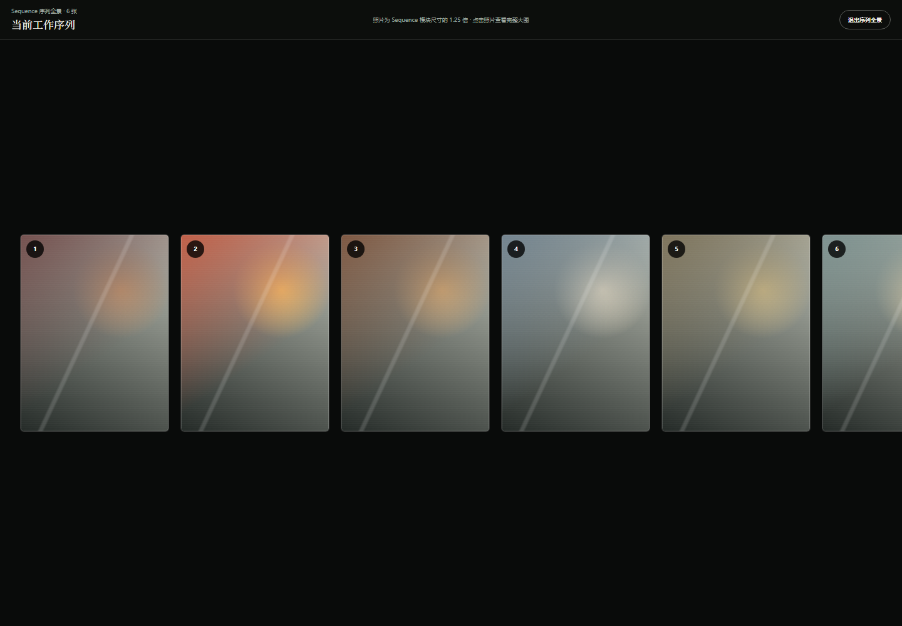
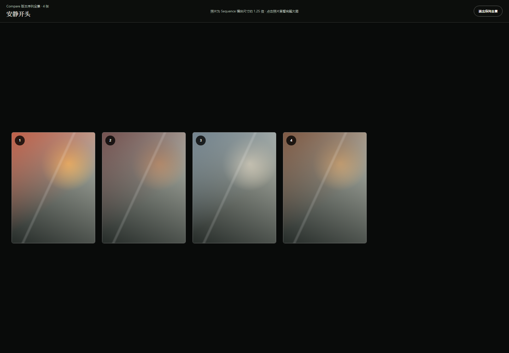

# PhotoFlex 核心工作流可点击原型

这是用于用户访谈的可丢弃原型，不是正式产品代码。方案 B 已被选为唯一方向，A/C 方案与切换器已经移除。

## 在线体验

- 真实测试入口：https://maadjdot.github.io/Photoflex/
- 快速演示入口：https://maadjdot.github.io/Photoflex/?demo=sequence

建议使用桌面版 Chrome 或 Edge。真实测试入口读取参与者选择的本地 JPEG 文件夹；照片仅通过浏览器本地 Object URL 展示，不会上传，刷新或关闭页面后本轮状态会清空。

它现在回答六个问题：

1. 500 张 JPEG 能否通过每页 60 张的增量渲染保持可操作，而不是让页面一次解码全部照片？
2. Contact/Pool 的“整图单击选择、按钮进入预览”是否比双击预览更清楚？
3. 用户能否在大图预览里直接选择或移除照片，并理解操作作用于哪个阶段？
4. 白板框选、成组移动、批量移除，以及“保留/放弃”两种退出方式是否清楚？
5. Sequence 的序列全景能否帮助用户连续观看，并自然进入完整比例的单张预览？
6. Compare 能否通过同一套“版本全景 → 单张大图”完成版本判断？

## 启动

先确认终端位于项目根目录：

    cd D:\project\Photoflex
    python -m http.server 4173 --directory ".\prototypes\photoflex-core-prototype"

然后打开：

    http://localhost:4173/index.html

如果终端已经位于本原型目录，也可以直接运行：

    python -m http.server 4173

出现 favicon.ico 404 不影响原型。结束服务时按 Ctrl + C。

如果浏览器仍显示旧版本，先打开带验收参数的新地址：

    http://localhost:4173/index.html?demo=sequence&whiteboard=1

然后按 Ctrl + F5 强制刷新。原型入口已为 app.js 与 styles.css 增加版本参数，之后普通刷新也会加载反馈7资源。

## 当前核心路径

1. 选择本地 JPEG 文件夹；浏览器用 Object URL 读取最多 500 张，并且 Contact Sheet 每次只渲染 60 张；
2. 使用分页、全选本页或反选本页建立最多 50 张的 Pool；单击整张 Contact 照片勾选，“预览大图”是唯一大图入口；
3. 单击整张 Pool 照片加入或移出 Sequence；预览按钮不改变选择，移除照片后保持原来的滚动位置；
4. 在大图里直接选择或移除照片；Contact 操作本次选择，Pool/Sequence 操作当前 Sequence，Compare 历史版本只读；
5. 在 Sequence 对照片全选、反选或批量移除；拖曳改变顺序，拖四角改变单张照片尺寸；白板与序列全景入口位于标题右侧；
6. 进入“序列全景”，以 Sequence 尺寸的 1.25 倍连续观看，点击照片进入不裁切的大图预览；
7. 进入 5200 × 3600 白板，框选多张照片后成组移动或移除，也可单张移除；
8. 白板支持 25%–150% 缩放和右键平移；退出时可选择写回排序或完全放弃本次白板改动；
9. 保存至少两个命名版本；第一个版本自动成为星标比较基准；
10. 点击 Compare 版本模块进入与 Sequence 相同的序列全景，再点击照片查看完整比例大图；
11. “打开版本，返回 Sequence”仍是独立按钮，并始终创建工作副本而不覆盖历史版本；
12. “重新开始”会清空 Pool、Sequence、版本与布局，但保留已经选择的本地 JPEG 图库，方便同一项目重新测试。

## 界面预览

| Contact Sheet | Sequence 横向 | 自由白板 | Compare |
|---|---|---|---|
|  |  |  |  |

| Sequence 网格 | Sequence 序列全景 | 单张大图预览 | Compare 版本序列全景 |
|---|---|---|---|
|  |  |  |  |

预览中的 Sequence 与 Compare 使用验收预置数据；正常打开仍从空白 Contact Sheet 开始。

仅用于界面验收的预置状态：

- Sequence + Pool：http://localhost:4173/index.html?demo=sequence
- Sequence 网格：http://localhost:4173/index.html?demo=sequence&view=grid
- Sequence 序列全景：http://localhost:4173/index.html?demo=sequence&panorama=1
- 自由白板：http://localhost:4173/index.html?demo=sequence&whiteboard=1
- 单张大图预览：http://localhost:4173/index.html?demo=sequence&preview=P03
- Compare：http://localhost:4173/index.html?demo=compare
- Compare 版本序列全景：http://localhost:4173/index.html?demo=compare&version=v1

## 建议访谈脚本

先不要解释 Pool、Sequence 或星标规则，让受试者边操作边说：

1. “请选择你的一个 JPEG 文件夹，载入本地照片。”
2. “请从这些照片中选出最多 50 张，并把它们放进候选池。”
3. “请用候选照片建立任意长度的序列。”
4. “请点开一张大图，在大图中选择或移除它，再确认列表里的状态是否同步。”
5. “请试试全选、反选和批量移除，再确认序列是否符合你的想法。”
6. “请从 Sequence 标题右侧进入序列全景，再点开一张竖图查看完整大图。”
7. “请进入白板，框选多张照片并一起移动，然后尝试批量移除。”
8. “请先放弃一次白板改动，再重新进入并保留一次改动。”
9. “请给当前序列起一个名字并保存，再改变序列并保存另一个版本。”
10. “请点击一个版本进入序列全景，再点开其中一张照片。”
11. “请记录两个版本各自的判断，并标出你更喜欢的版本。”
12. “请打开另一个版本继续调整，再回到比较。”

观察并记录：

- 用户是否理解灰阶照片已经进入 Pool；
- 用户是否理解单击整张照片是选择，而“预览大图”不会改变选择；
- 用户是否理解大图中的选择/移除会同步回当前 Contact 或 Sequence；
- 用户是否自然尝试拖曳，以及放置位置是否符合预期；
- 用户是否理解横向/网格是同一 Sequence 的两种视角；
- 滚动条和左右箭头哪个先被发现，是否需要同时保留；
- 用户是否把 Sequence 照片拖曳理解为排序、把四角拖曳理解为缩放；
- Pool 有很多照片时，用户是否能发现模块内部滚动；
- Pool 勾选后滚动位置保持不变，是否减少寻找上下文的成本；
- 用户是否把白板理解为自由空间，能否发现框选、成组移动和批量移除；
- 用户是否理解“保留排序退出”和“放弃改动退出”的差异；
- 用户是否能通过分页处理 500 张照片，并理解全选只作用于当前页且受 50 张上限约束；
- 用户是否把序列全景理解为连续观看入口，而不是另一个编辑界面；
- 用户点击照片后是否自然使用界面箭头或键盘方向键连续观看；
- 用户保存前是否自然理解版本名称输入框；
- 首个版本自动打星是否造成误解；
- 用户是否把 Memo 写成版本目标、判断理由或待办事项；
- 用户是否理解标题右侧版本包只是选择比较对象，不会打开或覆盖版本；
- 星标切换后，用户是否理解之后永远与星标版本比较；
- 用户是否理解“打开版本”创建工作副本而不是覆盖历史。

## 原型边界

- 所有状态都在浏览器内存中，刷新即清空；
- Pool 模块位置与尺寸、照片大小、白板位置和批量选择同样只保留在当前内存；
- 本地导入只接受 JPEG；使用浏览器 Object URL 引用文件，不上传、不生成代理图、不保存数据库；
- 未导入文件夹时，缩略图仍使用 CSS 生成的抽象占位图；
- 500 张图库采用每页 60 张的原型级分页，不是正式产品的虚拟滚动实现；
- Sequence 排序使用浏览器原生拖放；Pool 模块调整、白板框选/移动与四角缩放使用 Pointer Events，仅验证桌面鼠标心智模型；
- 原型结论应回写 PRD/ADR；不要直接把这份代码升级为生产实现。

## 本地验证

运行以下命令可复查 comment.md 中要求的状态转换：

    node prototypes/photoflex-core-prototype/smoke-test.js
