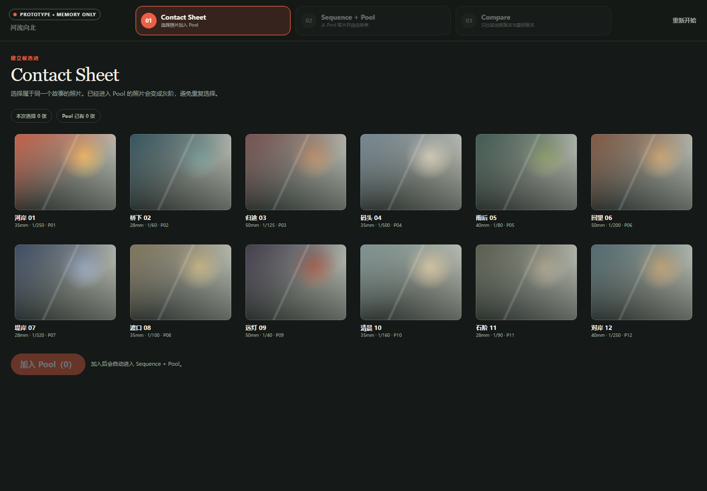
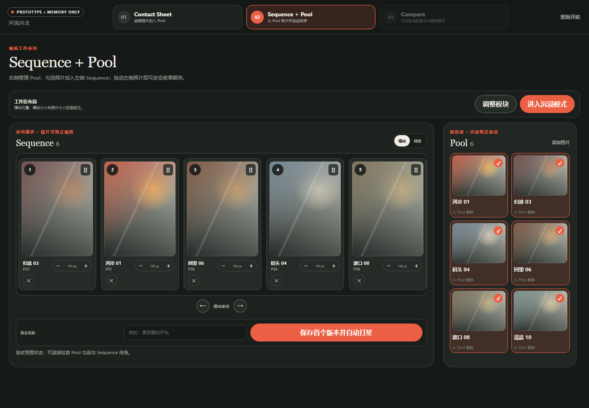
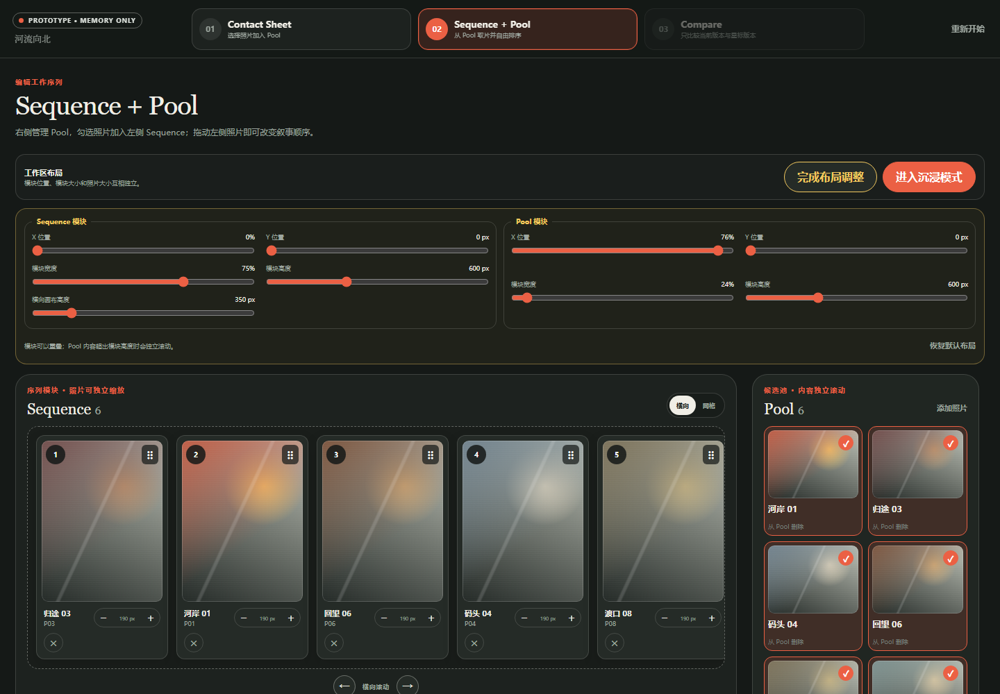
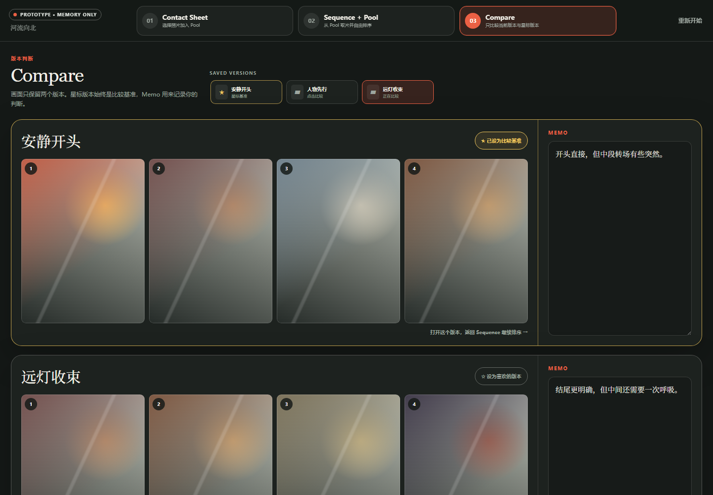
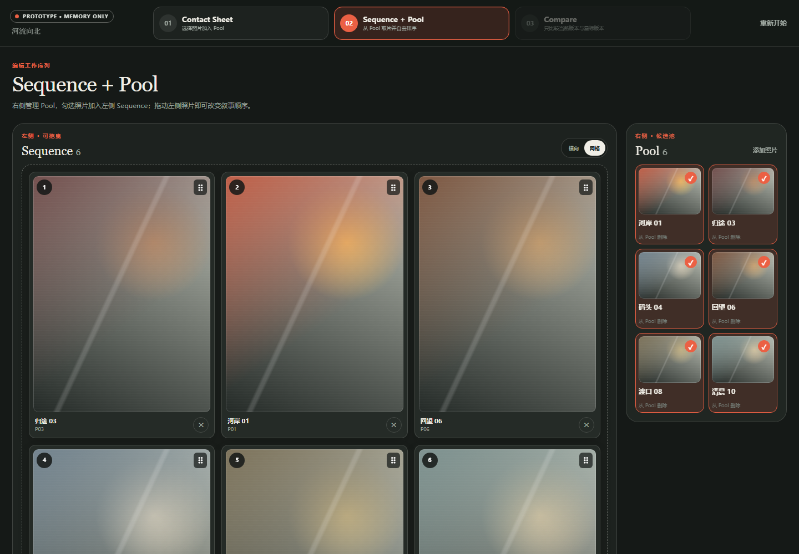
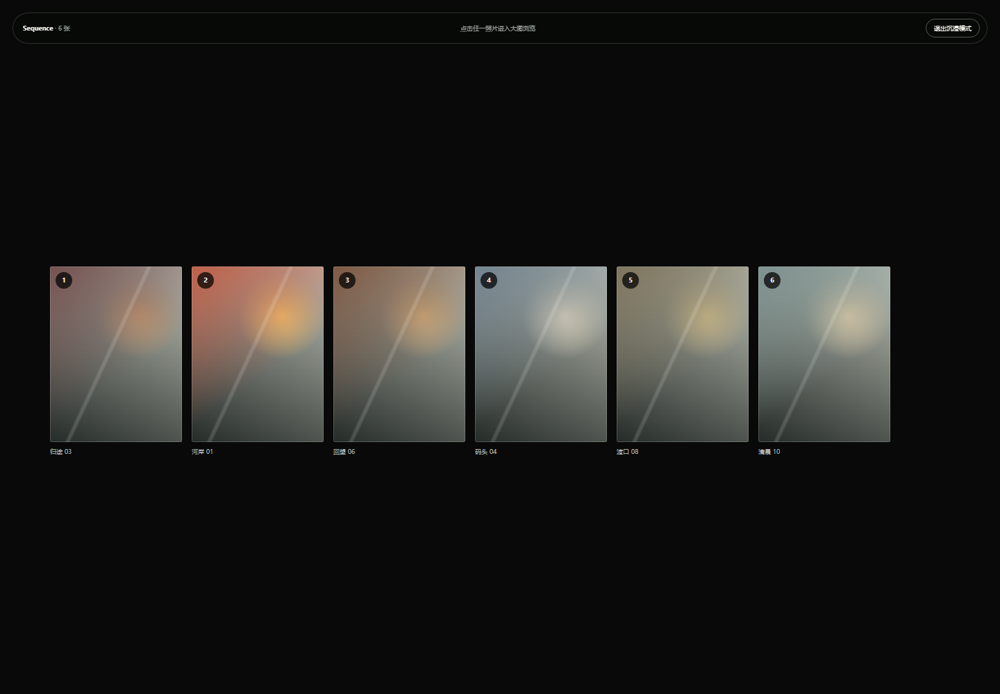
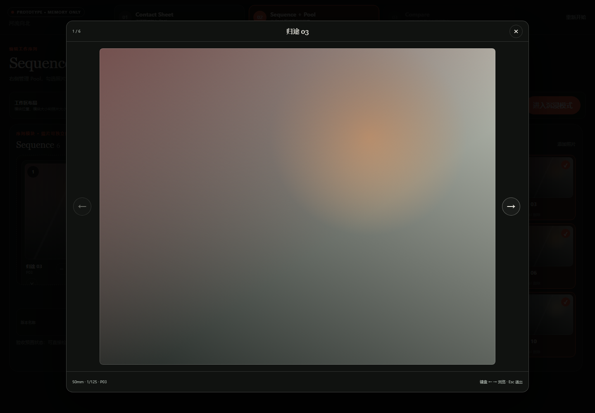

# PhotoFlex 核心工作流可点击原型

这是用于用户访谈的可丢弃原型，不是正式产品代码。方案 B 已被选为唯一方向，A/C 方案与切换器已经移除。

它现在回答四个问题：

1. Contact Sheet 中的“彩色待选 / 灰阶已在 Pool”状态是否容易理解？
2. 用户能否按项目需要调整 Sequence / Pool 的位置和尺寸，同时独立调整横向画布与单张照片大小？
3. 沉浸序列与单张大图预览，是否能支持不受其他界面干扰的连续观看？
4. 用户能否给版本命名保存，并通过版本包、星标与 Memo 完成清晰的版本判断？

## 启动

先确认终端位于项目根目录：

    cd D:\project\Photoflex
    python -m http.server 4173 --directory ".\prototypes\photoflex-core-prototype"

然后打开：

    http://localhost:4173/index.html

如果终端已经位于本原型目录，也可以直接运行：

    python -m http.server 4173

出现 favicon.ico 404 不影响原型。结束服务时按 Ctrl + C。

## 当前核心路径

1. 在 Contact Sheet 选择照片并加入 Pool；
2. 已进入 Pool 的照片在 Contact Sheet 中变成灰阶，不再保持临时勾选；
3. 在 Sequence + Pool 页面勾选右侧照片，左侧立即加入 Sequence；
4. 反选会移出 Sequence；从 Pool 删除会让 Contact Sheet 中的照片恢复彩色；
5. 点击“调整模块”，分别改变 Sequence / Pool 的 X、Y、宽度和高度；Pool 内容超出时在模块内部滚动；
6. 横向画布有独立高度；每张 Sequence 照片可用卡片内的 − / ＋ 单独缩放，不会改变画布尺寸；
7. Sequence 默认使用横向单排视角，可用滚动条或左右箭头浏览；也可以切换为网格视角；
8. 拖曳左侧照片改变顺序，Sequence 不限制张数；
9. 点击照片进入大图预览，用界面箭头或键盘 ← / → 按序浏览，Esc 退出；
10. 点击“进入沉浸模式”后，页面只保留横向照片序列和退出入口；
11. 输入版本名称并保存；第一个版本自动成为星标比较基准；
12. 调整顺序、命名并保存另一个版本后，只放大显示星标版本和当前比较版本；
13. 所有已保存版本显示为 Compare 标题右侧的小版本包；点击非星标版本包即可更换比较对象；
14. 两个放大版本分别填写 Memo，也可以改变星标；
15. 打开任一版本会回到 Sequence，以工作副本继续排序；再次保存生成新版本，不覆盖历史版本。

## 界面预览

| Contact Sheet | Sequence 横向 | 布局调整 | Compare |
|---|---|---|---|
|  |  |  |  |

| Sequence 网格 | 沉浸序列 | 单张大图预览 |
|---|---|---|
|  |  |  |

预览中的 Sequence 与 Compare 使用验收预置数据；正常打开仍从空白 Contact Sheet 开始。

仅用于界面验收的预置状态：

- Sequence + Pool：http://localhost:4173/index.html?demo=sequence
- Sequence 网格：http://localhost:4173/index.html?demo=sequence&view=grid
- 布局调整：http://localhost:4173/index.html?demo=sequence&layout=1
- 沉浸序列：http://localhost:4173/index.html?demo=sequence&immersive=1
- 单张大图预览：http://localhost:4173/index.html?demo=sequence&preview=P03
- Compare：http://localhost:4173/index.html?demo=compare

## 建议访谈脚本

先不要解释 Pool、Sequence 或星标规则，让受试者边操作边说：

1. “请选出属于同一个故事的照片，并把它们放进候选池。”
2. “请用候选照片建立任意长度的序列。”
3. “请把 Sequence 和 Pool 调整成你最舒服的位置和大小。”
4. “请只放大其中一张照片，再调整横向观看区域；看看两者会不会互相干扰。”
5. “请进入不受界面干扰的观看方式，再打开一张照片连续看完整个序列。”
6. “请用默认视角浏览并拖动照片，再切换到另一个视角看看。”
7. “请给当前序列起一个名字并保存。”
8. “请改变序列，命名并保存另一个版本。”
9. “请记录两个版本各自的判断，并标出你更喜欢的版本。”
10. “请再保存一个版本，然后用标题右侧的小版本包切换比较对象。”
11. “请打开另一个版本继续调整，再回到比较。”

观察并记录：

- 用户是否理解灰阶照片已经进入 Pool；
- 用户是否能发现右侧勾选与左侧 Sequence 的双向关系；
- 用户是否自然尝试拖曳，以及放置位置是否符合预期；
- 用户是否理解横向/网格是同一 Sequence 的两种视角；
- 滚动条和左右箭头哪个先被发现，是否需要同时保留；
- 用户是否会先调整模块位置、模块大小、横向画布还是单张照片，并能否理解四者相互独立；
- Pool 有很多照片时，用户是否能发现模块内部滚动；
- 用户是否把沉浸模式理解为“只看序列”，以及退出入口是否足够清楚；
- 用户点击照片后是否自然使用界面箭头或键盘方向键连续观看；
- 用户保存前是否自然理解版本名称输入框；
- 首个版本自动打星是否造成误解；
- 用户是否把 Memo 写成版本目标、判断理由或待办事项；
- 用户是否理解标题右侧版本包只是选择比较对象，不会打开或覆盖版本；
- 星标切换后，用户是否理解之后永远与星标版本比较；
- 用户是否理解“打开版本”创建工作副本而不是覆盖历史。

## 原型边界

- 所有数据都在浏览器内存中，刷新即清空；
- 模块位置、模块尺寸、横向画布高度和单张照片大小同样只保留在当前内存；
- 不读取真实文件，不生成代理图，不保存数据库；
- 缩略图是 CSS 生成的抽象占位图；
- 拖曳使用浏览器原生桌面拖放，仅用于验证排序心智模型；
- 原型结论应回写 PRD/ADR；不要直接把这份代码升级为生产实现。

## 本地验证

运行以下命令可复查 comment.md 中要求的状态转换：

    node prototypes/photoflex-core-prototype/smoke-test.js
